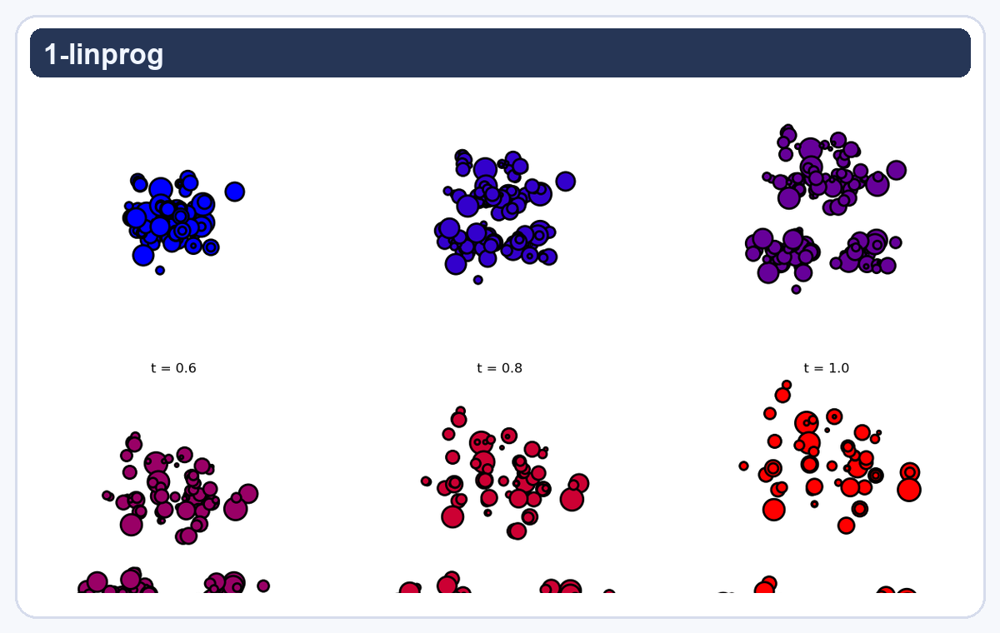
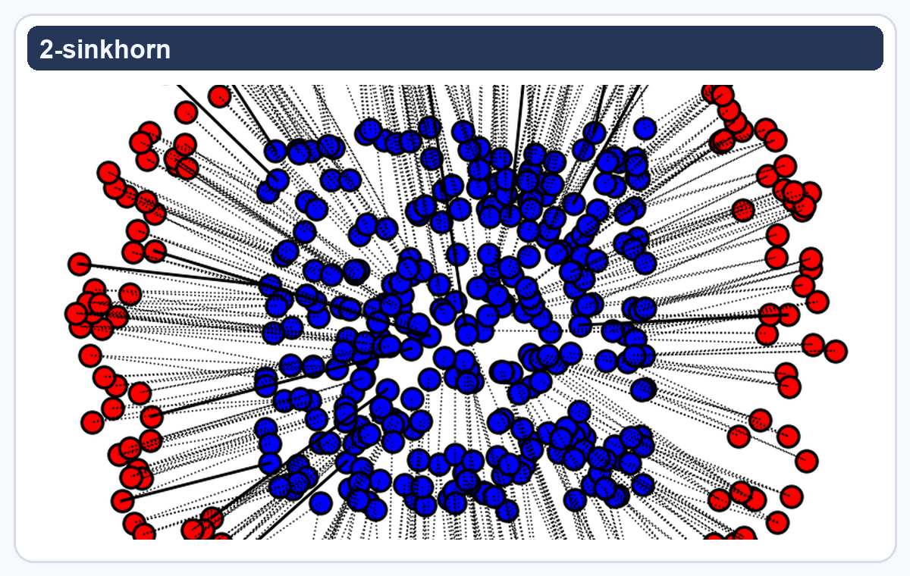
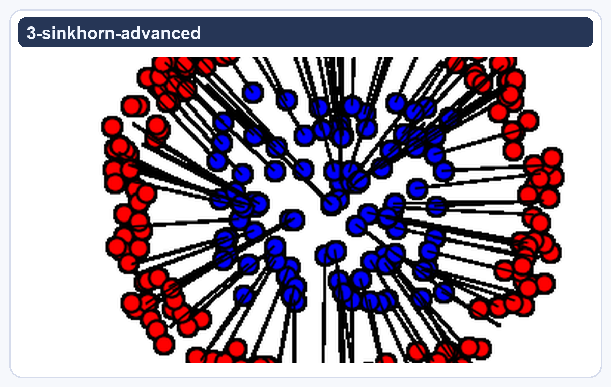
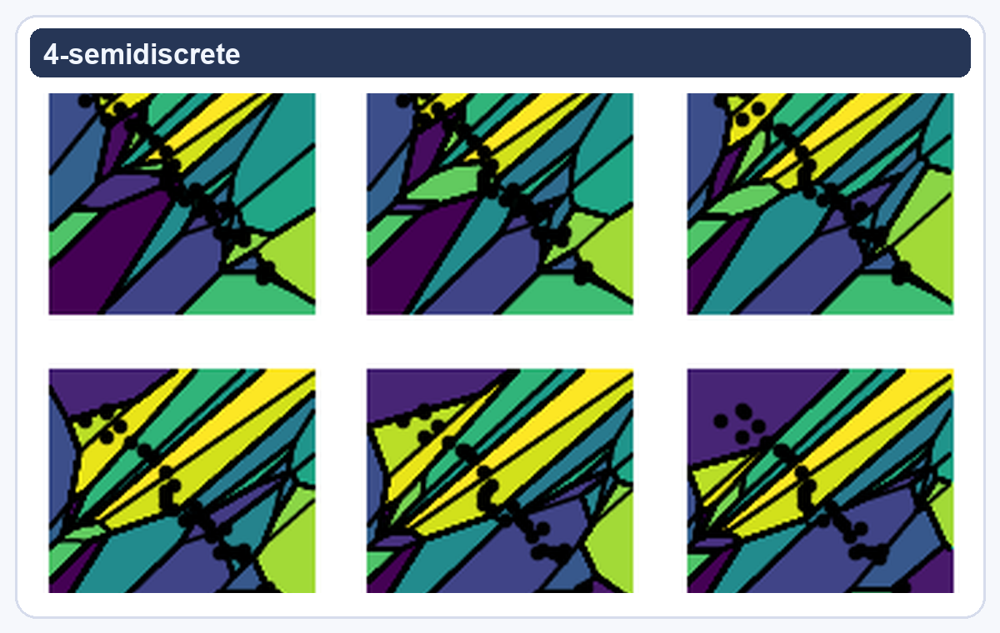
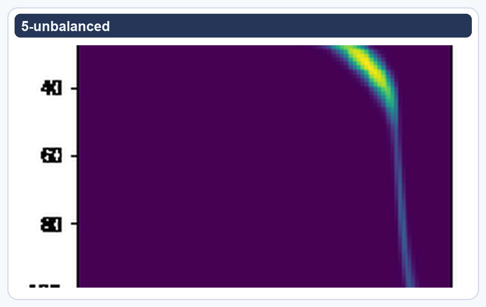
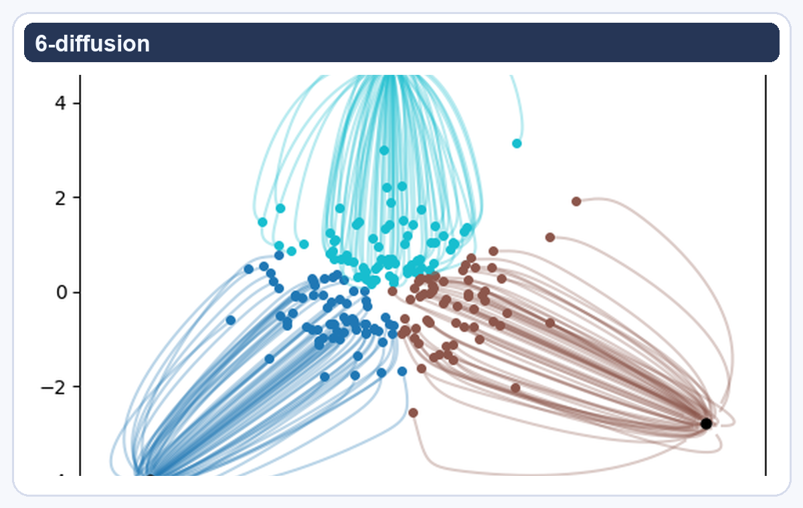

<h1 align="center">OT4ML - Optimal Transport for Machine Learners</h1>

This repository contains materials for a course on Optimal Transport for Machine Learning.

## Python Resources

The course notebooks are available below with a visual preview for each:

| Notebook | Notebook |
| --- | --- |
| **[1. Optimal Transport with Linear Programming](python/1-linprog.ipynb)**   | **[2. Entropic Regularization of Optimal Transport](python/2-sinkhorn.ipynb)**   |
| **[3. Advanced Topics on Sinkhorn Algorithms](python/3-sinkhorn-advanced.ipynb)**   | **[4. Semi-discrete Optimal Transport](python/4-semidiscrete.ipynb)**   |
| **[5. Unbalanced Optimal Transport](python/5-unbalanced.ipynb)**   | **[6. Diffusion Models and Optimal Transport](python/6-diffusion.ipynb)**   |
| **[7. Wasserstein Gradient Flows of Interaction Functionals](python/7-wasserstein-flows.ipynb)**   | **[8. Discrete Diffusion](python/8-discrete_diffusion.ipynb)**   |

You can run notebooks locally or directly in Google Colab using the badge.

## Slides for the Course

- [Monge and Kantorovich](https://speakerdeck.com/gpeyre/computational-ot-number-1-monge-and-kantorovitch)
- [Entropic Regularization](https://speakerdeck.com/gpeyre/computational-ot-number-2-entropic-regularization)
- [Dual and Semidiscrete](https://speakerdeck.com/gpeyre/computational-ot-number-1-dual-and-semidiscrete)
- [Gradient Flow and Diffusion Models](https://speakerdeck.com/gpeyre/computational-ot-number-4-gradient-flow-and-diffusion-models)

## Lecture Notes

The lecture notes [*Optimal Transport for Machine Learners* can be found at this link.](https://arxiv.org/abs/2505.06589).

## Other Resources

### Bibliography

- [*Computational Optimal Transport*](https://optimaltransport.github.io/), Gabriel Peyré & Marco Cuturi, 2018.
- [*Optimal Transport for Applied Mathematicians*](https://www.math.u-psud.fr/~filippo/OTAM-cvgmt.pdf), Filippo Santambrogio, Springer, 2016.
- [*Statistical Optimal Transport*](https://arxiv.org/abs/2407.18163), Sinho Chewi, Jonathan Niles-Weed, Philippe Rigollet, 2024.

### Code

- [Python Optimal Transport (POT)](https://pythonot.github.io/)
- [Optimal Transport Tools (OTT) in JAX](https://ott-jax.readthedocs.io/en/latest/)
- [GeomLoss](https://www.kernel-operations.io/geomloss/)
