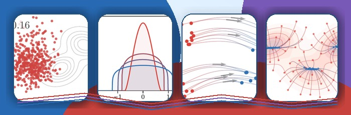
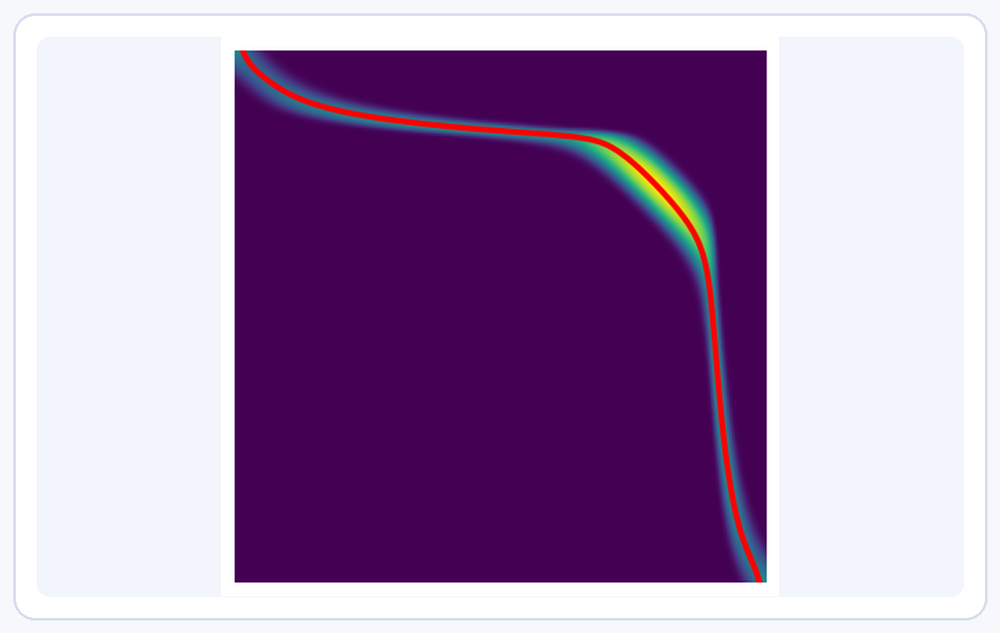
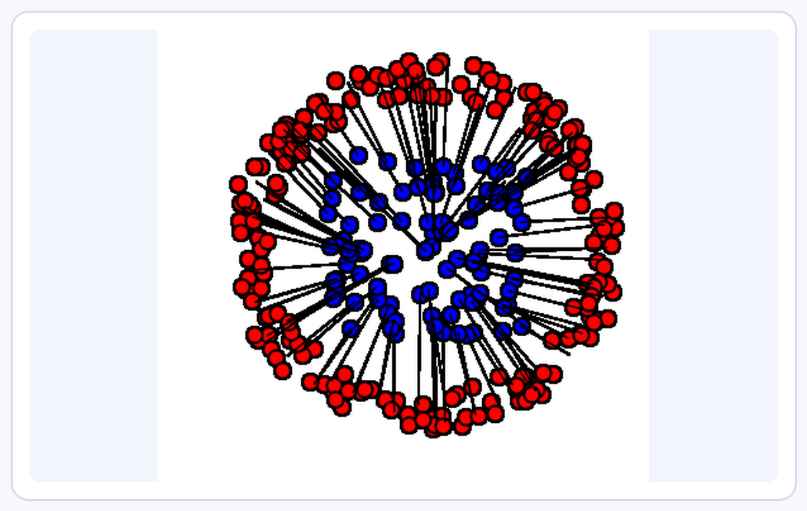
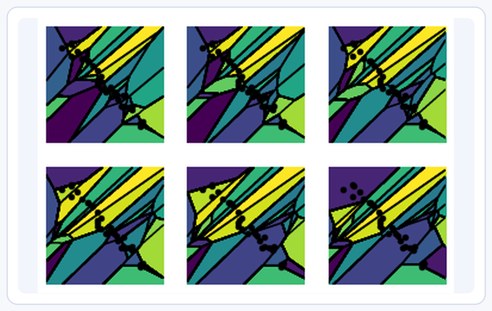
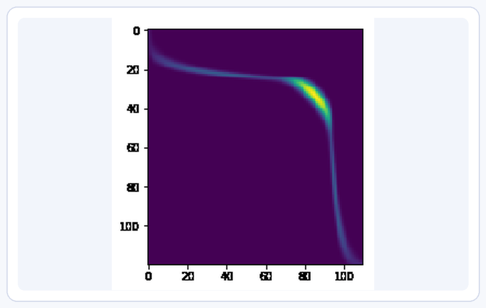
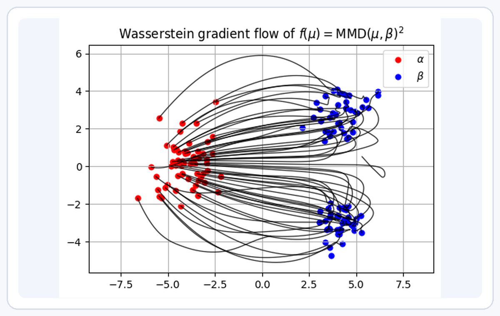
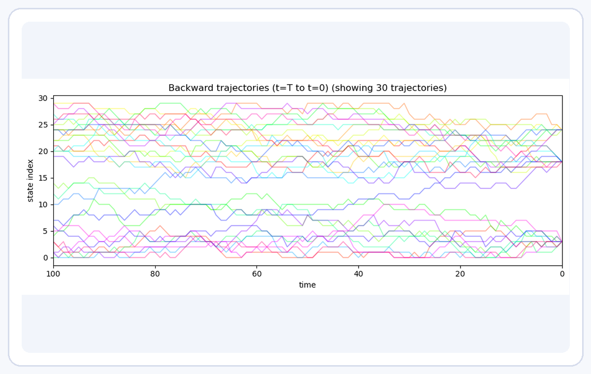

<h1 align="center">OT4ML - Optimal Transport for Machine Learners</h1>

  <strong>Project webpage:</strong>
  <a href="https://www.gpeyre.com/ot4ml">https://www.gpeyre.com/ot4ml</a>

  <a href="https://www.gpeyre.com/ot4ml/"><strong>Project homepage</strong></a>
  &nbsp;·&nbsp;
  <a href="PDE4ML/PDE4ML.pdf"><strong>PDE4ML survey</strong></a>
  &nbsp;·&nbsp;
  <a href="https://www.gpeyre.com/ot4ml/myst/_build/html/index.html"><strong>Interactive book</strong></a>
  &nbsp;·&nbsp;
  <a href="https://www.gpeyre.com/ot4ml/notebooks-figures/index.html"><strong>Rendered figure gallery</strong></a>
  &nbsp;·&nbsp;
  <a href="https://www.gpeyre.com/ot4ml/resources.html"><strong>Resources</strong></a>
  &nbsp;·&nbsp;
  <a href="https://github.com/gpeyre/ot4ml"><strong>GitHub source</strong></a>

This repository gathers the OT4ML book, the PDE4ML survey, the executable
notebooks used to reproduce the figures, a shorter set of teaching notebooks,
and an experimental MyST web prototype.

## PDE4ML Survey

**[*PDEs for Machine Learning*](PDE4ML/PDE4ML.pdf)** is a long survey of PDE
tools for machine learning, written with an optimal-transport bias. It
reorganizes the OT4ML material most relevant to dynamic optimal transport,
Wasserstein gradient flows, particle limits, diffusion models, flow matching,
mean-field training, and transportation views of modern architectures.

  

Sources and build notes live in [`PDE4ML/`](PDE4ML/).

## Book

The book **[*Optimal Transport for Machine Learners*](https://arxiv.org/abs/2505.06589)**
is available on arXiv.

## Figures of the book

The book figures are generated from executable notebooks and assembled by the
LaTeX source. The current searchable gallery has been checked against the live
LaTeX and MyST figure references: it exposes 113 figure views, covers all 112
referenced `OT4ML/figures/<figure-name>/` directories, and every active view has
a notebook link, thumbnail, and generated PDF panels. The manuscript contains
115 LaTeX figure labels because some figure directories generate several labeled
figures. Browse the rendered web gallery at
[www.gpeyre.com/ot4ml/notebooks-figures/index.html](https://www.gpeyre.com/ot4ml/notebooks-figures/index.html)
or the Markdown version in
[`notebooks-figures/README.md`](notebooks-figures/README.md), with thumbnails,
notebook links, and Open in Colab badges.

  

Each live figure notebook writes PDF panels to `OT4ML/figures/<figure-name>/`,
where the LaTeX source assembles them into the book. Retired exploratory
notebooks live in `notebooks-figures/removed/` and are not part of the paper
gallery.

## Teaching Notebooks

The course notebooks below are compact, self-contained introductions to the
main computational ideas. Each one can be opened locally or launched in Colab.

|  |  |
| --- | --- |
| **[1. Optimal Transport with Linear Programming](notebooks/1-linprog.ipynb)**   | **[2. Entropic Regularization of Optimal Transport](notebooks/2-sinkhorn.ipynb)**   |
| **[3. Advanced Topics on Sinkhorn Algorithms](notebooks/3-sinkhorn-advanced.ipynb)**   | **[4. Semi-discrete Optimal Transport](notebooks/4-semidiscrete.ipynb)**   |
| **[5. Unbalanced Optimal Transport](notebooks/5-unbalanced.ipynb)**   | **[6. Diffusion Models and Optimal Transport](notebooks/6-diffusion.ipynb)**   |
| **[7. Wasserstein Gradient Flows of Interaction Functionals](notebooks/7-wasserstein-flows.ipynb)**   | **[8. Discrete Diffusion](notebooks/8-discrete_diffusion.ipynb)**   |

## Executable Web Prototype

An experimental MyST/Jupyter Book 2 prototype lives in
[`myst/`](myst/). It mirrors the LaTeX book front matter, 14 main chapters,
conclusion, acknowledgements, and notation appendix while fusing the book text
with executable figures and browser-native interactive demos. The rendered static version is available from the
[project homepage](https://www.gpeyre.com/ot4ml/myst/_build/html/index.html). The local
workflow, the static-site build, and the offline behavior of the interactive demos
are documented in [`myst/README.md`](myst/README.md).

## Course Slides

- [Monge and Kantorovich](https://speakerdeck.com/gpeyre/computational-ot-number-1-monge-and-kantorovitch)
- [Entropic Regularization](https://speakerdeck.com/gpeyre/computational-ot-number-2-entropic-regularization)
- [Dual and Semidiscrete](https://speakerdeck.com/gpeyre/computational-ot-number-1-dual-and-semidiscrete)
- [Gradient Flow and Diffusion Models](https://speakerdeck.com/gpeyre/computational-ot-number-4-gradient-flow-and-diffusion-models)

## Further Resources

A rendered resource portal is available at
[www.gpeyre.com/ot4ml/resources.html](https://www.gpeyre.com/ot4ml/resources.html).

### Bibliography

Core books and monographs cited in the book:

- *Mass Transportation Problems, Vol. I: Theory*, Svetlozar T. Rachev & Ludger Rüschendorf, Springer, 1998.
- *Mass Transportation Problems, Vol. II: Applications*, Svetlozar T. Rachev & Ludger Rüschendorf, Springer, 1998.
- *Topics in Optimal Transportation*, Cédric Villani, AMS, 2003.
- *Optimal Transport: Old and New*, Cédric Villani, Springer, 2009.
- [*Optimal Transport for Applied Mathematicians*](https://www.math.u-psud.fr/~filippo/OTAM-cvgmt.pdf), Filippo Santambrogio, Birkhäuser, 2015.
- *Gradient Flows in Metric Spaces and in the Space of Probability Measures*, Luigi Ambrosio, Nicola Gigli & Giuseppe Savaré, Springer, 2006.
- *Optimal Transport Methods in Economics*, Alfred Galichon, Princeton University Press, 2016.
- [*Statistical Optimal Transport*](https://arxiv.org/abs/2407.18163), Sinho Chewi, Jonathan Niles-Weed & Philippe Rigollet, 2024.

Computational references and long reviews cited in the book:

- [*Computational Optimal Transport*](https://optimaltransport.github.io/), Gabriel Peyré & Marco Cuturi, Foundations and Trends in Machine Learning, 2019.
- [*A User's Guide to Optimal Transport*](https://link.springer.com/chapter/10.1007/978-3-642-32160-3_1), Luigi Ambrosio & Nicola Gigli, Lecture Notes in Mathematics, 2013.
- [*A Survey of the Schrödinger Problem and Some of Its Connections with Optimal Transport*](https://www.aimsciences.org/article/doi/10.3934/dcds.2014.34.1533), Christian Léonard, Discrete and Continuous Dynamical Systems, 2014.
- [*A Review of Matrix Scaling and Sinkhorn's Normal Form for Matrices and Positive Maps*](https://arxiv.org/abs/1609.06349), Martin Idel, 2016.
- [*Scalable Optimal Transport Methods in Machine Learning: A Contemporary Survey*](https://doi.org/10.1109/TPAMI.2024.3379571), Abdelwahed Khamis, Russell Tsuchida, Mohamed Tarek, Vivien Rolland & Lars Petersson, IEEE TPAMI, 2024.
- [*Recent Advances in Optimal Transport for Machine Learning*](https://arxiv.org/abs/2306.16156), Eduardo F. Montesuma, Fred Ngolè Mboula & Antoine Souloumiac, 2023.
- [*A Survey of Optimal Transport for Computer Graphics and Computer Vision*](https://doi.org/10.1111/cgf.14778), Nicolas Bonneel & Julie Digne, Computer Graphics Forum, 2023.

### Software

Most figures in the book are generated with standard Python scientific tools,
with several OT computations relying on POT, the Python Optimal Transport
library cited and acknowledged in the manuscript.

- [Python Optimal Transport (POT)](https://pythonot.github.io/)
- [Optimal Transport Tools (OTT) in JAX](https://ott-jax.readthedocs.io/en/latest/)
- [GeomLoss](https://www.kernel-operations.io/geomloss/)
