# Figure Notebooks

This directory contains the executable notebooks that generate the illustrative
figures currently included in the OT4ML book. Each live notebook writes one or
several PDF panels to `../OT4ML/figures/<figure-name>/`; the thumbnails below
are compact PNG previews rendered from those outputs.

Rendered web version: [www.gpeyre.com/ot4ml/notebooks-figures/](https://www.gpeyre.com/ot4ml/notebooks-figures/).

**Gallery status.** Checked against the current LaTeX and MyST sources: all 117
live `OT4ML/figures/<figure-name>/` directories referenced by
`\includegraphics{figures/...}` have a matching live `.ipynb` file, thumbnail
in [`thumbnails/`](thumbnails/), and generated PDF panels in
`../OT4ML/figures/`. The searchable gallery currently exposes 118 figure views,
because `generative-diffusion-versus-ot-2d.ipynb` also provides the distinct
schedule-comparison view. The book currently has 120 LaTeX figure labels because
some figure directories generate several labeled views. The contact sheet
below is built from the same active thumbnail set.

This README intentionally lists only figure views integrated in the current
LaTeX or MyST sources. Retired or exploratory notebooks live in
[`removed/`](removed/), with their matching
generated panels in [`../OT4ML/figures/removed/`](../OT4ML/figures/removed/).
They are kept for provenance but omitted from this paper gallery.

Open a notebook locally from the **Open notebook** link, or launch it in Google
Colab from the badge. The Colab links target the `main` branch of
[`gpeyre/ot4ml`](https://github.com/gpeyre/ot4ml).

[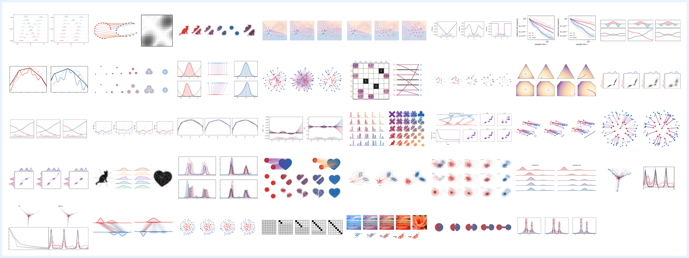](../README.md#figures-of-the-book)

## Optimal Matching between Point Clouds

<table>
<tr>

<td width="33%" align="center" valign="top">
  <a href="matching-1d-quantile-assignment.ipynb">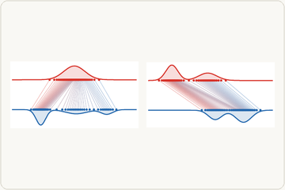</a> 
  <strong>One-dimensional quantile assignment</strong> 
  <a href="matching-1d-quantile-assignment.ipynb">Open notebook</a> &middot; 
</td>

<td width="33%" align="center" valign="top">
  <a href="matching-1d-convex-concave-costs.ipynb">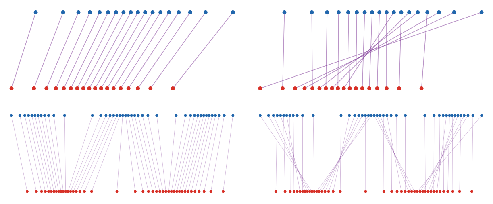</a> 
  <strong>Convex and concave costs on the line</strong> 
  <a href="matching-1d-convex-concave-costs.ipynb">Open notebook</a> &middot; 
</td>

<td width="33%" align="center" valign="top">
  <a href="monge-histogram-equalization.ipynb">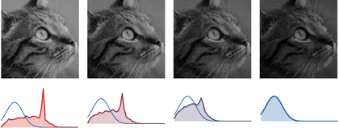</a> 
  <strong>Histogram equalization as one-dimensional Monge transport</strong> 
  <a href="monge-histogram-equalization.ipynb">Open notebook</a> &middot; 
</td>

</tr>
</table>

<table>
<tr>

<td width="33%" align="center" valign="top">
  <a href="monge-circle-cut-unfolding.ipynb">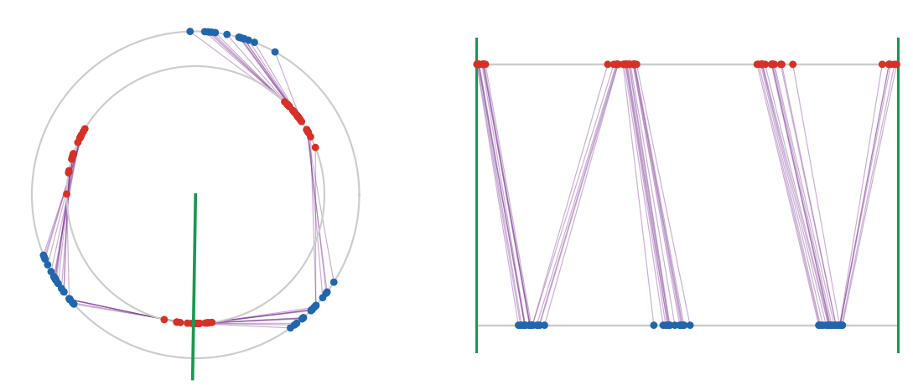</a> 
  <strong>Circle transport by cutting and unfolding</strong> 
  <a href="monge-circle-cut-unfolding.ipynb">Open notebook</a> &middot; 
</td>

<td width="33%" align="center" valign="top">
  <a href="matching-2d-cost-exponent.ipynb">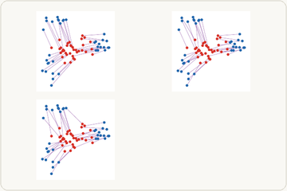</a> 
  <strong>Two-dimensional assignments for different cost exponents</strong> 
  <a href="matching-2d-cost-exponent.ipynb">Open notebook</a> &middot; 
</td>

<td width="33%" align="center" valign="top">
  <a href="matching-resolution-and-weights.ipynb">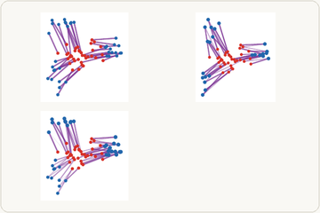</a> 
  <strong>Resolution and nonuniform weights in discrete transport</strong> 
  <a href="matching-resolution-and-weights.ipynb">Open notebook</a> &middot; 
</td>

</tr>
</table>

<table>
<tr>

<td width="33%" align="center" valign="top">
  <a href="matching-rational-duplication.ipynb">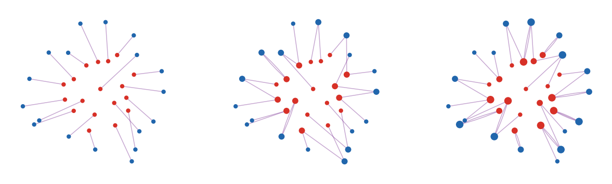</a> 
  <strong>Rational weights as duplicated matchings</strong> 
  <a href="matching-rational-duplication.ipynb">Open notebook</a> &middot; 
</td>

<td width="33%" align="center" valign="top">
  <a href="matching-hungarian-progression.ipynb">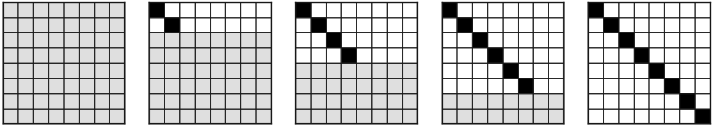</a> 
  <strong>Hungarian algorithm progression</strong> 
  <a href="matching-hungarian-progression.ipynb">Open notebook</a> &middot; 
</td>

<td width="33%"></td>

</tr>
</table>

## Monge Problem between Measures

<table>
<tr>

<td width="25%" align="center" valign="top">
  <a href="monge-jacobian-pushforward-density.ipynb">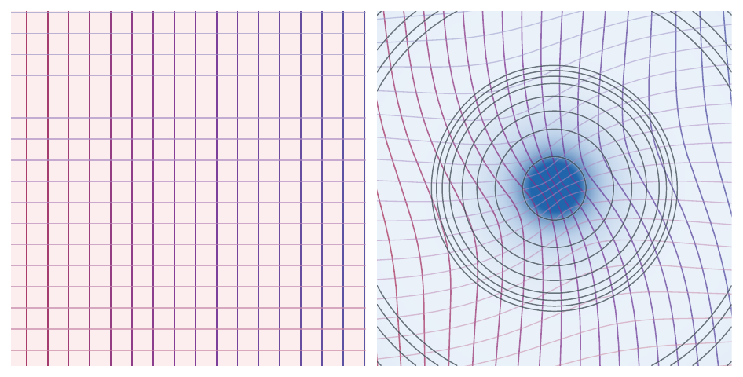</a> 
  <strong>Jacobian density push-forward</strong> 
  <a href="monge-jacobian-pushforward-density.ipynb">Open notebook</a> &middot; 
</td>

<td width="25%" align="center" valign="top">
  <a href="monge-polar-factorization.ipynb">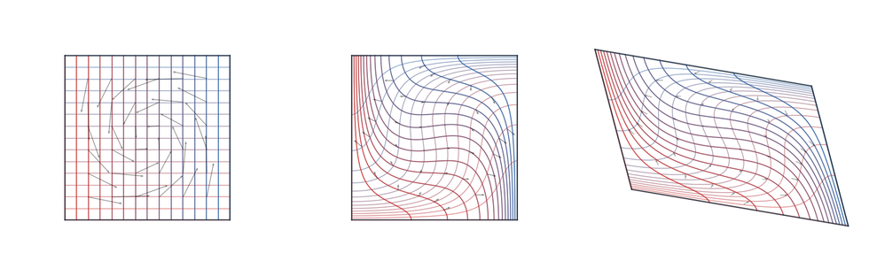</a> 
  <strong>Polar factorization</strong> 
  <a href="monge-polar-factorization.ipynb">Open notebook</a> &middot; 
</td>

<td width="25%" align="center" valign="top">
  <a href="monge-semidiscrete-maps.ipynb">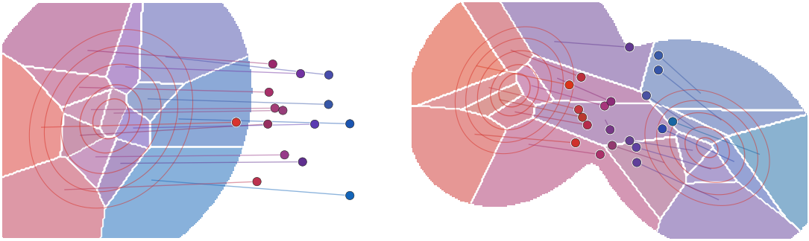</a> 
  <strong>Semi-discrete Monge maps</strong> 
  <a href="monge-semidiscrete-maps.ipynb">Open notebook</a> &middot; 
</td>

<td width="25%" align="center" valign="top">
  <a href="monge-color-transfer-rgb.ipynb">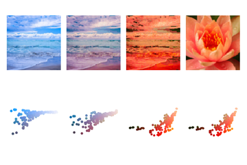</a> 
  <strong>RGB color transfer by a Monge map</strong> 
  <a href="monge-color-transfer-rgb.ipynb">Open notebook</a> &middot; 
</td>

</tr>
</table>

<table>
<tr>

<td width="25%" align="center" valign="top">
   
  <strong>McCann interpolation between two shapes</strong> 
  <a href="monge-shape-mccann-interpolation.ipynb">Open notebook</a> &middot; 
</td>

<td width="25%" align="center" valign="top">
  <a href="monge-caffarelli-nonconvex-map.ipynb">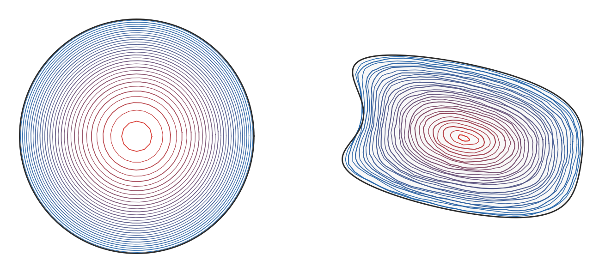</a> 
  <strong>Disk-to-dumbbell empirical McCann interpolation</strong> 
  <a href="monge-caffarelli-nonconvex-map.ipynb">Open notebook</a> &middot; 
</td>

<td width="25%" align="center" valign="top">
  <a href="monge-1d-quantile-geodesic.ipynb">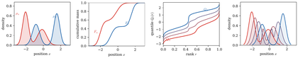</a> 
  <strong>One-dimensional quantiles and displacement interpolation</strong> 
  <a href="monge-1d-quantile-geodesic.ipynb">Open notebook</a> &middot; 
</td>

<td width="25%" align="center" valign="top">
   
  <strong>Triangular rearrangement between two silhouettes</strong> 
  <a href="monge-triangular-rearrangement.ipynb">Open notebook</a> &middot; 
</td>

</tr>
</table>

<table>
<tr>

<td width="33%" align="center" valign="top">
  <a href="monge-gaussian-w2-geodesic.ipynb">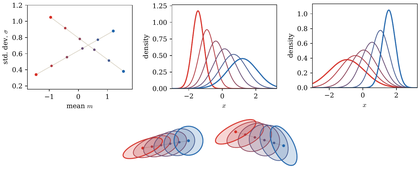</a> 
  <strong>Gaussian W2 geodesics and Bures cone</strong> 
  <a href="monge-gaussian-w2-geodesic.ipynb">Open notebook</a> &middot; 
</td>

<td width="33%" align="center" valign="top">
  <a href="monge-gaussian-fr-mean-geodesic.ipynb">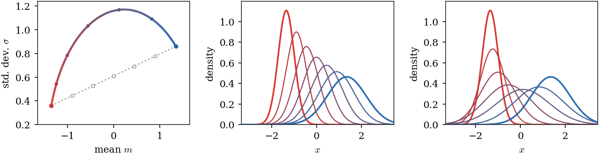</a> 
  <strong>Gaussian W2 and Fisher-Rao geodesics</strong> 
  <a href="monge-gaussian-fr-mean-geodesic.ipynb">Open notebook</a> &middot; 
</td>

<td width="33%" align="center" valign="top">
  <a href="monge-gaussian-fr-vs-bures-cone.ipynb">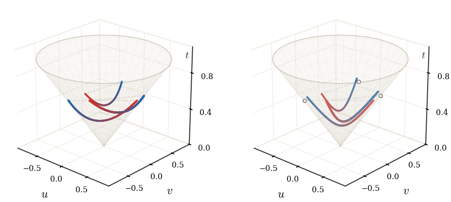</a> 
  <strong>Bures and Fisher-Rao covariance paths</strong> 
  <a href="monge-gaussian-fr-vs-bures-cone.ipynb">Open notebook</a> &middot; 
</td>

</tr>
</table>

## Kantorovich Relaxation

<table>
<tr>

<td width="33%" align="center" valign="top">
  <a href="kantorovich-coupling-polylines.ipynb">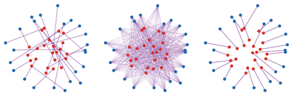</a> 
  <strong>Couplings as straight transport segments</strong> 
  <a href="kantorovich-coupling-polylines.ipynb">Open notebook</a> &middot; 
</td>

<td width="33%" align="center" valign="top">
  <a href="kantorovich-coupling-matrix-marginals.ipynb">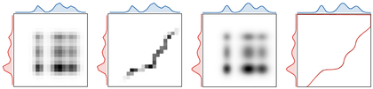</a> 
  <strong>Coupling matrices with marginals</strong> 
  <a href="kantorovich-coupling-matrix-marginals.ipynb">Open notebook</a> &middot; 
</td>

<td width="33%" align="center" valign="top">
  <a href="kantorovich-permutation-versus-splitting.ipynb">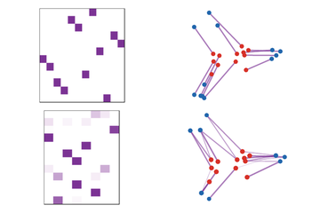</a> 
  <strong>From permutation matrices to splitting couplings</strong> 
  <a href="kantorovich-permutation-versus-splitting.ipynb">Open notebook</a> &middot; 
</td>

</tr>
</table>

<table>
<tr>

<td width="25%" align="center" valign="top">
  <a href="birkhoff-von-neumann-cycle.ipynb">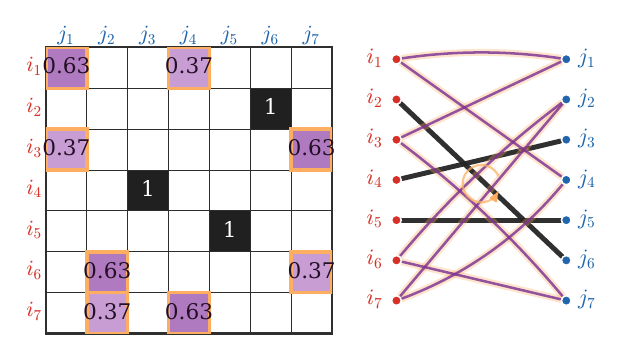</a> 
  <strong>Birkhoff-von Neumann cycle certificate</strong> 
  <a href="birkhoff-von-neumann-cycle.ipynb">Open notebook</a> &middot; 
</td>

<td width="25%" align="center" valign="top">
  <a href="kantorovich-log-barrier-lp-geometry.ipynb">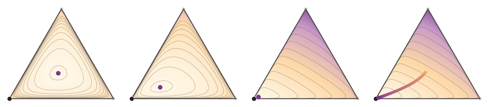</a> 
  <strong>Logarithmic barrier central path</strong> 
  <a href="kantorovich-log-barrier-lp-geometry.ipynb">Open notebook</a> &middot; 
</td>

<td width="25%" align="center" valign="top">
  <a href="kantorovich-plan-interpolation.ipynb">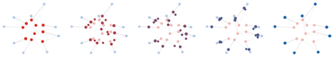</a> 
  <strong>McCann interpolation from a transport plan</strong> 
  <a href="kantorovich-plan-interpolation.ipynb">Open notebook</a> &middot; 
</td>

<td width="25%" align="center" valign="top">
  <a href="kantorovich-discrete-gluing-lemma.ipynb">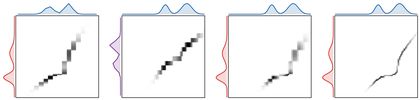</a> 
  <strong>Discrete gluing lemma</strong> 
  <a href="kantorovich-discrete-gluing-lemma.ipynb">Open notebook</a> &middot; 
</td>

</tr>
</table>

<table>
<tr>

<td width="33%" align="center" valign="top">
  <a href="matching-quantitative-clt.ipynb">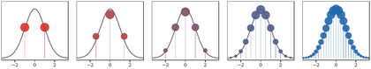</a> 
  <strong>Quantitative central-limit theorem</strong> 
  <a href="matching-quantitative-clt.ipynb">Open notebook</a> &middot; 
</td>

<td width="33%" align="center" valign="top">
  <a href="kantorovich-wow-mixtures.ipynb">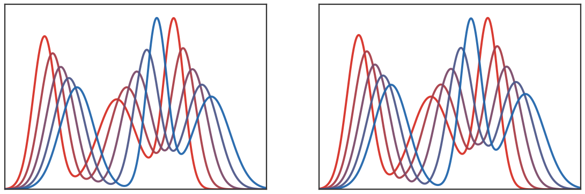</a> 
  <strong>Wasserstein over Wasserstein for asymmetric mixtures</strong> 
  <a href="kantorovich-wow-mixtures.ipynb">Open notebook</a> &middot; 
</td>

<td width="33%" align="center" valign="top">
  <a href="kantorovich-dro-ambiguity.ipynb">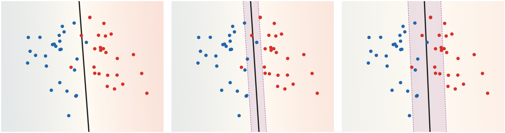</a> 
  <strong>Wasserstein DRO logistic boundaries</strong> 
  <a href="kantorovich-dro-ambiguity.ipynb">Open notebook</a> &middot; 
</td>

</tr>
</table>

## Dual Problem

<table>
<tr>

<td width="33%" align="center" valign="top">
  <a href="dual-kantorovich-discrete-potentials.ipynb">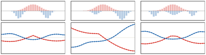</a> 
  <strong>Discrete Kantorovich dual potentials</strong> 
  <a href="dual-kantorovich-discrete-potentials.ipynb">Open notebook</a> &middot; 
</td>

<td width="33%" align="center" valign="top">
  <a href="dual-kantorovich-continuous-potentials.ipynb">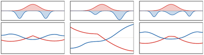</a> 
  <strong>Continuous Kantorovich dual potentials</strong> 
  <a href="dual-kantorovich-continuous-potentials.ipynb">Open notebook</a> &middot; 
</td>

<td width="33%" align="center" valign="top">
  <a href="dual-complementary-slackness-contacts.ipynb">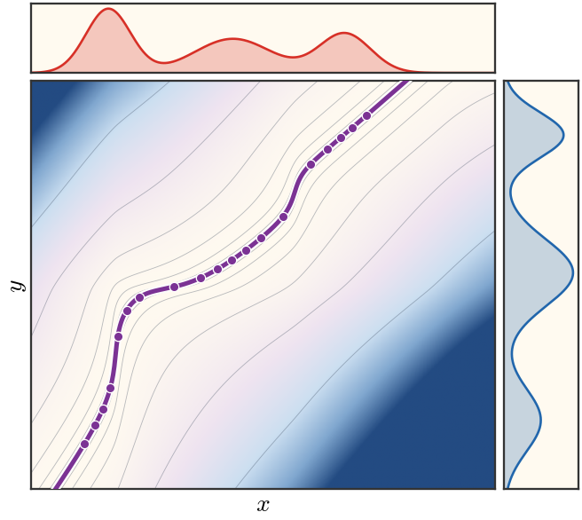</a> 
  <strong>Complementary slackness contacts</strong> 
  <a href="dual-complementary-slackness-contacts.ipynb">Open notebook</a> &middot; 
</td>

</tr>
</table>

<table>
<tr>

<td width="33%" align="center" valign="top">
  <a href="dual-c-transform-envelope.ipynb">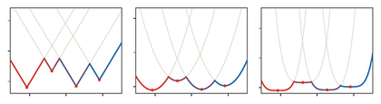</a> 
  <strong>Discrete c-transform lower envelopes</strong> 
  <a href="dual-c-transform-envelope.ipynb">Open notebook</a> &middot; 
</td>

<td width="33%" align="center" valign="top">
  <a href="dual-alternating-c-transform-failure.ipynb">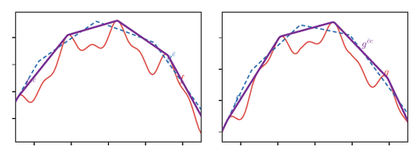</a> 
  <strong>Concave closures from hard c-transforms</strong> 
  <a href="dual-alternating-c-transform-failure.ipynb">Open notebook</a> &middot; 
</td>

<td width="33%" align="center" valign="top">
  <a href="dual-auction-progression.ipynb">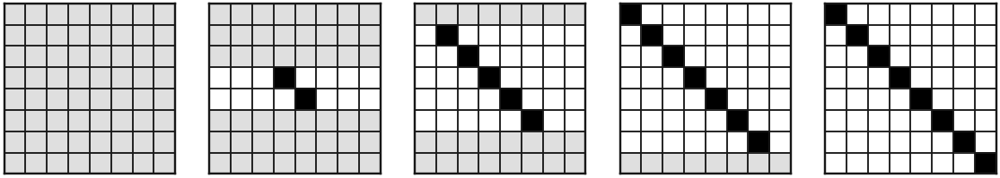</a> 
  <strong>Auction algorithm progression</strong> 
  <a href="dual-auction-progression.ipynb">Open notebook</a> &middot; 
</td>

</tr>
</table>

## Semi-discrete and $W_1$

<table>
<tr>

<td width="25%" align="center" valign="top">
  <a href="semidiscrete-laguerre-cells.ipynb">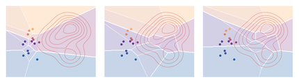</a> 
  <strong>Semi-discrete Laguerre cells</strong> 
  <a href="semidiscrete-laguerre-cells.ipynb">Open notebook</a> &middot; 
</td>

<td width="25%" align="center" valign="top">
  <a href="semidiscrete-weight-gradient-cells.ipynb">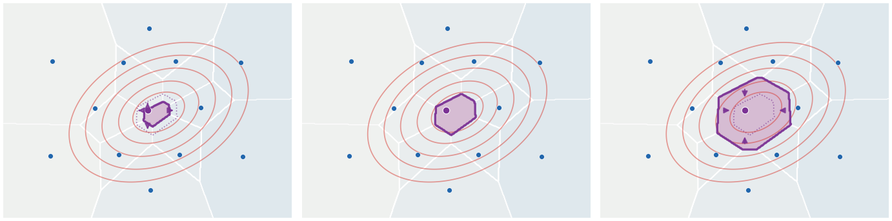</a> 
  <strong>Semi-discrete weight-gradient cells</strong> 
  <a href="semidiscrete-weight-gradient-cells.ipynb">Open notebook</a> &middot; 
</td>

<td width="25%" align="center" valign="top">
  <a href="semidiscrete-lloyd-quantization.ipynb">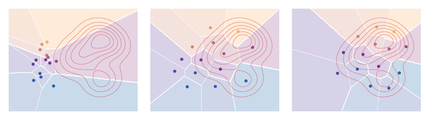</a> 
  <strong>Lloyd quantization of a continuous density</strong> 
  <a href="semidiscrete-lloyd-quantization.ipynb">Open notebook</a> &middot; 
</td>

<td width="25%" align="center" valign="top">
  <a href="semidiscrete-lloyd-flow-mixtures.ipynb">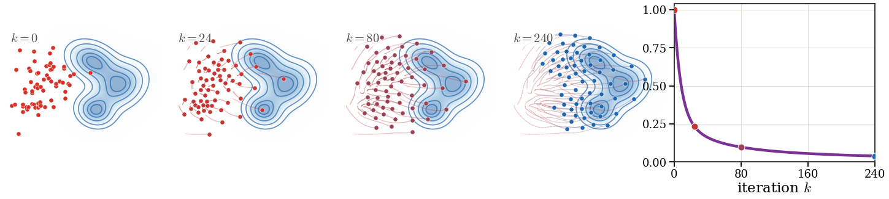</a> 
  <strong>Continuous Lloyd flow between Gaussian mixtures</strong> 
  <a href="semidiscrete-lloyd-flow-mixtures.ipynb">Open notebook</a> &middot; 
</td>

</tr>
</table>

<table>
<tr>

<td width="33%" align="center" valign="top">
  <a href="semidiscrete-quantile-quantization-rates.ipynb">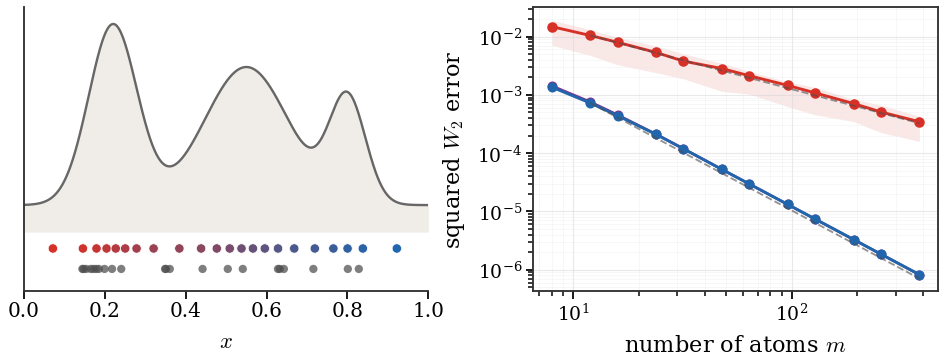</a> 
  <strong>One-dimensional quantile quantization rates</strong> 
  <a href="semidiscrete-quantile-quantization-rates.ipynb">Open notebook</a> &middot; 
</td>

<td width="33%" align="center" valign="top">
  <a href="w1-graph-transport-flow.ipynb">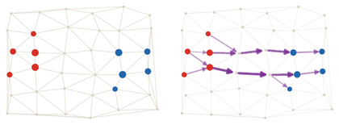</a> 
  <strong>Graph Beckmann flow for W1</strong> 
  <a href="w1-graph-transport-flow.ipynb">Open notebook</a> &middot; 
</td>

<td width="33%"></td>

</tr>
</table>

## Divergences and Dual Norms

<table>
<tr>

<td width="33%" align="center" valign="top">
  <a href="dualnorms-ipm-witnesses.ipynb">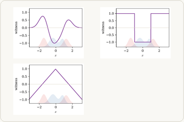</a> 
  <strong>Integral probability metric witnesses</strong> 
  <a href="dualnorms-ipm-witnesses.ipynb">Open notebook</a> &middot; 
</td>

<td width="33%" align="center" valign="top">
  <a href="dualnorms-phi-generators.ipynb">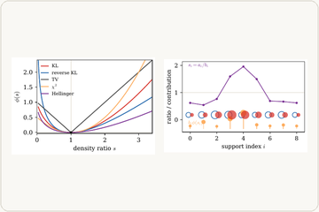</a> 
  <strong>Generator functions for phi-divergences</strong> 
  <a href="dualnorms-phi-generators.ipynb">Open notebook</a> &middot; 
</td>

<td width="33%"></td>

</tr>
</table>

## Entropic Regularization: Sinkhorn Algorithm

<table>
<tr>

<td width="33%" align="center" valign="top">
  <a href="sinkhorn-entropy-lp-geometry.ipynb">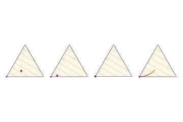</a> 
  <strong>Entropic regularization on a transport polytope</strong> 
  <a href="sinkhorn-entropy-lp-geometry.ipynb">Open notebook</a> &middot; 
</td>

<td width="33%" align="center" valign="top">
  <a href="sinkhorn-marginal-errors.ipynb">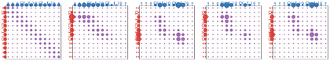</a> 
  <strong>Marginal constraints during Sinkhorn scaling</strong> 
  <a href="sinkhorn-marginal-errors.ipynb">Open notebook</a> &middot; 
</td>

<td width="33%" align="center" valign="top">
  <a href="sinkhorn-continuous-marginal-scaling.ipynb">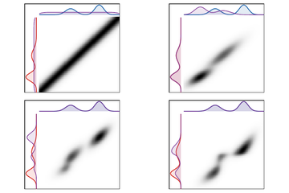</a> 
  <strong>Dense Sinkhorn marginal scaling</strong> 
  <a href="sinkhorn-continuous-marginal-scaling.ipynb">Open notebook</a> &middot; 
</td>

</tr>
</table>

<table>
<tr>

<td width="33%" align="center" valign="top">
  <a href="sinkhorn-coupling-iterations.ipynb">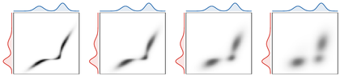</a> 
  <strong>Entropic plans as epsilon changes</strong> 
  <a href="sinkhorn-coupling-iterations.ipynb">Open notebook</a> &middot; 
</td>

<td width="33%" align="center" valign="top">
  <a href="sinkhorn-potentials-iterations.ipynb">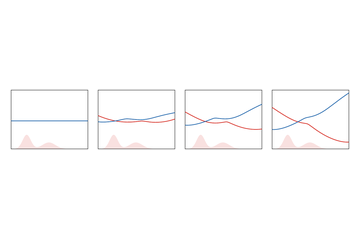</a> 
  <strong>Sinkhorn potentials along the iteration</strong> 
  <a href="sinkhorn-potentials-iterations.ipynb">Open notebook</a> &middot; 
</td>

<td width="33%" align="center" valign="top">
  <a href="sinkhorn-linear-rate-epsilon.ipynb">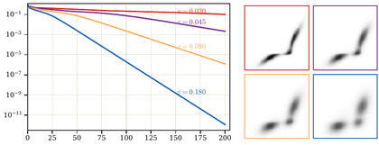</a> 
  <strong>Sinkhorn marginal error rates</strong> 
  <a href="sinkhorn-linear-rate-epsilon.ipynb">Open notebook</a> &middot; 
</td>

</tr>
</table>

<table>
<tr>

<td width="33%" align="center" valign="top">
  <a href="sinkhorn-geodesics-in-heat.ipynb">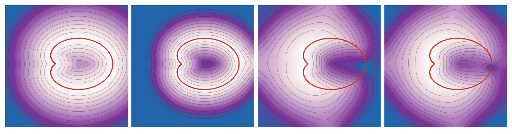</a> 
  <strong>Geodesics in heat for a curve</strong> 
  <a href="sinkhorn-geodesics-in-heat.ipynb">Open notebook</a> &middot; 
</td>

<td width="33%" align="center" valign="top">
  <a href="sinkhorn-hopf-cole-transform.ipynb">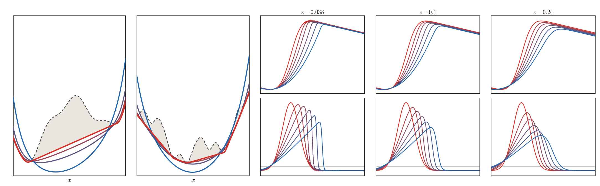</a> 
  <strong>Soft biconjugates and Burgers</strong> 
  <a href="sinkhorn-hopf-cole-transform.ipynb">Open notebook</a> &middot; 
</td>

<td width="33%" align="center" valign="top">
   
  <strong>Path-space Brownian bridges</strong> 
  <a href="sinkhorn-path-space-bridges.ipynb">Open notebook</a> &middot; 
</td>

</tr>
</table>

<table>
<tr>

<td width="33%" align="center" valign="top">
   
  <strong>Sinkhorn dual potentials as epsilon changes</strong> 
  <a href="sinkhorn-dual-potentials-epsilon.ipynb">Open notebook</a> &middot; 
</td>

<td width="33%" align="center" valign="top">
   
  <strong>Entropic couplings as epsilon changes</strong> 
  <a href="sinkhorn-plan-epsilon.ipynb">Open notebook</a> &middot; 
</td>

</tr>
</table>

<table>
<tr>

<td width="33%" align="center" valign="top">
   
  <strong>Soft c-transforms as epsilon decreases</strong> 
  <a href="sinkhorn-soft-c-transform-epsilon.ipynb">Open notebook</a> &middot; 
</td>

<td width="33%" align="center" valign="top">
   
  <strong>Generalized phi-soft c-transforms</strong> 
  <a href="sinkhorn-phi-soft-c-transforms.ipynb">Open notebook</a> &middot; 
</td>

<td width="33%" align="center" valign="top">
   
  <strong>Regularized couplings and entropy choice</strong> 
  <a href="sinkhorn-entropic-versus-quadratic-regularization.ipynb">Open notebook</a> &middot; 
</td>

</tr>
</table>

<table>
<tr>

<td width="33%" align="center" valign="top">
   
  <strong>Sinkhorn debiasing by point optimization</strong> 
  <a href="sinkhorn-divergence-debiasing.ipynb">Open notebook</a> &middot; 
</td>

<td width="33%" align="center" valign="top">
   
  <strong>Complex Sinkhorn potentials</strong> 
  <a href="sinkhorn-complex-epsilon-continuation.ipynb">Open notebook</a> &middot; 
</td>

</tr>
</table>

## Entropic Regularization: Convergence

<table>
<tr>

<td width="33%" align="center" valign="top">
   
  <strong>Continuous ε-Sinkhorn flow</strong> 
  <a href="sinkhorn-continuous-epsilon-flow.ipynb">Open notebook</a> &middot; 
</td>

<td width="33%" align="center" valign="top">
   
  <strong>Empirical fluctuations of regularized losses</strong> 
  <a href="sinkhorn-bias-variance-tradeoff.ipynb">Open notebook</a> &middot; 
</td>

<td width="33%" align="center" valign="top">
   
  <strong>Monotone non-variational scaling</strong> 
  <a href="sinkhorn-mfunctions-nonvariational-scaling.ipynb">Open notebook</a> &middot; 
</td>

</tr>
</table>

## Generalized Wasserstein Distances

<table>
<tr>

<td width="33%" align="center" valign="top">
   
  <strong>Partial OT active mass selection</strong> 
  <a href="partial-ot-active-mass.ipynb">Open notebook</a> &middot; 
</td>

<td width="33%" align="center" valign="top">
   
  <strong>Partial OT active regions between shapes</strong> 
  <a href="partial-ot-shape-active-mass.ipynb">Open notebook</a> &middot; 
</td>

<td width="33%" align="center" valign="top">
   
  <strong>Unbalanced OT and KL mass relaxation</strong> 
  <a href="unbalanced-mass-relaxation.ipynb">Open notebook</a> &middot; 
</td>

</tr>
<tr>

<td width="33%" align="center" valign="top">
   
  <strong>Unbalanced OT and marginal divergences</strong> 
  <a href="unbalanced-divergence-choice.ipynb">Open notebook</a> &middot; 
</td>

</tr>
</table>

<table>
<tr>

<td width="33%" align="center" valign="top">
   
  <strong>Sliced Wasserstein projections</strong> 
  <a href="sliced-wasserstein-projections.ipynb">Open notebook</a> &middot; 
</td>

<td width="33%" align="center" valign="top">
   
  <strong>Min-sliced lifted transport plan</strong> 
  <a href="min-sliced-transport-plan.ipynb">Open notebook</a> &middot; 
</td>

<td width="33%" align="center" valign="top">
   
  <strong>Wasserstein--Procrustes rigid alignment</strong> 
  <a href="wasserstein-procrustes-rigid-motion.ipynb">Open notebook</a> &middot; 
</td>

</tr>
</table>

<table>
<tr>

<td width="33%" align="center" valign="top">
   
  <strong>Linear OT tangent coordinates</strong> 
  <a href="dualnorms-linear-ot-embedding.ipynb">Open notebook</a> &middot; 
</td>

<td width="33%" align="center" valign="top">
   
  <strong>One-dimensional linear OT PCA</strong> 
  <a href="linear-ot-1d-pca.ipynb">Open notebook</a> &middot; 
</td>

<td width="33%" align="center" valign="top">
   
  <strong>Linear OT PCA on MNIST zeros</strong> 
  <a href="linear-ot-mnist-pca.ipynb">Open notebook</a> &middot; 
</td>

</tr>
</table>

<table>
<tr>

<td width="33%" align="center" valign="top">
   
  <strong>Spectral gauges of displacement covariances</strong> 
  <a href="spectral-wasserstein-gauge.ipynb">Open notebook</a> &middot; 
</td>

</tr>
</table>

## Generalized OT Problems

<table>
<tr>

<td width="33%" align="center" valign="top">
   
  <strong>Wasserstein barycenters of four shapes</strong> 
  <a href="barycenters-four-shapes.ipynb">Open notebook</a> &middot; 
</td>

<td width="33%" align="center" valign="top">
   
  <strong>Gaussian covariance barycenters</strong> 
  <a href="barycenters-gaussian-covariances.ipynb">Open notebook</a> &middot; 
</td>

<td width="33%" align="center" valign="top">
   
  <strong>Three-marginal Coulomb Sinkhorn</strong> 
  <a href="multimarginal-coulomb-sinkhorn.ipynb">Open notebook</a> &middot; 
</td>

</tr>
</table>

<table>
<tr>

<td width="33%" align="center" valign="top">
   
  <strong>Low-rank entropic OT factorization</strong> 
  <a href="low-rank-ot-factorization.ipynb">Open notebook</a> &middot; 
</td>

<td width="33%" align="center" valign="top">
   
  <strong>Capacity-constrained OT in 1D</strong> 
  <a href="capacity-constrained-ot-1d.ipynb">Open notebook</a> &middot; 
</td>

<td width="33%" align="center" valign="top">
   
  <strong>Capacity-constrained local couplings</strong> 
  <a href="capacity-constrained-ot-2d.ipynb">Open notebook</a> &middot; 
</td>

</tr>
</table>

<table>
<tr>

<td width="33%" align="center" valign="top">
   
  <strong>Metric learning as cost deformation</strong> 
  <a href="metric-learning-cost-deformation.ipynb">Open notebook</a> &middot; 
</td>

<td width="33%" align="center" valign="top">
   
  <strong>Forward OT solutions for bilinear logo costs</strong> 
  <a href="inverse-ot-bilinear-logo-map.ipynb">Open notebook</a> &middot; 
</td>

</tr>
</table>

<table>
<tr>

<td width="33%" align="center" valign="top">
   
  <strong>Inverse OT gap loss on Gaussian mixtures</strong> 
  <a href="inverse-ot-gap-loss.ipynb">Open notebook</a> &middot; 
</td>

<td width="33%" align="center" valign="top">
   
  <strong>Weak OT and barycentric projection</strong> 
  <a href="weak-ot-barycentric-projection.ipynb">Open notebook</a> &middot; 
</td>

<td width="33%" align="center" valign="top">
   
  <strong>Martingale OT with centered kernels</strong> 
  <a href="martingale-ot-centered-kernels.ipynb">Open notebook</a> &middot; 
</td>

</tr>
</table>

## Beyond Comparing Measures

<table>
<tr>

<td width="33%" align="center" valign="top">
   
  <strong>Positive vector-valued coupled transport</strong> 
  <a href="vector-valued-measure-geodesics.ipynb">Open notebook</a> &middot; 
</td>

<td width="33%" align="center" valign="top">
   
  <strong>Positive matrix-valued coupled transport</strong> 
  <a href="matrix-valued-measure-geodesic.ipynb">Open notebook</a> &middot; 
</td>

<td width="33%" align="center" valign="top">
   
  <strong>Gromov-Wasserstein matching of isometric shapes</strong> 
  <a href="gromov-isometry-matching.ipynb">Open notebook</a> &middot; 
</td>

</tr>
</table>

<table>
<tr>

<td width="33%" align="center" valign="top">
   
  <strong>Gromov-Wasserstein distortion for non-isometric shapes</strong> 
  <a href="gromov-nonisometric-distortion.ipynb">Open notebook</a> &middot; 
</td>

<td width="33%" align="center" valign="top">
   
  <strong>Fused Gromov-Wasserstein: features versus geometry</strong> 
  <a href="fused-gromov-feature-geometry.ipynb">Open notebook</a> &middot; 
</td>

<td width="33%"></td>

</tr>
</table>

## Dynamic Optimal Transport

<table>
<tr>

<td width="33%" align="center" valign="top">
   
  <strong>Benamou-Brenier primal-dual solutions</strong> 
  <a href="dynamic-benamou-brenier-duality.ipynb">Open notebook</a> &middot; 
</td>

<td width="33%" align="center" valign="top">
   
  <strong>Benamou-Brenier geodesic</strong> 
  <a href="dynamic-benamou-brenier-geodesic.ipynb">Open notebook</a> &middot; 
</td>

<td width="33%" align="center" valign="top">
   
  <strong>One-dimensional balanced and unbalanced dynamic geodesics</strong> 
  <a href="dynamic-unbalanced-geodesic.ipynb">Open notebook</a> &middot; 
</td>

</tr>
<tr>

<td width="33%" align="center" valign="top">
   
  <strong>Discrete Wasserstein distances on Markov-chain simplices</strong> 
  <a href="discrete-markov-simplex-distances.ipynb">Open notebook</a> &middot; 
</td>

<td width="33%"></td>

<td width="33%"></td>

</tr>
</table>

## Wasserstein Gradient Flows

<table>
<tr>

<td width="25%" align="center" valign="top">
   
  <strong>JKO steps for the entropy flow</strong> 
  <a href="gradflow-jko-entropy-steps.ipynb">Open notebook</a> &middot; 
</td>

<td width="25%" align="center" valign="top">
   
  <strong>Heat flow and porous-medium powers</strong> 
  <a href="gradflow-heat-versus-porous-medium.ipynb">Open notebook</a> &middot; 
</td>

<td width="25%" align="center" valign="top">
   
  <strong>Fractional Laplacian diffusion</strong> 
  <a href="gradflow-fractional-laplacian-diffusion.ipynb">Open notebook</a> &middot; 
</td>

<td width="25%" align="center" valign="top">
   
  <strong>Particle count for squared-MMD flow</strong> 
  <a href="gradflow-mmd-particle-count.ipynb">Open notebook</a> &middot; 
</td>

</tr>
</table>

<table>
<tr>

<td width="33%" align="center" valign="top">
   
  <strong>Interaction-energy particle flow</strong> 
  <a href="gradflow-interaction-particles.ipynb">Open notebook</a> &middot; 
</td>

<td width="33%" align="center" valign="top">
   
  <strong>Particle trajectories for different discrepancy geometries</strong> 
  <a href="gradflow-particle-objective-geometries.ipynb">Open notebook</a> &middot; 
</td>

<td width="33%" align="center" valign="top">
   
  <strong>Three Fokker-Planck representations</strong> 
  <a href="gradflow-fokker-planck-three-representations.ipynb">Open notebook</a> &middot; 
</td>

</tr>
</table>

<table>
<tr>

<td width="33%" align="center" valign="top">
   
  <strong>Density-constrained gradient flow</strong> 
  <a href="gradflow-density-constrained-flow.ipynb">Open notebook</a> &middot; 
</td>

<td width="33%" align="center" valign="top">
   
  <strong>Multi-species entropy flow</strong> 
  <a href="gradflow-multispecies-entropy-flow.ipynb">Open notebook</a> &middot; 
</td>

<td width="33%" align="center" valign="top">
   
  <strong>Balanced and unbalanced WFR gradient flows</strong> 
  <a href="gradflow-wfr-unbalanced-flow.ipynb">Open notebook</a> &middot; 
</td>

</tr>
</table>

<table>
<tr>

<td width="33%" align="center" valign="top">
   
  <strong>Homogeneous ReLU mean-field flow</strong> 
  <a href="gradflow-mlp-homogeneous-relu.ipynb">Open notebook</a> &middot; 
</td>

<td width="33%" align="center" valign="top">
   
  <strong>Brunn-Minkowski through affine OT</strong> 
  <a href="gradflow-brunn-minkowski-ot.ipynb">Open notebook</a> &middot; 
</td>

<td width="33%" align="center" valign="top">
   
  <strong>HWI and entropy decay</strong> 
  <a href="gradflow-hwi-entropy-decay.ipynb">Open notebook</a> &middot; 
</td>

</tr>
</table>

<table>
<tr>

<td width="33%" align="center" valign="top">
   
  <strong>First-order and Newton MMD particle flows</strong> 
  <a href="gradflow-second-order-momentum-mmd.ipynb">Open notebook</a> &middot; 
</td>

<td width="33%" align="center" valign="top">
   
  <strong>Finite-difference inertial entropy flow</strong> 
  <a href="gradflow-second-order-momentum-entropy.ipynb">Open notebook</a> &middot; 
</td>

<td width="33%" align="center" valign="top">
   
  <strong>W2 versus Muon ReLU mean-field flow</strong> 
  <a href="gradflow-mlp-w2-vs-muon.ipynb">Open notebook</a> &middot; 
</td>

</tr>
</table>

## Generative Models via Transportation

<table>
<tr>

<td width="33%" align="center" valign="top">
   
  <strong>Flow matching: stochastic interpolants</strong> 
  <a href="generative-flow-matching-interpolants.ipynb">Open notebook</a> &middot; 
</td>

<td width="33%" align="center" valign="top">
   
  <strong>One-dimensional diffusion bridge</strong> 
  <a href="generative-diffusion-1d-forward-backward.ipynb">Open notebook</a> &middot; 
</td>

<td width="33%" align="center" valign="top">
   
  <strong>Two-dimensional diffusion bridge</strong> 
  <a href="generative-diffusion-2d-forward-backward.ipynb">Open notebook</a> &middot; 
</td>

</tr>
</table>

<table>
<tr>

<td width="33%" align="center" valign="top">
   
  <strong>Diffusion trajectories versus OT rays</strong> 
  <a href="generative-diffusion-versus-ot-2d.ipynb">Open notebook</a> &middot; 
</td>

<td width="33%" align="center" valign="top">
   
  <strong>Diffusion schedule comparison</strong> 
  <a href="generative-diffusion-versus-ot-2d.ipynb">Open notebook</a> &middot; 
</td>

<td width="33%" align="center" valign="top">
   
  <strong>Drifting fields for a small particle generator</strong> 
  <a href="generative-drifting-model-trajectories.ipynb">Open notebook</a> &middot; 
</td>

</tr>
</table>

<table>
<tr>

<td width="33%" align="center" valign="top">
   
  <strong>Forward moment-measure construction</strong> 
  <a href="moment-measure-forward-map.ipynb">Open notebook</a> &middot; 
</td>

<td width="33%" align="center" valign="top">
   
  <strong>Mean-shift PDE for Gaussian-kernel attention</strong> 
  <a href="generative-mean-shift-pde.ipynb">Open notebook</a> &middot; 
</td>

<td width="33%" align="center" valign="top">
   
  <strong>Gaussian closure of a Wasserstein flow</strong> 
  <a href="gradflow-gaussian-closure.ipynb">Open notebook</a> &middot; 
</td>

</tr>
</table>

## Roadmap and Archive

Archived or exploratory notebooks are intentionally omitted from this gallery.
See [`figures.md`](figures.md) for the figure roadmap and
[`removed/`](removed/) for retired notebooks.
