# Figure Notebooks

This directory contains the executable notebooks used to generate the illustrative figures for the OT4ML book. Each notebook writes one or several PDF panels to `../latex/figures/<figure-name>/`; the thumbnails below are compact PNG previews rendered from those PDFs.

**Gallery status.** 77 notebooks, 77 roadmap entries, thumbnails in [`thumbnails/`](thumbnails/).

Open a notebook locally from the **Notebook** link, or launch it in Google Colab from the **Colab** badge. The Colab links target the `main` branch of [`gpeyre/ot4ml`](https://github.com/gpeyre/ot4ml).

## Optimal Matching between Point Clouds

<table>
<tr>
<td width="33%" align="center" valign="top">
   
  <strong>One-dimensional quantile assignment</strong> 
  <a href="matching-1d-quantile-assignment.ipynb">Notebook</a> &middot;   
</td>
<td width="33%" align="center" valign="top">
   
  <strong>Two-dimensional assignments for different cost exponents</strong> 
  <a href="matching-2d-cost-exponent.ipynb">Notebook</a> &middot;   
</td>
<td width="33%" align="center" valign="top">
   
  <strong>Resolution and nonuniform weights in discrete transport</strong> 
  <a href="matching-resolution-and-weights.ipynb">Notebook</a> &middot;   
</td>
</tr>
</table>

## Monge Problem between Measures

<table>
<tr>
<td width="33%" align="center" valign="top">
   
  <strong>Histogram equalization as one-dimensional Monge transport</strong> 
  <a href="monge-histogram-equalization.ipynb">Notebook</a> &middot;   
</td>
<td width="33%" align="center" valign="top">
   
  <strong>McCann interpolation between two shapes</strong> 
  <a href="monge-shape-mccann-interpolation.ipynb">Notebook</a> &middot;   
</td>
<td width="33%" align="center" valign="top">
   
  <strong>RGB color transfer by a Monge map</strong> 
  <a href="monge-color-transfer-rgb.ipynb">Notebook</a> &middot;   
</td>
</tr>
</table>

<table>
<tr>
<td width="33%" align="center" valign="top">
   
  <strong>One-dimensional quantile geodesics</strong> 
  <a href="monge-1d-quantile-geodesic.ipynb">Notebook</a> &middot;   
</td>
<td width="33%" align="center" valign="top">
   
  <strong>Linearized transport coordinates</strong> 
  <a href="monge-linearized-transport-coordinates.ipynb">Notebook</a> &middot;   
</td>
<td width="33%" align="center" valign="top">
   
  <strong>Wasserstein Geodesics Between Gaussian Measures</strong> 
  <a href="monge-gaussian-w2-geodesic.ipynb">Notebook</a> &middot;   
</td>
</tr>
</table>

<table>
<tr>
<td width="33%" align="center" valign="top">
  <a href="monge-bures-spd-geodesic.ipynb">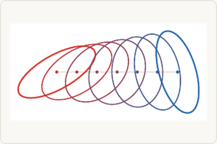</a> 
  <strong>Bures Geodesic on Covariance Matrices</strong> 
  <a href="monge-bures-spd-geodesic.ipynb">Notebook</a> &middot;   
</td>
<td width="33%"></td>
<td width="33%"></td>
</tr>
</table>

## Kantorovich Relaxation

<table>
<tr>
<td width="33%" align="center" valign="top">
   
  <strong>Couplings as transport polylines</strong> 
  <a href="kantorovich-coupling-polylines.ipynb">Notebook</a> &middot;   
</td>
<td width="33%" align="center" valign="top">
   
  <strong>Coupling matrices with marginals</strong> 
  <a href="kantorovich-coupling-matrix-marginals.ipynb">Notebook</a> &middot;   
</td>
<td width="33%" align="center" valign="top">
   
  <strong>Discrete gluing lemma</strong> 
  <a href="kantorovich-discrete-gluing-lemma.ipynb">Notebook</a> &middot;   
</td>
</tr>
</table>

<table>
<tr>
<td width="33%" align="center" valign="top">
   
  <strong>From permutation matrices to splitting couplings</strong> 
  <a href="kantorovich-permutation-versus-splitting.ipynb">Notebook</a> &middot;   
</td>
<td width="33%" align="center" valign="top">
   
  <strong>McCann interpolation from a transport plan</strong> 
  <a href="kantorovich-plan-interpolation.ipynb">Notebook</a> &middot;   
</td>
<td width="33%" align="center" valign="top">
   
  <strong>Quantitative central-limit theorem</strong> 
  <a href="matching-quantitative-clt.ipynb">Notebook</a> &middot;   
</td>
</tr>
</table>

<table>
<tr>
<td width="33%" align="center" valign="top">
  <a href="kantorovich-cyclical-monotonicity.ipynb">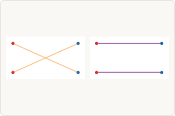</a> 
  <strong>Cyclical monotonicity as absence of crossings</strong> 
  <a href="kantorovich-cyclical-monotonicity.ipynb">Notebook</a> &middot;   
</td>
<td width="33%" align="center" valign="top">
  <a href="kantorovich-wasserstein-infinity.ipynb">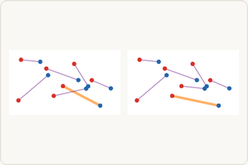</a> 
  <strong>The Bottleneck Viewpoint of $\mathcal W_\infty$</strong> 
  <a href="kantorovich-wasserstein-infinity.ipynb">Notebook</a> &middot;   
</td>
<td width="33%"></td>
</tr>
</table>

## Sinkhorn

<table>
<tr>
<td width="33%" align="center" valign="top">
   
  <strong>Entropic regularization on a transport polytope</strong> 
  <a href="sinkhorn-entropy-lp-geometry.ipynb">Notebook</a> &middot;   
</td>
<td width="33%" align="center" valign="top">
   
  <strong>Marginal constraints during Sinkhorn scaling</strong> 
  <a href="sinkhorn-marginal-errors.ipynb">Notebook</a> &middot;   
</td>
<td width="33%" align="center" valign="top">
   
  <strong>Dense Sinkhorn marginal scaling</strong> 
  <a href="sinkhorn-continuous-marginal-scaling.ipynb">Notebook</a> &middot;   
</td>
</tr>
</table>

<table>
<tr>
<td width="33%" align="center" valign="top">
   
  <strong>Coupling matrices along Sinkhorn iterations</strong> 
  <a href="sinkhorn-coupling-iterations.ipynb">Notebook</a> &middot;   
</td>
<td width="33%" align="center" valign="top">
   
  <strong>Sinkhorn potentials along the iteration</strong> 
  <a href="sinkhorn-potentials-iterations.ipynb">Notebook</a> &middot;   
</td>
<td width="33%" align="center" valign="top">
   
  <strong>Sinkhorn marginal error rates</strong> 
  <a href="sinkhorn-linear-rate-epsilon.ipynb">Notebook</a> &middot;   
</td>
</tr>
</table>

<table>
<tr>
<td width="33%" align="center" valign="top">
   
  <strong>Sinkhorn dual potentials as epsilon changes</strong> 
  <a href="sinkhorn-dual-potentials-epsilon.ipynb">Notebook</a> &middot;   
</td>
<td width="33%" align="center" valign="top">
   
  <strong>Entropic plans as the temperature changes</strong> 
  <a href="sinkhorn-plan-epsilon.ipynb">Notebook</a> &middot;   
</td>
<td width="33%"></td>
</tr>
</table>

## Dual Problem

<table>
<tr>
<td width="33%" align="center" valign="top">
   
  <strong>Discrete Kantorovich dual potentials</strong> 
  <a href="dual-kantorovich-discrete-potentials.ipynb">Notebook</a> &middot;   
</td>
<td width="33%" align="center" valign="top">
   
  <strong>Continuous Kantorovich dual potentials</strong> 
  <a href="dual-kantorovich-continuous-potentials.ipynb">Notebook</a> &middot;   
</td>
<td width="33%" align="center" valign="top">
   
  <strong>Discrete c-transform lower envelopes</strong> 
  <a href="dual-c-transform-envelope.ipynb">Notebook</a> &middot;   
</td>
</tr>
</table>

<table>
<tr>
<td width="33%" align="center" valign="top">
  <a href="dual-euclidean-potential-map.ipynb">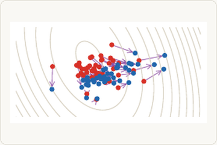</a> 
  <strong>Euclidean Dual Potential and Induced Brenier Map</strong> 
  <a href="dual-euclidean-potential-map.ipynb">Notebook</a> &middot;   
</td>
<td width="33%" align="center" valign="top">
   
  <strong>Concave closures from hard c-transforms</strong> 
  <a href="dual-alternating-c-transform-failure.ipynb">Notebook</a> &middot;   
</td>
<td width="33%"></td>
</tr>
</table>

## Semi-discrete and Wasserstein-1

<table>
<tr>
<td width="33%" align="center" valign="top">
   
  <strong>Semi-discrete Laguerre cells</strong> 
  <a href="semidiscrete-laguerre-cells.ipynb">Notebook</a> &middot;   
</td>
<td width="33%" align="center" valign="top">
   
  <strong>Lloyd quantization of a continuous density</strong> 
  <a href="semidiscrete-lloyd-quantization.ipynb">Notebook</a> &middot;   
</td>
<td width="33%" align="center" valign="top">
  <a href="w1-kantorovich-rubinstein-potential.ipynb">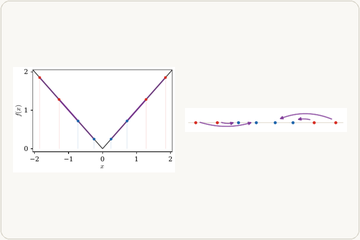</a> 
  <strong>Kantorovich--Rubinstein potential for $\Wass_1$</strong> 
  <a href="w1-kantorovich-rubinstein-potential.ipynb">Notebook</a> &middot;   
</td>
</tr>
</table>

<table>
<tr>
<td width="33%" align="center" valign="top">
   
  <strong>Graph Beckmann flow for W1</strong> 
  <a href="w1-graph-transport-flow.ipynb">Notebook</a> &middot;   
</td>
<td width="33%"></td>
<td width="33%"></td>
</tr>
</table>

## Divergences and Dual Norms

<table>
<tr>
<td width="33%" align="center" valign="top">
   
  <strong>Witness Functions for Integral Probability Metrics</strong> 
  <a href="dualnorms-ipm-witnesses.ipynb">Notebook</a> &middot;   
</td>
<td width="33%" align="center" valign="top">
  <a href="dualnorms-mmd-kernel-mean-embedding.ipynb">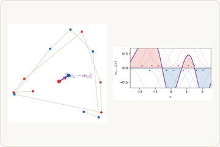</a> 
  <strong>MMD as a Kernel Mean Embedding</strong> 
  <a href="dualnorms-mmd-kernel-mean-embedding.ipynb">Notebook</a> &middot;   
</td>
<td width="33%" align="center" valign="top">
   
  <strong>Linear OT Tangent Coordinates</strong> 
  <a href="dualnorms-linear-ot-embedding.ipynb">Notebook</a> &middot;   
</td>
</tr>
</table>

<table>
<tr>
<td width="33%" align="center" valign="top">
   
  <strong>Generator Functions for $\phi$-Divergences</strong> 
  <a href="dualnorms-phi-generators.ipynb">Notebook</a> &middot;   
</td>
<td width="33%"></td>
<td width="33%"></td>
</tr>
</table>

## Advanced Topics on Entropic Regularization

<table>
<tr>
<td width="33%" align="center" valign="top">
   
  <strong>Soft $c$-Transforms</strong> 
  <a href="sinkhorn-soft-c-transform-epsilon.ipynb">Notebook</a> &middot;   
</td>
<td width="33%" align="center" valign="top">
   
  <strong>Regularized Couplings and Entropy Choice</strong> 
  <a href="sinkhorn-entropic-versus-quadratic-regularization.ipynb">Notebook</a> &middot;   
</td>
<td width="33%" align="center" valign="top">
  <a href="sinkhorn-gaussian-regularized-geodesic.ipynb">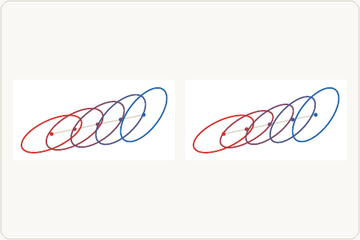</a> 
  <strong>Gaussian Entropic Interpolation</strong> 
  <a href="sinkhorn-gaussian-regularized-geodesic.ipynb">Notebook</a> &middot;   
</td>
</tr>
</table>

<table>
<tr>
<td width="33%" align="center" valign="top">
   
  <strong>Sinkhorn Debiasing by Point Optimization</strong> 
  <a href="sinkhorn-divergence-debiasing.ipynb">Notebook</a> &middot;   
</td>
<td width="33%" align="center" valign="top">
   
  <strong>Empirical Decay of OT, MMD, and Sinkhorn</strong> 
  <a href="sinkhorn-bias-variance-tradeoff.ipynb">Notebook</a> &middot;   
</td>
<td width="33%"></td>
</tr>
</table>

## Generalized Wasserstein Distances

<table>
<tr>
<td width="33%" align="center" valign="top">
   
  <strong>Unbalanced OT and KL Mass Relaxation</strong> 
  <a href="unbalanced-mass-relaxation.ipynb">Notebook</a> &middot;   
</td>
<td width="33%" align="center" valign="top">
   
  <strong>Unbalanced OT: Choice of Marginal Divergence</strong> 
  <a href="unbalanced-divergence-choice.ipynb">Notebook</a> &middot;   
</td>
<td width="33%" align="center" valign="top">
   
  <strong>Sliced Wasserstein Projections</strong> 
  <a href="sliced-wasserstein-projections.ipynb">Notebook</a> &middot;   
</td>
</tr>
</table>

<table>
<tr>
<td width="33%" align="center" valign="top">
   
  <strong>Min-Sliced Lifted Transport Plan</strong> 
  <a href="min-sliced-transport-plan.ipynb">Notebook</a> &middot;   
</td>
<td width="33%" align="center" valign="top">
   
  <strong>Spectral Gauges of Displacement Covariances</strong> 
  <a href="spectral-wasserstein-gauge.ipynb">Notebook</a> &middot;   
</td>
<td width="33%" align="center" valign="top">
  <a href="subspace-robust-wasserstein.ipynb">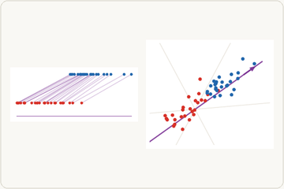</a> 
  <strong>Subspace Robust Wasserstein</strong> 
  <a href="subspace-robust-wasserstein.ipynb">Notebook</a> &middot;   
</td>
</tr>
</table>

## Generalized OT Problems

<table>
<tr>
<td width="33%" align="center" valign="top">
   
  <strong>Wasserstein Barycenters of Four Shapes</strong> 
  <a href="barycenters-four-shapes.ipynb">Notebook</a> &middot;   
</td>
<td width="33%" align="center" valign="top">
  <a href="barycenters-four-histograms.ipynb">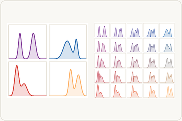</a> 
  <strong>Quantile barycenters of four histograms</strong> 
  <a href="barycenters-four-histograms.ipynb">Notebook</a> &middot;   
</td>
<td width="33%" align="center" valign="top">
   
  <strong>Gaussian covariance barycenters</strong> 
  <a href="barycenters-gaussian-covariances.ipynb">Notebook</a> &middot;   
</td>
</tr>
</table>

<table>
<tr>
<td width="33%" align="center" valign="top">
  <a href="multimarginal-barycenter-coupling.ipynb">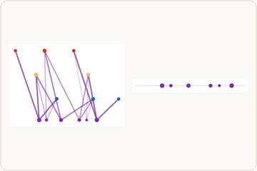</a> 
  <strong>Multi-Marginal Coupling for a Barycenter</strong> 
  <a href="multimarginal-barycenter-coupling.ipynb">Notebook</a> &middot;   
</td>
<td width="33%" align="center" valign="top">
   
  <strong>Metric Learning as Cost Deformation</strong> 
  <a href="metric-learning-cost-deformation.ipynb">Notebook</a> &middot;   
</td>
<td width="33%" align="center" valign="top">
   
  <strong>Weak OT and barycentric projection</strong> 
  <a href="weak-ot-barycentric-projection.ipynb">Notebook</a> &middot;   
</td>
</tr>
</table>

## Beyond Comparing Measures

<table>
<tr>
<td width="33%" align="center" valign="top">
  <a href="matrix-valued-transport-coupling.ipynb">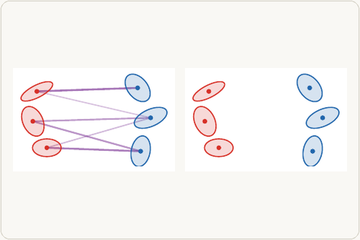</a> 
  <strong>Matrix-valued transport coupling</strong> 
  <a href="matrix-valued-transport-coupling.ipynb">Notebook</a> &middot;   
</td>
<td width="33%" align="center" valign="top">
   
  <strong>Gromov--Wasserstein matching of isometric shapes</strong> 
  <a href="gromov-isometry-matching.ipynb">Notebook</a> &middot;   
</td>
<td width="33%" align="center" valign="top">
   
  <strong>Gromov--Wasserstein distortion for non-isometric shapes</strong> 
  <a href="gromov-nonisometric-distortion.ipynb">Notebook</a> &middot;   
</td>
</tr>
</table>

<table>
<tr>
<td width="33%" align="center" valign="top">
   
  <strong>Fused Gromov--Wasserstein: features versus geometry</strong> 
  <a href="fused-gromov-feature-geometry.ipynb">Notebook</a> &middot;   
</td>
<td width="33%" align="center" valign="top">
  <a href="quantum-ot-coupling-marginals.ipynb">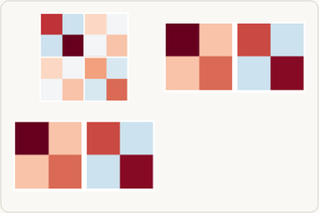</a> 
  <strong>Quantum OT couplings and partial traces</strong> 
  <a href="quantum-ot-coupling-marginals.ipynb">Notebook</a> &middot;   
</td>
<td width="33%" align="center" valign="top">
  <a href="quantum-sinkhorn-scaling.ipynb">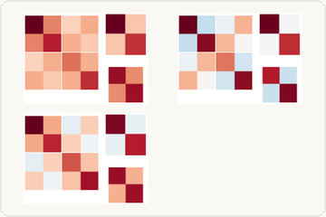</a> 
  <strong>Quantum Sinkhorn and Gurvits scaling</strong> 
  <a href="quantum-sinkhorn-scaling.ipynb">Notebook</a> &middot;   
</td>
</tr>
</table>

## Dynamic Optimal Transport

<table>
<tr>
<td width="33%" align="center" valign="top">
   
  <strong>Continuity equation from particles to density</strong> 
  <a href="dynamic-continuity-equation.ipynb">Notebook</a> &middot;   
</td>
<td width="33%" align="center" valign="top">
  <a href="dynamic-action-kinetic-energy.ipynb">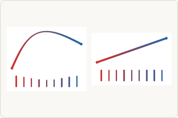</a> 
  <strong>Kinetic action and straight geodesics</strong> 
  <a href="dynamic-action-kinetic-energy.ipynb">Notebook</a> &middot;   
</td>
<td width="33%" align="center" valign="top">
   
  <strong>Benamou--Brenier geodesic</strong> 
  <a href="dynamic-benamou-brenier-geodesic.ipynb">Notebook</a> &middot;   
</td>
</tr>
</table>

## Wasserstein Gradient Flows

<table>
<tr>
<td width="33%" align="center" valign="top">
   
  <strong>JKO steps for the entropy flow</strong> 
  <a href="gradflow-jko-entropy-steps.ipynb">Notebook</a> &middot;   
</td>
<td width="33%" align="center" valign="top">
   
  <strong>Heat flow versus porous-medium flow</strong> 
  <a href="gradflow-heat-versus-porous-medium.ipynb">Notebook</a> &middot;   
</td>
<td width="33%" align="center" valign="top">
   
  <strong>Interaction-energy particle flow</strong> 
  <a href="gradflow-interaction-particles.ipynb">Notebook</a> &middot;   
</td>
</tr>
</table>

<table>
<tr>
<td width="33%" align="center" valign="top">
   
  <strong>Particle trajectories for different discrepancy geometries</strong> 
  <a href="gradflow-particle-objective-geometries.ipynb">Notebook</a> &middot;   
</td>
<td width="33%" align="center" valign="top">
   
  <strong>Homogeneous ReLU mean-field flow</strong> 
  <a href="gradflow-mlp-homogeneous-relu.ipynb">Notebook</a> &middot;   
</td>
<td width="33%"></td>
</tr>
</table>

## General Models via Transportation

<table>
<tr>
<td width="33%" align="center" valign="top">
   
  <strong>Flow matching: stochastic interpolants</strong> 
  <a href="generative-flow-matching-interpolants.ipynb">Notebook</a> &middot;   
</td>
<td width="33%" align="center" valign="top">
   
  <strong>One-dimensional diffusion bridge</strong> 
  <a href="generative-diffusion-1d-forward-backward.ipynb">Notebook</a> &middot;   
</td>
<td width="33%" align="center" valign="top">
   
  <strong>Two-dimensional diffusion bridge</strong> 
  <a href="generative-diffusion-2d-forward-backward.ipynb">Notebook</a> &middot;   
</td>
</tr>
</table>

<table>
<tr>
<td width="33%" align="center" valign="top">
   
  <strong>Diffusion trajectories versus OT rays</strong> 
  <a href="generative-diffusion-versus-ot-2d.ipynb">Notebook</a> &middot;   
</td>
<td width="33%" align="center" valign="top">
   
  <strong>Normalized drifting model trajectories</strong> 
  <a href="generative-drifting-model-trajectories.ipynb">Notebook</a> &middot;   
</td>
<td width="33%" align="center" valign="top">
   
  <strong>Attention as token-measure flow</strong> 
  <a href="transformer-token-measure-flow.ipynb">Notebook</a> &middot;   
</td>
</tr>
</table>

<table>
<tr>
<td width="33%" align="center" valign="top">
   
  <strong>Gaussian closure of a Wasserstein flow</strong> 
  <a href="gradflow-gaussian-closure.ipynb">Notebook</a> &middot;   
</td>
<td width="33%"></td>
<td width="33%"></td>
</tr>
</table>
