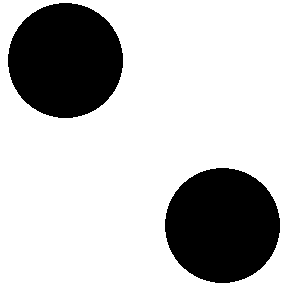
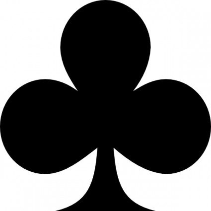

# Figure Plan for OT4ML

This working document lists numerical illustrations to be added to the paper.  Each entry is indexed by the future LaTeX label `fig:<name>`.  The `<name>` part should also be used for the notebook and for the output directory:

- notebook: `notebooks-figures/<name>.ipynb`;
- generated PDFs: `latex/figures/<name>/*.pdf`;
- LaTeX reference: `\label{fig:<name>}`.

The entries below are organized in the order of the current paper sections, and within each section in the order where the figures are expected to appear.  They are figure ideas, not benchmark protocols: every notebook should remain lightweight, reproducible, and visually explanatory.

## Global Figure Conventions

- Status tags:
  - `[planned]` means the figure is specified in this roadmap but has not yet been implemented.
  - `[to revise]` means an existing notebook/PDF/LaTeX figure must be regenerated according to the detailed specification below.
  - `[to review]` means the notebook has been created, the PDFs have been generated, the LaTeX integration has been polished, and the figure is ready for human review.
  - `[to remove]` means the figure should be removed from the LaTeX integration and eventually archived or deleted after review.
  - `[archived]` means the figure notebook is kept for provenance, but the figure is no longer part of the live paper roadmap.
- Use red for the source measure `\alpha` and blue for the target measure `\beta`.
- Use linearly interpolated red-to-blue colors for geodesics, interpolants, barycenters, and time evolutions.
- Reuse the same simple one-dimensional Gaussian mixtures whenever comparison across figures is helpful.
- Reuse a small set of two-dimensional Gaussian mixtures or point clouds whenever this makes figures visually comparable.
- Fix random seeds in all notebooks.
- Export each panel as a separate PDF whenever the LaTeX figure should assemble several panels.
- Do not put titles inside exported PDFs; put panel titles and figure titles in LaTeX.
- Use boxed axes only when axes carry information.  Remove axes for point clouds, shapes, trajectories, and transport diagrams.
- Use small circular markers for points; avoid squares unless the object is intrinsically a matrix or grid cell.
- For discrete transport plans, draw red-to-blue transport segments or curves.  Use line thickness, opacity, or multiplicity to encode transported mass.
- Put numerical parameters in captions rather than in plot titles: number of points, exponent `p`, regularization `\varepsilon`, number of Sinkhorn iterations, relaxation strength, and time values.
- The notebook producing each figure should be polished, with a short pitching paragraph exposing the purpose. It should be split into several computational cells, with explanatory markdown cells and equations between them. Use the same notation as the paper, and keep the exposition fully synchronized with the LaTeX text. Use `$...$` and `$$...$$` for mathematical notation.
- Use as much as possible POT library.
- For the blue/red/violet disks representing Dirac masses, do not use white edges; only the filled disk should be colored.

### Shared Visual Dimensions

These values should be treated as the default contract for all notebooks.  They are also implemented in `notebooks-figures/figure_style.py`.

- Dirac mass disks: filled circles with area `s=15` in Matplotlib scatter units, no edge color and `linewidth=0`.
- Weighted Dirac disks: areas vary between `0.50*s` and `1.55*s`, normalized by the largest visible mass in the panel.
- Transport segments: default minimum width `0.18`, maximum width `1.75`, with width proportional to the square root of the displayed transported mass.
- Transport segment opacity: default alpha scale `0.68`, capped below full opacity so overlapping mass remains visible.
- Boxed axes: spine width `0.75`, used only when coordinates, densities, histograms, or functions are semantically important.
- Axis-free geometric panels: no ticks, no spines, equal aspect ratio whenever distances or angles matter.
- Default panel size: around `2.25in x 2.25in` for small geometric panels; use wider panels only for one-dimensional curves, densities, matrices, or time series that need horizontal space.
- PDF export padding: default `pad_inches=0.035`; use at most about `0.085` when dezooming is needed to avoid cropped disks or labels.
- Embedded text: no panel titles inside PDFs.  Use only mathematical annotations that are intrinsic to the drawing, and prefer putting parameter values in the LaTeX caption.
- Markers: circles only for points and Dirac masses.  Squares are allowed only for matrices, heatmaps, image pixels, or grid cells.

## Optimal Matching between Point Clouds

- `[to review]` `fig:matching-1d-quantile-assignment` -- One-dimensional optimal matching by quantile sorting.  The figure has two axis-free side-by-side examples with denser quantile samples: a two-mixture matching, and a central Gaussian transported to a three-component Gaussian mixture with varying widths and amplitudes.

- `[to review]` `fig:matching-2d-cost-exponent` -- Canonical two-dimensional assignment clouds reused across the paper.  The point clouds are a compact central Gaussian source and a three-component Gaussian-mixture target arranged around it; later coupling, Sinkhorn, weak OT, and metric-learning figures should reuse this stable setup.

- `[to review]` `fig:matching-resolution-and-weights` -- From assignments to transport plans using the same canonical two-dimensional measures as `fig:matching-2d-cost-exponent`.  The panels compare equal-cardinality matching, unequal cardinalities, and nonuniform weights so the transition from permutations to genuine transport plans is visually explicit.

## Monge Problem between Measures

- `[to review]` `fig:monge-histogram-equalization` -- Histogram equalization as one-dimensional Monge transport using the cat photograph from `notebooks-figures/assets/`.  The LaTeX figure has two rows: progressively equalized images on top and the corresponding histograms below.

- `[to review]` `fig:monge-shape-mccann-interpolation` -- McCann displacement interpolation between the cat and heart shapes from `notebooks-figures/assets/`.  The first row shows the point-cloud interpolation, and the second row shows kernel-density estimates of the evolving density computed from a larger point sample.

- `[to review]` `fig:monge-color-transfer-rgb` -- Color transfer as a Monge map in RGB space using the beach and flower images from `notebooks-figures/assets/`.  The figure shows the recolored image path and the corresponding compact RGB clouds without embedded titles.

- `[to review]` `fig:monge-1d-quantile-geodesic` -- CDFs, inverse CDFs, and one-dimensional Wasserstein geodesics.  For two Gaussian mixtures, plot densities, cumulative distribution functions, quantile functions, and interpolated quantiles `Q_t=(1-t)Q_0+tQ_1`.  The interpolated densities should be obtained from the quantile interpolation.

- `[to review]` `fig:monge-linearized-transport-coordinates` -- Linearized transport coordinates around a fixed disk reference.  The figure uses a central uniform point cloud on a disk as reference and two target mixtures, one red and one purple; OT maps are computed on dense clouds, densities are displayed by colored level sets, and arrows are drawn only on a farthest-point subsample.

- `[to review]` `fig:monge-gaussian-w2-geodesic` -- Wasserstein geodesic between Gaussian measures.  In dimension one, plot the evolving Gaussian density.  In dimension two, represent means and covariance matrices by ellipses, with intermediate ellipses colored from red to blue.

## Kantorovich Relaxation

- `[to review]` `fig:kantorovich-coupling-polylines` -- Discrete couplings represented as transport polylines using the canonical point clouds from `fig:matching-2d-cost-exponent`.  The revised figure compares a deterministic graph, the independent product plan, and the optimal quadratic plan with line width and opacity proportional to transported mass.

- `[to review]` `fig:kantorovich-coupling-matrix-marginals` -- Couplings for discrete and dense one-dimensional measures, illustrating Definition 5.  Use two Gaussian-mixture marginals with shifted means, unequal widths, and unequal amplitudes; show both the tensor-product coupling and the OT coupling for 20-bin and dense 200-bin discretizations.  Render each coupling as a black-on-white matrix `P\in U(a,b)` with a thin square border, the source marginal attached vertically on the left, the target marginal attached above, no axes, and a thin red barycentric-projection curve highlighting the Monge map.

- `[to review]` `fig:kantorovich-discrete-gluing-lemma` -- Discrete gluing lemma.  The implemented figure uses three one-dimensional two-Gaussian mixtures `a`, `b`, and `c`, with a coarser intermediate grid for `b` so the mediated coupling is visually distinct.  It displays the OT couplings `P` between `a,b`, `Q` between `b,c`, the glued coupling `R=P\operatorname{diag}(1/b)Q`, and the direct OT coupling between `a,c`, all with the same matrix-plus-side-marginal rendering.

- `[to review]` `fig:kantorovich-permutation-versus-splitting` -- From permutation matrices to general couplings in one horizontal row.  The revised figure uses twelve atoms for the permutation case, a weighted eight-target splitting case, no embedded legends, and centered LaTeX panel captions below the matrix and segment panels.

- `[to review]` `fig:kantorovich-plan-interpolation` -- McCann interpolation induced by a non-deterministic transport plan on the canonical clouds from `fig:matching-2d-cost-exponent`, with fewer points for readability.  Every time panel draws the endpoint measures with opacity about 0.3, interpolated particles in red-to-blue colors, and the support `P_{ij}>\mathrm{tol}` using thin gray segments.

- `[to review]` `fig:matching-quantitative-clt` -- Quantitative central-limit theorem illustration.  Starting from `\alpha_0=\tfrac12(\delta_{-1}+\delta_1)`, display the law of `n^{-1/2}\sum_i X_i` for five values of `n`, including a large final value.  The Dirac bars are rescaled by the grid spacing and overlaid with the gray Gaussian density to which the normalized sums converge.

## Sinkhorn

- `[to review]` `fig:sinkhorn-entropy-lp-geometry` -- Entropic regularization of a linear objective on a triangle.  The revised figure displays the feasible triangle for large, medium, and small `\varepsilon`, with objective level sets and the regularized minimizer in each panel, plus a final panel showing the continuous entropic path.

- `[to review]` `fig:sinkhorn-marginal-errors` -- Marginal constraints during Sinkhorn scaling, now placed early in the Sinkhorn section when the algorithm is introduced.  The revised figure uses twelve bins, localized Gaussian-mixture marginals, and one horizontal sequence showing the initial kernel followed by two row and two column normalizations.

- `[to review]` `fig:sinkhorn-continuous-marginal-scaling` -- Dense Sinkhorn marginal scaling.  The implemented figure uses one-dimensional Gaussian-mixture histograms and displays the initial Gibbs kernel, one row scaling, one column scaling, and the result after 12 full cycles.  The matrix is shown in grayscale, the prescribed source and target marginals are red and blue side curves, and the current row/column sums are violet side curves.

- `[to review]` `fig:sinkhorn-coupling-iterations` -- Evolution of the coupling matrix during Sinkhorn scaling in the same one-dimensional setting as `fig:sinkhorn-dual-potentials-epsilon`.  The implemented figure shows iterations `k=0,1,3,12,60` with a common grayscale normalization and without axis labels.

- `[to review]` `fig:sinkhorn-potentials-iterations` -- KL-normalized Sinkhorn dual potentials along the scaling iteration, using the same one-dimensional setting and density rendering style as `fig:sinkhorn-dual-potentials-epsilon`.  The revised panels remove axis labels and the caption explicitly refers back to the shared setting.

- `[to review]` `fig:sinkhorn-linear-rate-epsilon` -- Linear convergence of Sinkhorn scaling.  For four values of `\varepsilon`, the notebook plots the total marginal violation `0.5*(||P1-a||_1+||P^T1-b||_1)` along row/column half-steps in log scale, emphasizing the eventual linear regime and the slowdown induced by smaller regularization.

- `[to review]` `fig:sinkhorn-dual-potentials-epsilon` -- Sinkhorn dual potentials for the same one-dimensional Gaussian-mixture histograms.  The revised notebook defines the plotted KL-normalized potentials as logarithmic scalings `f=\varepsilon\log u` and `g=\varepsilon\log v`, uses the density rendering shared with `fig:sinkhorn-potentials-iterations`, and removes axis labels.

- `[to review]` `fig:sinkhorn-plan-epsilon` -- Entropically regularized couplings for four `\varepsilon` values using the same canonical measures as `fig:matching-2d-cost-exponent`.  The displayed edge budget increases with the regularization strength so that the sparse-to-diffuse transition is immediate.

## Dual Problem

- `[to review]` `fig:dual-kantorovich-discrete-potentials` -- Discrete Kantorovich duality for Proposition 36.  The implemented figure uses a fixed central Gaussian source histogram on 31 bins and three two-mode target histograms with balanced, shifted, and unequal-width modes.  Each panel displays the source/target histograms and an optimal pair of dual vectors `f` and `g` for the quadratic cost, in a gauge where `<f,a>=0`.

- `[to review]` `fig:dual-kantorovich-continuous-potentials` -- Continuous Kantorovich dual potentials for the general formulation.  The implemented figure uses the same source/target family as `fig:dual-kantorovich-discrete-potentials`, but renders smooth densities and continuous potentials obtained from the one-dimensional quadratic monotone map through `f'(x)=2(x-T(x))` and `g=f^c`.

- `[to review]` `fig:dual-c-transform-envelope` -- Discrete `c`-transform as a lower envelope for costs `|x-y|^p` with `p=1`, `p=2`, and `p=4`.  The revised figure exports one boxed, label-free panel per exponent, and the LaTeX caption explains the semi-discrete interpretation where `\mathcal X` is finite, equivalently `\alpha` is discrete.

- `[to review]` `fig:dual-alternating-c-transform-failure` -- Concave-envelope illustration for the bilinear cost `-\langle x,y\rangle`.  The revised two-panel figure uses oscillating non-concave potentials `f` and `g`, shows their double-transform closures `f^{c\bar c}` and `g^{\bar c c}`, and also displays the opposite one-sided best responses `g^{\bar c}` and `f^c`.

## Semi-discrete and Wasserstein-1

- `[to review]` `fig:semidiscrete-laguerre-cells` -- Laguerre cells for semi-discrete quadratic transport with fourteen target sites.  The revised figure samples the target sites from a compact Gaussian cloud on the left, displays a continuous Gaussian-mixture density on the right by red contours, and uses matching colors for each site and its Laguerre cell.

- `[to review]` `fig:semidiscrete-lloyd-quantization` -- Lloyd quantization using the same geometric setup as `fig:semidiscrete-laguerre-cells`.  The revised figure displays the continuous Gaussian-mixture density by red contours, uses fourteen small circular codepoints, and colors each Voronoi cell consistently with its generator.

- `[to review]` `fig:w1-graph-transport-flow` -- Graph Beckmann formulation of `\Wass_1` on a larger Delaunay graph with thirty-six vertices.  The positive and negative input masses are localized on five vertices each, and the optimal flow uses legible arrow orientations and widths proportional to `\sqrt{|m_e|}`.

## Divergences and Dual Norms

- `[to review]` `fig:dualnorms-ipm-witnesses` -- Witness functions for several integral probability metrics.  For the same pair of one-dimensional mixtures, plot representative dual witnesses for `\Wass_1`, MMD with an energy or Gaussian kernel, and total variation.  The goal is to show the geometry of the test-function classes.

- `[to review]` `fig:dualnorms-mmd-kernel-mean-embedding` -- Kernel mean embedding interpretation of MMD.  The restored figure pairs a schematic RKHS mean-vector distance with the corresponding signed one-dimensional kernel witness, matching the restored subsection on dual RKHS norms.

- `[to review]` `fig:dualnorms-linear-ot-embedding` -- Linear OT coordinates with an exact one-dimensional quantile picture and a two-dimensional tangent-map picture.  The figure contrasts displacement-field averaging in 1D, where it coincides with Wasserstein barycenters, with map-space interpolation from a Gaussian reference toward left and right multimodal point clouds, where the construction is only a linearized approximation.

- `[to review]` `fig:dualnorms-phi-generators` -- Generator functions for common `\phi`-divergences.  Plot the normalized generators for Kullback--Leibler, reverse KL, total variation, chi-square, and Hellinger-like divergences, and add a small discrete example showing how density ratios `a_i/b_i` produce local weighted penalties `b_i\phi(a_i/b_i)`.

## Advanced Topics on Entropic Regularization

- `[to review]` `fig:sinkhorn-soft-c-transform-epsilon` -- Soft `c`-transform for several `\varepsilon`.  Use the same four-Dirac one-dimensional setup as `fig:dual-c-transform-envelope`, and show how the hard minimum is replaced by a smooth soft minimum.  Include the limit `\varepsilon=0` as the unregularized envelope.

- `[to review]` `fig:sinkhorn-entropic-versus-quadratic-regularization` -- Regularized couplings for a densely sampled one-dimensional Gaussian-mixture problem, using a common marginal-matrix rendering with red and blue side density plots.  The revised figure compares KL entropy, Burg entropy, and a quadratic density penalty at a fairly large regularization value, emphasizing how the scalar entropy changes the support and tails of the plan.

- `[to review]` `fig:sinkhorn-divergence-debiasing` -- Debiasing of the entropic cost through point optimization.  The revised figure fixes a continuous two-Gaussian target density `\beta`, optimizes a discrete empirical measure `\alpha_n` by lightweight Sinkhorn-gradient descent, and displays four panels: small/large `\varepsilon` crossed with raw cost/debiased divergence.  Red contours show `\beta`; blue circular atoms show the optimized `\alpha_n`.

- `[to review]` `fig:sinkhorn-bias-variance-tradeoff` -- Sample-complexity illustration by a true simulation in dimension three.  The regenerated notebook draws independent empirical samples `\alpha_n` and `\alpha'_n` from an isotropic Gaussian and plots, on logarithmic axes, the normalized decay of `D(\alpha_n,\alpha'_n)` for exact OT, fixed-`\varepsilon` Sinkhorn divergence, and Gaussian-kernel MMD.  The figure emphasizes statistical fluctuation rates rather than solver timing.

## Generalized Wasserstein Distances

- `[to review]` `fig:unbalanced-mass-relaxation` -- Unbalanced OT with KL marginal relaxation in one dimension.  The regenerated notebook uses continuous Gaussian-mixture densities, displays each coupling matrix with red/blue prescribed side marginals and violet transported side marginals, and shows three values of the relaxation parameter `\tau` to highlight transported, created, and destroyed mass.

- `[to review]` `fig:unbalanced-divergence-choice` -- Effect of the marginal divergence in the same one-dimensional unbalanced setup as `fig:unbalanced-mass-relaxation`.  The regenerated notebook compares KL, Burg, and total-variation marginal penalties with the same coupling-plus-side-marginal rendering, so the qualitative differences in created and destroyed mass are visible without changing the geometry.

- `[to review]` `fig:sliced-wasserstein-projections` -- Sliced Wasserstein projections using the cat and heart densities from `notebooks-figures/assets/`.  The regenerated figure uses the layout `[density 1] [five projected histograms for density 1] [five projected histograms for density 2] [density 2]`, with the five projection angles stacked vertically.

- `[to review]` `fig:min-sliced-transport-plan` -- Min-sliced lifted transport plan with the selected projection direction drawn in a non-purple color, and with an additional panel showing the classical `\Wass_2` coupling for comparison.

- `[to review]` `fig:spectral-wasserstein-gauge` -- Spectral Wasserstein through discrete couplings.  The regenerated figure compares the trace gauge and an approximate finite-direction `\lambda_{\max}` gauge, and shows the induced interpolated densities along their geodesics.

## Generalized OT Problems

- `[to review]` `fig:barycenters-four-shapes` -- Wasserstein barycenter grids for four corner measures.  The implemented figure fuses one-dimensional quantile barycenters with two-dimensional correspondence-based shape barycenters: the left panel averages quantile functions on a `5x5` grid, and the right panel averages four deformation maps from a shared reference cloud on the same bilinear grid.

- `[to review]` `fig:barycenters-gaussian-covariances` -- Gaussian covariance barycenters.  The implemented figure shows two `5x5` grids with no separate input panels: a moderate covariance configuration and a strongly anisotropic configuration.  Each ellipse is a Bures--Wasserstein barycenter computed by POT from the four corner covariances.

- `[to review]` `fig:metric-learning-cost-deformation` -- Changing the ground metric changes the optimal coupling.  The regenerated figure has no embedded titles, uses closer mixture centers, and shows three metric tensors: isotropic, moderately anisotropic, and strongly anisotropic.

- `[to review]` `fig:weak-ot-barycentric-projection` -- Weak barycentric transport with a small readable two-dimensional coupling.  The regenerated figure emphasizes the conditional barycenters of target mass sent from each source point.

## Beyond Comparing Measures

- `[to review]` `fig:gromov-isometry-matching` -- Gromov--Wasserstein matching under increasing deformation.  The implemented figure compares a perfectly isometric copy, a mildly deformed target, and a strongly deformed target, drawing the dominant correspondence of the GW coupling in each case.

- `[to review]` `fig:gromov-nonisometric-distortion` -- GW distortion for a non-isometric shape pair.  The implemented figure displays a correspondence colored by pointwise average distortion and a compact pairwise-distance residual matrix `|d_X(x_i,x_j)-d_Y(y_{sigma(i)},y_{sigma(j)})|`, matching the local contribution to the GW objective.

- `[to review]` `fig:fused-gromov-feature-geometry` -- Fused Gromov--Wasserstein with competing feature and geometry information.  The implemented figure compares feature-only OT, fused GW, and pure GW on two nearly isometric point clouds with shifted binary node features, showing how feature information and intrinsic geometry trade off.

## Dynamic Optimal Transport

- `[to review]` `fig:dynamic-continuity-equation` -- Continuity equation as Lagrangian advection and Eulerian flux.  The implemented figure uses a smooth affine vector field to advect a Gaussian density, draws particle trajectories and selected-time density contours, and displays the density flux `m_t=rho_t v_t`, with `alpha_t=rho_t dx`, at an intermediate time.

- `[to review]` `fig:dynamic-benamou-brenier-geodesic` -- Benamou--Brenier geodesic between the cat and two-disks silhouettes.  The implemented notebook samples both masks, computes a discrete quadratic OT plan with POT, and exports a density sequence plus midpoint velocity arrows for the McCann interpolation.

## Wasserstein Gradient Flows

- `[to review]` `fig:gradflow-jko-entropy-steps` -- JKO minimizing movements for entropy.  The regenerated figure keeps the density/quantile visual idea, removes embedded axis labels, and the caption explains that the tracked quantiles are inverse CDF values `Q_t(s)=F_t^{-1}(s)` for selected probability levels `s`.

- `[to review]` `fig:gradflow-heat-versus-porous-medium` -- Two entropy-driven Wasserstein gradient flows.  The regenerated figure removes embedded axis labels and the caption states the entropy densities, including the porous-medium power `m=2`.

- `[to review]` `fig:gradflow-interaction-particles` -- Interaction-energy particle flow for three kernels: repulsive, attractive, and attraction--repulsion.  The regenerated notebook and caption give the kernel forms and show the three trajectory families in a consistent layout.

- `[to review]` `fig:gradflow-particle-objective-geometries` -- Particle trajectories induced by four discrepancy geometries: `\Wass_2`, MMD, Sinkhorn divergence with a small `\varepsilon`, and a drifting field with a Laplacian kernel.  The regenerated figure replaces the previous local-force panel by Sinkhorn divergence, uses longer integrations, and gives the simulation details in the notebook.

- `[to review]` `fig:gradflow-mlp-homogeneous-relu` -- Mean-field training of a homogeneous two-layer ReLU model.  The regenerated figure spreads the teacher directions more clearly in parameter space and adds a directional histogram showing concentration of neurons along teacher rays.

## General Models via Transportation

- `[to review]` `fig:generative-flow-matching-interpolants` -- Flow matching with different stochastic interpolants.  For a simple one-dimensional or two-dimensional pair of distributions, draw the paths generated by several interpolants and the corresponding velocity field samples.

- `[to review]` `fig:generative-diffusion-1d-forward-backward` -- One-dimensional diffusion bridge for a Gaussian-mixture data law.  The regenerated backward panel uses about 1.5 times more displayed trajectories so the splitting toward data modes is easier to read.

- `[to review]` `fig:generative-diffusion-2d-forward-backward` -- Two-dimensional diffusion bridge from a three-component Gaussian mixture to an isotropic Gaussian.  The implemented figure shows the forward noising density evolution and backward probability-flow trajectories computed from the explicit Gaussian-mixture score.

- `[to review]` `fig:generative-diffusion-versus-ot-2d` -- Diffusion-style sampling trajectories compared with OT rays.  The regenerated trajectories reach the three target clusters from a central isotropic cloud, and each trajectory, including its initial disk, is colored by the final cluster.

- `[to review]` `fig:generative-drifting-model-trajectories` -- Normalized drifting fields for a small particle generator.  The regenerated figure compares unnormalized and normalized Laplacian-kernel drifting fields, integrates longer, and includes the normalized vector field around an intermediate distribution.

- `[to review]` `fig:transformer-token-measure-flow` -- Attention as transportation dynamics on token measures.  The regenerated figure uses the attractive setup `Q=K=I` with velocity `W(X)X-X`, rescales the display for readability, and shows local clustering through residual depth.

- `[to review]` `fig:gradflow-gaussian-closure` -- Gaussian closure of transport dynamics.  The regenerated figure compares $W_2$, Sinkhorn-style, and drifting-style Gaussian closures between two shifted anisotropic Gaussians, with dezoomed ellipses and the same red-to-blue rendering style.

## Archived Figure Ideas

These notebooks are kept for provenance, but they are not part of the current paper figure sequence.

- `[archived]` `fig:monge-bures-spd-geodesic` -- Remove the standalone Bures covariance-geodesic figure from the book figure sequence; the Gaussian-geodesic figure already carries the needed covariance interpolation intuition.

- `[archived]` `fig:kantorovich-cyclical-monotonicity` -- Remove the standalone cyclical-monotonicity crossing figure from the current figure sequence.

- `[archived]` `fig:kantorovich-wasserstein-infinity` -- Remove the standalone `\Wass_\infty` bottleneck-matching figure from the current figure sequence.

- `[archived]` `fig:dual-euclidean-potential-map` -- Remove the standalone quadratic Euclidean dual-geometry figure from the current sequence.  It is not integrated in the LaTeX section; the notebook remains only as an archived gallery item until final cleanup.

- `[archived]` `fig:w1-kantorovich-rubinstein-potential` -- Remove the standalone one-dimensional Kantorovich--Rubinstein witness figure from the current sequence.  It is not integrated in the LaTeX section; the notebook remains only as an archived gallery item until final cleanup.

- `[archived]` `fig:sinkhorn-gaussian-regularized-geodesic` -- Remove the standalone Gaussian Sinkhorn-geodesic figure from the current sequence.

- `[archived]` `fig:subspace-robust-wasserstein` -- Remove the standalone rank-one subspace-robust Wasserstein figure from the current sequence.

- `[archived]` `fig:barycenters-four-histograms` -- Remove this standalone one-dimensional histogram-barycenter figure after merging its content into `fig:barycenters-four-shapes`.

- `[archived]` `fig:multimarginal-barycenter-coupling` -- Remove the standalone multi-marginal barycenter mechanism figure from the current sequence.

- `[archived]` `fig:matrix-valued-transport-coupling` -- Remove the standalone matrix-valued transport schematic from the current sequence.

- `[archived]` `fig:quantum-ot-coupling-marginals` -- Remove the finite-dimensional quantum-coupling figure from the current sequence.

- `[archived]` `fig:quantum-sinkhorn-scaling` -- Remove the Gurvits/operator-scaling figure from the current sequence.

- `[archived]` `fig:dynamic-action-kinetic-energy` -- Remove the standalone kinetic-action path-comparison figure from the current sequence.

## Correction Integration Log

The former scratch correction block has been integrated into the roadmap above. Existing figures that required regeneration have been marked `[to review]` after notebook execution and LaTeX integration. Figures requested for removal have been moved to the archived list, so no live `[planned]`, `[to revise]`, or `[to remove]` entry remains.

## New corrections

Figure 2: Histogram equalization as one-dimensional Monge transport on pixel intensities. ->
replace the uniform target measure by a gaussian quite concentrate and mean close to 0.  Also enforce a fixed vertical axis for all the plot of histogram to be compare them easily

Figure 3: Optimal assignments between the same two point clouds for three powers of the Euclidean distance. -> and also for all the other numerics that use this reference point cloud : replace the mixture of gaussian by uniform on a disc in the middle and uniform on an annulus. The annulus should have radius 1 and width .15 while the disk should have radius .5. Make the sampling semi-random / semi regular by applying a farther point sampling and then add a very small noise of ~30% of the avage distance to the closest point in the same cloud.

Figure 4: From assignments to transport plans, -> make the same width of segment as in "Figure 3: Optimal assignments between". Make this width consistant accoss the plots of the book
-> make coarse targer 50% coarder. For the title, replace "balanced assignmen" by "n=m" and "coarser target" by "m<n", "nonuniform β" by "n=m but a_j \neq 1/n".
-> varies more the mass for "nonuniform β" and also display the variation of mass by putting the area of the circle propositional to the mass.

General comments :
- put the title bellow (and not above) the plots (which shouldn't be harcoded in the pdf but added in the latex when forming the figure using eg latex array)
- try to crop a bit all the figure to avoid having lots of white space arround.

2.5 One-Dimensional Transport and Quantiles -> there was originally a figure on 1D, "monge-1d-quantile-geodesic" which has been removed I think, it should be integrated back.

Figure 6: McCann displacement interpolation -> for the bottom row, use a much higher number of points (like ~1000), use a bit larger smoothing window for the density estimator

Figure 7: Linearized transport coordinates around a fixed disk reference. -> replace "red target mixture" and "purple target mixture" by alpha and beta, which should be in red and blue, show them on the same figure, and then show on the same line, on the right, in purple, a linearized bayrcenter compute by averaging the monge maps, and use a kernel density estimator to estimate also a level set display on plus of the point. For the computaiton, once again use a very large number of sample, and display on screen a subset obtained by subsampling the reference measure by farthest point sampling.

2.7 Gaussian Measures and the Bures Metric -> you should add a figure for 1D gaussian interpolation : you show the (m,sigma) half upper plan space, with 2 geodesics between two (m,sigma) (so these are segment over the 2D space with a few intermediate point along the segment, which are from red to blue, with violet interpolation) and then on the right you show the interpolated density, colored from red to blue. So there should be 3 plots : the (sigma,m) space with the 2 segment / the first segment as interpolation of densities / the second segment as interpolation of densities /

You should add also another figure showing two interpolations between two 2D gaussian : one betwen anisotropic gausian and isotropic gaussian, and another between two rotated anisotropic gaussian (use the same color code red->violet)

There is a large white space/page break after "Figure 7: Linearized transport coordinates around a fixed " and before "3 Kantorovich Relaxation", fix this.

Figure 8: Coupling matrices with their prescribed marginals -> remove the black box around each display. for the "product" coupling and "OT, 20 bins", remove the red curve (no monge map approx), show it only for "OT, 200 bins"

Figure 12: Discrete gluing lemma in matrix form. -> do not show the red approximation of the monge map

Figure 14: Entropic regularization of a linear objective on -> use a very large epsilon for the "large epsilon" to be sure to obtain the barycenter of the triangle as initial point.
--> in each triangle, display the entropic penalized functional, not the linear function, and display it using a colormap + levelset for nice display
--> do a second row where in place of the triangle you display a 2D polyhedra A(P)<=b and penalize H(A(P)-b) where H is the entropy sum_i P_i (log(P_i)-1). You need to explain, say this is the entropic barrier function for a linear program, this is not a very good barrier function for interior point of linear progam, the canonical barrier function is the reverse KL / burg one, -sum_i log(P_i), which is self-concordant hence benefiting from favorable property when coupled with second order quasi newton method (give classical ref to book on interior point), but it leads to cubic complexity n^3 per iteration, which is too much for large n, whereas we leverage the nice structure of entropy in the case of the specific class of linprog which are OT problems, and this leads to sinkhorn exposed in the next section. [write this in a dedicated paragraph at the end of the section]

Figure 15: Marginal constraints during Sinkhorn scaling -> put on the left rather than on the right the red display of marginal constraint (with red dots and circle)

Figure 16: Dense Sinkhorn scaling for one-dimensional Gaussian-mixture marginals.
Figure 17: Coupling matrices along Sinkhorn iterations for the same one-dimensional 
 -> remove the black box around each plot for these two figures

Figure 17: Coupling matrices along Sinkhorn iterations for the same one-dimensional setting as Figure -> replace this figure with a display of the final solutin of sinkhorn but for a varying epsilon

Figure 18: KL-normalized Sinkhorn dual potentials along the scaling iteration for the same one-dimensional -> show on the bottom of each plot both alpha and beta, not just alpha (as you did for "Figure 29: Dual witnesses for integral probability metrics. ")

Figure 20: KL-normalized Sinkhorn dual potentials for the same one-dimensional Gaussian-mixture his- -> same thing here

Figure 21: Entropically regularized couplings between the canonical red and blue point clouds -> something bad happended, redo the numeric, be sure it converged, the cost is correctly computed, etc. Also as requeted earlier "Figure 3: Optimal assignments between the same two point clouds  ..." change the measure to be supported on disk/annulus

Figure 22: Discrete Kantorovich dual potentials for the quadratic cost -> for the second example, shows a stronger shift of the beta distribution. For the third example, use as target a mixture of 3 gaussians in place of 2.

Figure 23: Continuous Kantorovich potentials for the same source -> do the change also on this one

Figure 25: Hard c-transforms for the bilinea -> find different color palette for let (redish color) and the right (blueish colors). Also make f and g visually very differents

Figure 26: Laguerre cells for semi-discrete quadratic transport -> use 1.5x more points

Figure 27: Lloyd quantization for the same continuous density and initial site. -> use 1.5x more points

Figure 30: Kernel mean embedding interpretation of MMD.  -> remove this figure

Figure 33: Debiasing by point optimization -> ue 3x more blue points. Make the centroid of the mixture closer so that the ellispsoid overlap. Make a 1 liner (4 plots on same line) and put title bellow the sub-figs 

Figure 35: Effect of the density-ratio regularizer on the coupling.  --> use a smaller epsilon. Display the coupling using level sets (use a large number of level set to highlight the compact support). Replace the title by "Vizualization of debiasing effect", instead of raw cost / debiased divergence use maths notation from the main text

Figure 34: Empirical fluctuation in dimension three. -> add a second plot on the the same line but in dimension d=6 

Figure 38: Sliced Wasserstein projections -> use more 2x sampling point and farther sampling stragegy

Figure 40: Linear OT coordinates.  -> for the 1D example (top row) for the red measure alpha just use a single translated gaussian on the left, and the blue measure beta use a mixture of 3 gaussians translated on the right. Put the title bellow the plots.
Change the title into "Displacement" "Measure alpha, beta, gamma" where you put T_alpha, T_beta and T_gamma=(T_alpha+T_beta)/2 (do not substratc Id) and put the alpha, beta, gamma legend with the color of the curves.

Figure 41: Trace and spectral gauges for displacement covariances. -> replace this by farther point sampling between twodisks and heart with lots of point, show both the OT segments associated to trace and lambda_max (for a subsampled of points) and the mccann interpolation displyed using kernel density estimator (render the density with interpolating color from red to blue)

Figure 42: Wasserstein barycenter grids for four corner measures.  -> for the figure on the left (1D) consider as input distribution a mixture of 1/2/3/4 gaussians, sampled using inverse cumulative samples, then compute the barycenter by averaging the point in sorted order, and render using a kernel density estimator.
--> for the figure on the right (densty) compute the densy on a uniform grid of pixel, and then use some sinkhorn barycenter code. Use as input shapes
    images in assets

Figure 43: Bures–Wasserstein barycenters: use stronger anisotropy for the figture on the rights

Figure 44: Changing the ground metric changes the optimal coupling. -> use 1.5x more point, and put the centroids in both mixture a bit closer

gure 45: Weak barycentric transport on a small discrete coupling -> use the same clouds as in "Figure 3: Optimal assignments between the same two point" but with less point, still keep 3x more points for the blue than the red, and replace the title 'conditional coupling' 'barycentric projection' by the actual math notation for these things (and put title bellow the figs)

Figure 46: Gromov–Wasserstein correspondences under increasing deformation. -> do a much stronger deformation of the space to distored strongly the shape on the right

Figure 47: Local distortion in a non-isometric GW match. -> replace the title "correspondence" "pairwise-distance residual" by the actual mathematical notation for these things

Figure 49: Two views of the continuity equation. -> remove this figure

Figure 50: Benamou–Brenier geodesic between two sampled silhouettes. -> remove the dots from the density sequence, remove the white space all around the shapes, use a smaller kernel density estimator, use a higher number of sample with father point sampling strateg. For midpoint velocities, be sure to use another fatherst point sampling to distribute more evenly the points, use more points, only show the arrow and not the points, and use black longer arrow. Be sure to remove as much as white space arround the figure as possible.

Figure 53: Interaction-energy particle flows for three choices -> run for longer time, display the curve with interpolation from red to blue using some curvilinear length interpolation to better see the red->blue transition, use 1.5x point and render with smaller dots

Figure 55: Mean-field training of a homogeneous two-layer model as transport in neuron space. -> you need to re-check seriously how aux/mlp/ proceeds, check the figure rendered in fig-mlp/ to have a similar rendering (only do the W2 flow, not the spectral flow)

Figure 58: Two-dimensional diffusion bridge from a three-component 
--> display only the diffusion from 3 dirac masses to a single gaussian, same setup as what is shown in "Figure 59: Diffusion-style sampling trajectories compared with OT rays "

Figure 59: Diffusion-style sampling trajectories compared with OT rays 
--> fuse them together to have the interpolation between 3 diracs and a single gaussian in the middle (make sure the spread of the gaussian not too large so that the 3 dirac are far enough to it). So the target should just be 3 points, trajectores (ot and diffusion) should cluster to these 3 locations. Display the trajectory location.

Figure 60: Drifting fields for a small particle generator.  -> integrate for longer time. Remove "normalized field"

Figure 61: Attention as a transportation dynamics on token measures. -> remove this figure