# Monge and Kantorovich Optimal Transport {.title-slide}

From matchings to probability measures, maps, relaxations, and Wasserstein distances.

Gabriel Peyré

CNRS and École normale supérieure, PSL Université

Optimal Transport for Machine Learners

## Why compare distributions?

Modern machine learning repeatedly asks for distances between probability laws:

- empirical data versus a model distribution,
- source versus target domains,
- generated samples versus real samples,
- evolving particle clouds during training.

Optimal transport compares distributions by using the geometry of the ambient space.

source: $\alpha,x,a$target: $\beta,y,b$transport: $T,\pi,P$

Transport turns distribution comparison into geometry.

## The fitting problem

::: {.definition-box}
Data and model distributions.
A model produces samples from $\alpha_\theta$, while observations come from a target law $\beta$. A geometric fitting objective has the form
$$
\min_\theta D(\textcolor{#c7372f}{\alpha_\theta},\textcolor{#226db4}{\beta}),
$$
where $D$ is a discrepancy between probability measures.
:::

In practice, both laws are often empirical:
$$
\textcolor{#c7372f}{\alpha_\theta^n}
=\frac1n\sum_{i=1}^n\delta_{\textcolor{#c7372f}{x_i(\theta)}},
\qquad
\textcolor{#226db4}{\widehat\beta_m}
=\frac1m\sum_{j=1}^m\delta_{\textcolor{#226db4}{y_j}}.
$$
If $x_i(\theta)=g_\theta(z_i)$ for latent samples $z_i\sim\zeta$, this is the push-forward model
$$
\textcolor{#c7372f}{\alpha_\theta}=(g_\theta)_\#\zeta,
\qquad
\min_\theta D((g_\theta)_\#\zeta,\textcolor{#226db4}{\beta}).
$$

OT chooses $D$ by asking how much effort is needed to move the mass of $\alpha_\theta$ onto $\beta$.

## Computational OT in practice

OT is not a single formula, but a computational toolbox.

::: {.result-box}
Computational ecosystem.
The same geometric principle gives sorting algorithms in one dimension, assignment algorithms for equal weights, linear programs for general discrete measures, semi-discrete solvers for continuous-to-discrete maps, and Sinkhorn iterations for differentiable large-scale losses.
:::

This course uses the POT library and the numerical figures of the OT4ML book to keep these regimes visible throughout.

## Roadmap: discrete Monge matching

  
<h3>1&#46; Monge matching</h3>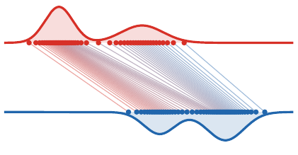

  
<h3>2&#46; Continuous Monge</h3>

  
<h3>3&#46; Kantorovich relaxation</h3>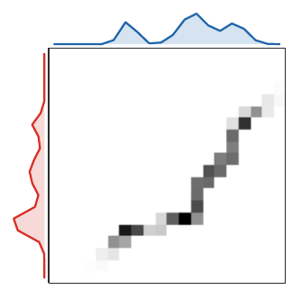

  
<h3>4&#46; Metric structure</h3>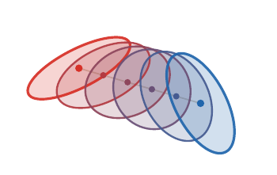

  
<h3>5&#46; Applications</h3>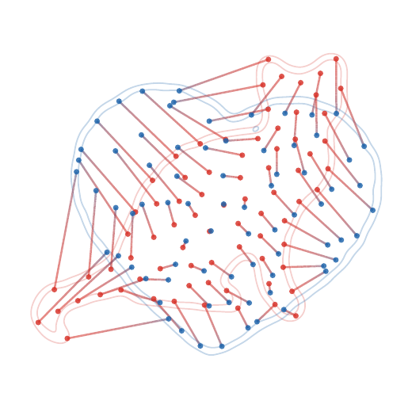

## Finite Monge problem

Let $x_1,\ldots,x_n$ and $y_1,\ldots,y_n$ be two point clouds and let
$c_{i,j}=c(\textcolor{#c7372f}{x_i},\textcolor{#226db4}{y_j})$.

::: {.definition-box}
Permutation matching.
The finite Monge problem is
$$
\min_{\sigma \in \mathfrak S_n}
\sum_{i=1}^n c_{i,\sigma(i)}.
$$
For $c(\textcolor{#c7372f}{x},\textcolor{#226db4}{y})=\|\textcolor{#c7372f}{x}-\textcolor{#226db4}{y}\|^p$, it matches points while paying a geometric displacement cost.
:::

Equivalently, one minimizes $\langle C,\textcolor{#7c5bbd}{P_\sigma}\rangle$ over permutation matrices
$(\textcolor{#7c5bbd}{P_\sigma})_{i,j}=\mathbf 1_{\{j=\sigma(i)\}}$.

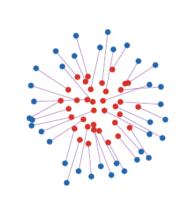

## Why this is hard

::: {.result-box}
Combinatorial nature.
The feasible set has $n!$ permutations. A brute force search is impossible except for very small $n$.
:::

For arbitrary cost matrices, this is the linear assignment problem. Classical methods include:

- Hungarian algorithm,
- auction algorithm,
- linear programming and network simplex variants.

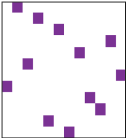

A matching is a permutation matrix.

## The one-dimensional miracle

For convex costs on the real line, sorting solves the problem.

::: {.theorem-box}
Monotone matching.
If $\textcolor{#c7372f}{x_1} \leq \cdots \leq \textcolor{#c7372f}{x_n}$ and $\textcolor{#226db4}{y_1} \leq \cdots \leq \textcolor{#226db4}{y_n}$, then for every convex increasing cost $h(|\textcolor{#c7372f}{x}-\textcolor{#226db4}{y}|)$,
$$
\sigma(i)=i
$$
is an optimal assignment.
:::

The proof follows from the crossing inequality: replacing two crossing segments by non-crossing ones decreases the cost.

## Convex versus concave costs in 1D

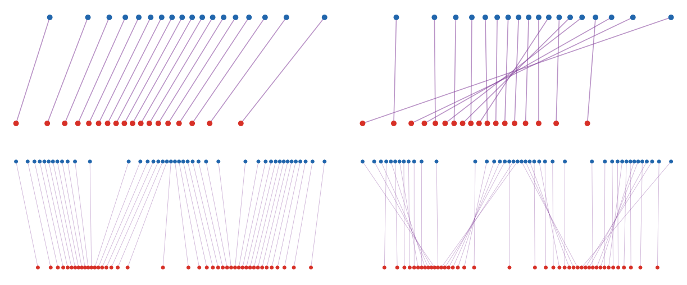

Same ordered one-dimensional supports: convex $p=2$ matchings are monotone, while concave $p=1/2$ matchings create long crossing exchanges.

For $c_p(\textcolor{#c7372f}{x},\textcolor{#226db4}{y})=|\textcolor{#c7372f}{x}-\textcolor{#226db4}{y}|^p$:

- $p>1$: convexity gives the monotone rearrangement;
- $p=1$: non-uniqueness can appear;
- $0<p<1$: concavity favors different alternating-chain patterns.

The line is special because order is global. Convex costs are solved by sorting; concave costs still exploit the one-dimensional order, but through recursive local matching indicators rather than monotone pairing.

## Live panel: one-dimensional costs

<iframe src="../../myst/live/linecost.html" title="Interactive one-dimensional transport costs"></iframe>

Use the controls to compare how the exponent in $|\textcolor{#c7372f}{x}-\textcolor{#226db4}{y}|^p$ changes the matching geometry.

## Roadmap: continuous Monge formulation

  
<h3>1&#46; Monge matching</h3>

  
<h3>2&#46; Continuous Monge</h3>

  
<h3>3&#46; Kantorovich relaxation</h3>

  
<h3>4&#46; Metric structure</h3>

  
<h3>5&#46; Applications</h3>

## Probability measures

::: {.definition-box}
Probability measure.
A probability measure $\alpha$ assigns masses $\textcolor{#c7372f}{\alpha}(A)\in[0,1]$ to measurable sets $A\subset X$, with $\textcolor{#c7372f}{\alpha}(X)=1$.
:::

<strong>Discrete</strong>
$$\textcolor{#c7372f}{\alpha}=\sum_i \textcolor{#c7372f}{a_i}\delta_{\textcolor{#c7372f}{x_i}}$$

<strong>Density</strong>
$$d\textcolor{#c7372f}{\alpha}(\textcolor{#c7372f}{x})=\rho_{\textcolor{#c7372f}{\alpha}}(\textcolor{#c7372f}{x})\,d\textcolor{#c7372f}{x}$$

<strong>Random variable</strong>
$$
\textcolor{#c7372f}{X}:\Omega\to X,\qquad
\textcolor{#c7372f}{\alpha}(A)=\mathbb P(\textcolor{#c7372f}{X}\in A)
$$

## Push-forward

::: {.definition-box}
Push-forward.
For a measurable map $T$ from a source space $X$ to a target space $Y$, the push-forward $\textcolor{#7c5bbd}{T_\#}\textcolor{#c7372f}{\alpha}$ is defined by
$$
(\textcolor{#7c5bbd}{T_\#}\textcolor{#c7372f}{\alpha})(B)
=
\textcolor{#c7372f}{\alpha}(\textcolor{#7c5bbd}{T}^{-1}(B)).
$$
Equivalently, for all test functions $g$,
$$
\int_{\textcolor{#226db4}{Y}} g(\textcolor{#226db4}{y})\,d(\textcolor{#7c5bbd}{T_\#}\textcolor{#c7372f}{\alpha})(\textcolor{#226db4}{y})
=
\int_{\textcolor{#c7372f}{X}} g(\textcolor{#7c5bbd}{T}(\textcolor{#c7372f}{x}))\,d\textcolor{#c7372f}{\alpha}(\textcolor{#c7372f}{x}).
$$
:::

If $\textcolor{#c7372f}{\alpha}=\sum_i \textcolor{#c7372f}{a_i}\delta_{\textcolor{#c7372f}{x_i}}$, then $\textcolor{#7c5bbd}{T_\#}\textcolor{#c7372f}{\alpha}=\sum_i \textcolor{#c7372f}{a_i}\delta_{\textcolor{#7c5bbd}{T}(\textcolor{#c7372f}{x_i})}$.

## Density change of variables

When $T$ is a diffeomorphism between open subsets of $\mathbb R^d$,
$$
\rho_{\textcolor{#7c5bbd}{T_\#}\textcolor{#c7372f}{\alpha}}(\textcolor{#7c5bbd}{T}(\textcolor{#c7372f}{x}))
=
\frac{\rho_{\textcolor{#c7372f}{\alpha}}(\textcolor{#c7372f}{x})}{|\det D\textcolor{#7c5bbd}{T}(\textcolor{#c7372f}{x})|}.
$$

The Jacobian determinant is not cosmetic: compression creates larger density.

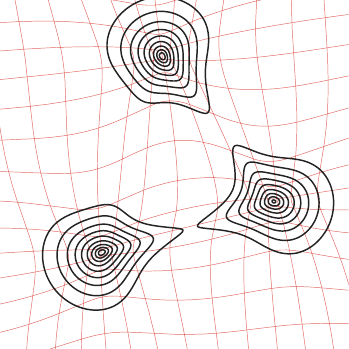

## Continuous Monge problem

::: {.definition-box}
Monge problem.
Given probability measures $\alpha$ on $X$ and $\beta$ on $Y$, Monge's formulation is
$$
\inf_{\textcolor{#7c5bbd}{T_\#}\textcolor{#c7372f}{\alpha}=\textcolor{#226db4}{\beta}}
\int_{\textcolor{#c7372f}{X}} c(\textcolor{#c7372f}{x},\textcolor{#7c5bbd}{T}(\textcolor{#c7372f}{x}))\,d\textcolor{#c7372f}{\alpha}(\textcolor{#c7372f}{x}).
$$
:::

This is a nonlinear constraint: the unknown is a map, and the constraint imposes the entire target distribution.

## Discrete versus continuous Monge

If
$$
\textcolor{#c7372f}{\alpha}=\frac1n\sum_{i=1}^n\delta_{\textcolor{#c7372f}{x_i}},
\qquad
\textcolor{#226db4}{\beta}=\frac1n\sum_{j=1}^n\delta_{\textcolor{#226db4}{y_j}},
$$
then $\textcolor{#7c5bbd}{T_\#}\textcolor{#c7372f}{\alpha}=\textcolor{#226db4}{\beta}$ means that $\textcolor{#7c5bbd}{T}(\textcolor{#c7372f}{x_i})=\textcolor{#226db4}{y_{\sigma(i)}}$ for some permutation $\sigma$.

Thus finite equal-weight matching is a special case of Monge.

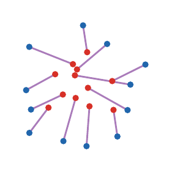

## Brenier theorem

::: {.theorem-box}
Brenier theorem.
Let $X$$=$$Y$$=\mathbb R^d$ and $c(\textcolor{#c7372f}{x},\textcolor{#226db4}{y})=\|\textcolor{#c7372f}{x}-\textcolor{#226db4}{y}\|^2$.
If $\alpha$ is absolutely continuous, then the optimal Monge map is unique and
$$
\textcolor{#7c5bbd}{T}=\nabla\varphi
$$
for a convex function $\varphi$.
:::

The theorem replaces arbitrary maps by gradients of convex potentials: geometry enters through convexity.

## Monge-Ampere equation

If $\textcolor{#7c5bbd}{T}=\nabla\varphi$ is smooth and $\alpha$,$\beta$ have densities, then
$$
\rho_{\textcolor{#c7372f}{\alpha}}(\textcolor{#c7372f}{x})
=
\rho_{\textcolor{#226db4}{\beta}}(\nabla\varphi(\textcolor{#c7372f}{x}))\det(D^2\varphi(\textcolor{#c7372f}{x})).
$$

This nonlinear PDE is the analytic form of the mass conservation constraint.

## Regularity is geometric

Brenier maps are well behaved under geometric assumptions, but singularities appear when the target geometry is poor.

::: {.result-box}
Caffarelli principle.
For quadratic transport, convexity and smooth positive densities are central hypotheses behind regularity of the map $\textcolor{#7c5bbd}{T}=\nabla\varphi$.
:::

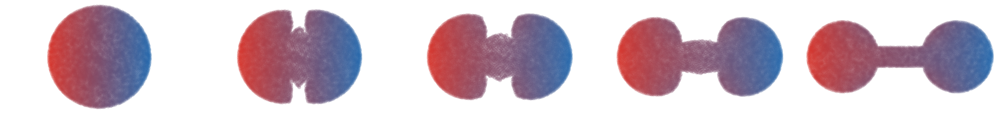

Empirical quadratic OT interpolation from a disk to a connected non-convex two-disk target.

## One-dimensional quantiles

::: {.definition-box}
CDF and quantile.
For a probability $\alpha$ on $\mathbb R$,
$$
F_{\textcolor{#c7372f}{\alpha}}(\textcolor{#c7372f}{x})=\textcolor{#c7372f}{\alpha}((-\infty,\textcolor{#c7372f}{x}]),
\qquad
F_{\textcolor{#c7372f}{\alpha}}^{-1}(u)=\inf\{\textcolor{#c7372f}{x}:F_{\textcolor{#c7372f}{\alpha}}(\textcolor{#c7372f}{x})\geq u\}.
$$
:::

If $\alpha$ has no atoms, the monotone Monge map from $\alpha$ to $\beta$ is
$$
\textcolor{#7c5bbd}{T_{\alpha\to\beta}}
=
\textcolor{#226db4}{F_\beta^{-1}}\circ \textcolor{#c7372f}{F_\alpha}.
$$

## Interactive: quantile interpolation

The 1D Wasserstein geodesic is linear in quantile functions:
$$
\textcolor{#7c5bbd}{F_{\alpha_t}^{-1}}(u)
=(1-t)\textcolor{#c7372f}{F_\alpha^{-1}(u)}
+t\textcolor{#226db4}{F_\beta^{-1}(u)}.
$$

Move the slider to see the density induced by interpolating quantiles.

<canvas id="quantile-interpolation-canvas"></canvas>

source<input id="quantile-interpolation-slider" type="range" min="0" max="1" value="0.5" step="0.01">t = 0.50

## Live panel: quantile rearrangement

<iframe src="../../myst/live/monge-quantile.html" title="Interactive monotone rearrangement and quantile transport"></iframe>

This is the exact one-dimensional Monge solution $\textcolor{#7c5bbd}{T}=\textcolor{#226db4}{F_\beta^{-1}}\circ\textcolor{#c7372f}{F_\alpha}$.

## Histogram equalization

<figure><figcaption>$t=0$</figcaption></figure>
<figure><figcaption>$t=.25$</figcaption></figure>
<figure><figcaption>$t=.5$</figcaption></figure>
<figure><figcaption>$t=.75$</figcaption></figure>
<figure><figcaption>$t=1$</figcaption></figure>

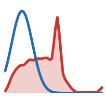
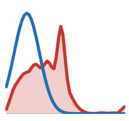
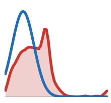
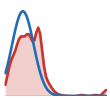
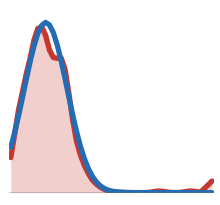

Histogram equalization is a direct application of monotone rearrangement:
$$
\textcolor{#7c5bbd}{T}
=
\textcolor{#226db4}{F_\beta^{-1}}\circ \textcolor{#c7372f}{F_\alpha}.
$$

Here $\alpha$ is the grayscale distribution of the input image and $\beta$ is the target grayscale distribution.

## Live panel: histogram equalization

<iframe src="../../myst/live/histogram.html" title="Interactive histogram equalization by monotone transport"></iframe>

## McCann interpolation

::: {.definition-box}
Displacement interpolation.
If $\textcolor{#7c5bbd}{T_\#}\textcolor{#c7372f}{\alpha}=\textcolor{#226db4}{\beta}$, the Monge interpolation is
$$
\textcolor{#7c5bbd}{\alpha_t}=((1-t)\operatorname{Id}+t\textcolor{#7c5bbd}{T})_\#\textcolor{#c7372f}{\alpha},
\qquad t\in[0,1].
$$
When $\textcolor{#7c5bbd}{T}$ is the quadratic optimal map, this is a constant-speed $W_2$ geodesic:
$$
W_2(\textcolor{#7c5bbd}{\alpha_s},\textcolor{#7c5bbd}{\alpha_t})=|s-t|\,W_2(\textcolor{#c7372f}{\alpha},\textcolor{#226db4}{\beta}).
$$
:::

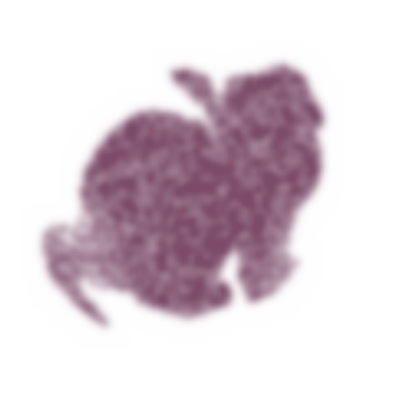

## Live panel: McCann shape interpolation

<iframe src="../../myst/live/monge-shape.html" title="Interactive McCann displacement interpolation between shapes"></iframe>

## Color transfer as transport

A color image can be viewed as a cloud in RGB space. Transporting one color distribution onto another gives a palette transfer.

For each input pixel color $x\in\mathbb R^3$, apply an approximate OT map $T(x)$ in RGB space and display
$$
\textcolor{#7c5bbd}{x_t}=(1-t)\textcolor{#c7372f}{x}+t\textcolor{#7c5bbd}{T}(\textcolor{#c7372f}{x}),
\qquad
\textcolor{#7c5bbd}{\alpha_t}=((1-t)\operatorname{Id}+t\textcolor{#7c5bbd}{T})_\#\textcolor{#c7372f}{\alpha}.
$$

The top row shows the impact on pixels, while the bottom row shows the moving RGB distribution.

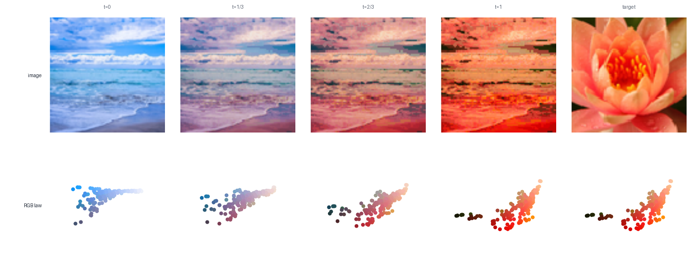

## Live panel: color transfer

<iframe src="../../myst/live/monge-color.html" title="Interactive color transfer by optimal transport"></iframe>

## Gaussian measures in one dimension

::: {.result-box}
Closed form for 1D Gaussians.
For $\textcolor{#c7372f}{\alpha}=\mathrm N(\textcolor{#c7372f}{m_0},\textcolor{#c7372f}{\sigma_0^2})$ and $\textcolor{#226db4}{\beta}=\mathrm N(\textcolor{#226db4}{m_1},\textcolor{#226db4}{\sigma_1^2})$,
$$
\textcolor{#7c5bbd}{T}(\textcolor{#c7372f}{x})=\textcolor{#226db4}{m_1}+\frac{\textcolor{#226db4}{\sigma_1}}{\textcolor{#c7372f}{\sigma_0}}(\textcolor{#c7372f}{x}-\textcolor{#c7372f}{m_0}),
$$
and
$$
W_2^2(\textcolor{#c7372f}{\alpha},\textcolor{#226db4}{\beta})=(\textcolor{#c7372f}{m_0}-\textcolor{#226db4}{m_1})^2+(\textcolor{#c7372f}{\sigma_0}-\textcolor{#226db4}{\sigma_1})^2.
$$
:::

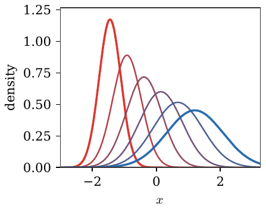

## Gaussian measures in dimension d

::: {.theorem-box}
Gaussian optimal map.
For $\textcolor{#c7372f}{\alpha}=\mathrm N(\textcolor{#c7372f}{m_0},\textcolor{#c7372f}{\Sigma_0})$ and $\textcolor{#226db4}{\beta}=\mathrm N(\textcolor{#226db4}{m_1},\textcolor{#226db4}{\Sigma_1})$,
$$
\textcolor{#7c5bbd}{T}(\textcolor{#c7372f}{x})=\textcolor{#226db4}{m_1}+\textcolor{#7c5bbd}{A}(\textcolor{#c7372f}{x}-\textcolor{#c7372f}{m_0}),
$$
where
$$
\textcolor{#7c5bbd}{A}=\textcolor{#c7372f}{\Sigma_0}^{-1/2}\big(\textcolor{#c7372f}{\Sigma_0}^{1/2}\textcolor{#226db4}{\Sigma_1}\textcolor{#c7372f}{\Sigma_0}^{1/2}\big)^{1/2}\textcolor{#c7372f}{\Sigma_0}^{-1/2}.
$$
:::

The linear part $A$ is symmetric positive definite: it is a Brenier map.

## Gaussian maps and Riccati equations

The Gaussian formula is also a computational statement: the Brenier linear part is the symmetric positive definite solution of a matrix equation.

::: {.result-box}
Riccati viewpoint.
The covariance constraint $\textcolor{#7c5bbd}{T_\#}\mathrm N(\textcolor{#c7372f}{m_0},\textcolor{#c7372f}{\Sigma_0})=\mathrm N(\textcolor{#226db4}{m_1},\textcolor{#226db4}{\Sigma_1})$ imposes
$$
\textcolor{#7c5bbd}{A}\textcolor{#c7372f}{\Sigma_0}\textcolor{#7c5bbd}{A}=\textcolor{#226db4}{\Sigma_1},\qquad \textcolor{#7c5bbd}{A}=\textcolor{#7c5bbd}{A}^\top\succeq0.
$$
This is an algebraic Riccati equation, whose unique symmetric positive solution is
$$
\textcolor{#7c5bbd}{A}=\textcolor{#c7372f}{\Sigma_0}^{-1/2}
\big(\textcolor{#c7372f}{\Sigma_0}^{1/2}\textcolor{#226db4}{\Sigma_1}\textcolor{#c7372f}{\Sigma_0}^{1/2}\big)^{1/2}
\textcolor{#c7372f}{\Sigma_0}^{-1/2}.
$$
:::

This is one reason Gaussian OT is a useful test case: the nonlinear Monge problem collapses to matrix square roots.

## Interactive: Gaussian geodesic

For Gaussian measures, the $W_2$ geodesic remains Gaussian. In one dimension,
$$
m_t=(1-t)m_0+tm_1,
\qquad
\sigma_t=(1-t)\sigma_0+t\sigma_1.
$$
In higher dimension, $\Sigma_t=((1-t)I+tA)\Sigma_0((1-t)I+tA)$.

Move the slider to see the density and the corresponding pointwise affine map.

<canvas id="gaussian-geodesic-canvas"></canvas>

source<input id="gaussian-geodesic-slider" type="range" min="0" max="1" value="0.45" step="0.01">t = 0.45

## Live panel: Gaussian maps

<iframe src="../../myst/live/monge-gaussian.html" title="Interactive Gaussian optimal transport maps"></iframe>

## Bures metric

The covariance contribution to Gaussian $W_2$ is the Bures metric:
$$
W_2^2(\textcolor{#c7372f}{\alpha},\textcolor{#226db4}{\beta})
=\|\textcolor{#c7372f}{m_0}-\textcolor{#226db4}{m_1}\|^2+B^2(\textcolor{#c7372f}{\Sigma_0},\textcolor{#226db4}{\Sigma_1}),
$$
$$
B^2(\textcolor{#c7372f}{\Sigma_0},\textcolor{#226db4}{\Sigma_1})
=\operatorname{tr}\big(\textcolor{#c7372f}{\Sigma_0}+\textcolor{#226db4}{\Sigma_1}-2(\textcolor{#c7372f}{\Sigma_0}^{1/2}\textcolor{#226db4}{\Sigma_1}\textcolor{#c7372f}{\Sigma_0}^{1/2})^{1/2}\big).
$$

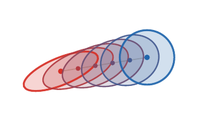

## Geometry of covariance matrices

For $2\times 2$ covariances, the positive semidefinite cone can be drawn explicitly. Bures geodesics follow a non-Euclidean matrix geometry.

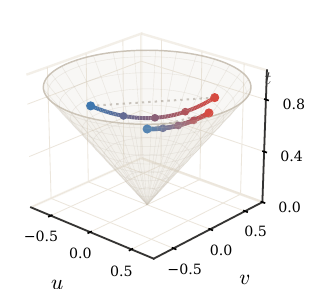

## Roadmap: Kantorovich relaxation

  
<h3>1&#46; Monge matching</h3>

  
<h3>2&#46; Continuous Monge</h3>

  
<h3>3&#46; Kantorovich relaxation</h3>

  
<h3>4&#46; Metric structure</h3>

  
<h3>5&#46; Applications</h3>

## Why relax Monge?

Monge maps can fail to exist when mass must split.

Map-like transport.

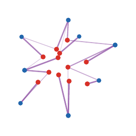

Kantorovich allows splitting.

## Couplings

::: {.definition-box}
Coupling.
A coupling between $\alpha$ and $\beta$ is a probability measure $\pi$ on $X$$\times$$Y$ such that
$$
(\textcolor{#c7372f}{P_X})_\#\textcolor{#7c5bbd}{\pi}=\textcolor{#c7372f}{\alpha},
\qquad
(\textcolor{#226db4}{P_Y})_\#\textcolor{#7c5bbd}{\pi}=\textcolor{#226db4}{\beta}.
$$
The set of all couplings is denoted $\Gamma(\textcolor{#c7372f}{\alpha},\textcolor{#226db4}{\beta})$.
:::

The product coupling $\textcolor{#c7372f}{\alpha}\otimes\textcolor{#226db4}{\beta}$ always belongs to $\Gamma(\textcolor{#c7372f}{\alpha},\textcolor{#226db4}{\beta})$, so the feasible set is nonempty.

## Live panel: coupling geometry

<iframe src="../../myst/live/kantorovich-couplings.html" title="Interactive Kantorovich coupling geometry"></iframe>

## Discrete couplings

For discrete measures
$$
\textcolor{#c7372f}{\alpha}=\sum_i a_i\delta_{\textcolor{#c7372f}{x_i}},
\qquad
\textcolor{#226db4}{\beta}=\sum_j b_j\delta_{\textcolor{#226db4}{y_j}},
$$
a coupling is a nonnegative matrix $P$ satisfying
$$
\textcolor{#7c5bbd}{P}\mathbb 1_m=\textcolor{#c7372f}{a},
\qquad
\textcolor{#7c5bbd}{P}^\top\mathbb 1_n=\textcolor{#226db4}{b}.
$$
This feasible polytope is denoted
$U(\textcolor{#c7372f}{a},\textcolor{#226db4}{b})=\{\textcolor{#7c5bbd}{P}\geq0:\textcolor{#7c5bbd}{P}\mathbb 1_m=\textcolor{#c7372f}{a},\ \textcolor{#7c5bbd}{P}^\top\mathbb 1_n=\textcolor{#226db4}{b}\}$.

## Live panel: transport matrices

<iframe src="../../myst/live/kantorovich-matrix.html" title="Interactive transport matrices"></iframe>

The matrix view makes row and column mass constraints visible.

## Three coupling regimes

The same Kantorovich object appears in three numerical regimes.

::: {.result-box}
Discrete, semi-discrete, continuous.
Discrete OT optimizes a matrix $P$. Semi-discrete OT optimizes Laguerre cells when one measure has a density and the other is finitely supported. Continuous OT studies a measure $\pi$ on $X$$\times$$Y$ and often recovers a map through regularity.
:::

The later decks revisit these regimes with duality, Sinkhorn scaling, and gradient-flow interpretations.

## Kantorovich problem

::: {.definition-box}
Kantorovich formulation.
The relaxed optimal transport problem is
$$
\mathcal L_c(\textcolor{#c7372f}{\alpha},\textcolor{#226db4}{\beta})
=
\inf_{\textcolor{#7c5bbd}{\pi}\in\Gamma(\textcolor{#c7372f}{\alpha},\textcolor{#226db4}{\beta})}
\int_{\textcolor{#c7372f}{X}\times\textcolor{#226db4}{Y}} c(\textcolor{#c7372f}{x},\textcolor{#226db4}{y})\,d\textcolor{#7c5bbd}{\pi}(\textcolor{#c7372f}{x},\textcolor{#226db4}{y}).
$$
:::

For finite measures, this is the linear program
$$
\min_{\textcolor{#7c5bbd}{P}\geq 0}\sum_{i,j} \textcolor{#7c5bbd}{P}_{i,j}C_{i,j}
\quad\text{s.t.}\quad
\textcolor{#7c5bbd}{P}\mathbb 1_m=\textcolor{#c7372f}{a},
\ \textcolor{#7c5bbd}{P}^\top\mathbb 1_n=\textcolor{#226db4}{b}.
$$

## Live panel: transport plans

<iframe src="../../myst/live/kantorovich-plan.html" title="Interactive transport plans"></iframe>

Changing the cost and marginals changes which entries of the plan become active.

## Product versus optimal coupling

The product plan is the independent coupling:
$$
(\textcolor{#c7372f}{\alpha}\otimes\textcolor{#226db4}{\beta})(A\times B)=\textcolor{#c7372f}{\alpha}(A)\textcolor{#226db4}{\beta}(B),
\qquad
\textcolor{#7c5bbd}{P^\otimes}_{i,j}=\textcolor{#c7372f}{a_i}\textcolor{#226db4}{b_j}.
$$
The OT plan instead minimizes $\langle C,\textcolor{#7c5bbd}{P}\rangle$ over $U(\textcolor{#c7372f}{a},\textcolor{#226db4}{b})$.

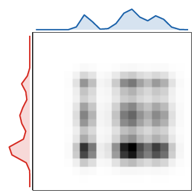

Independent product coupling.

Optimal coupling concentrates near low cost.

## Live panel: splitting versus product couplings

<iframe src="../../myst/live/kantorovich-splitting.html" title="Interactive splitting versus product couplings"></iframe>

The product coupling is feasible but usually diffuse; the optimal plan concentrates on cost-effective pairs.

## Exact relaxation for equal weights

::: {.theorem-box}
Birkhoff-von Neumann theorem.
The set of bistochastic matrices is the convex hull of permutation matrices:
$$
\{\textcolor{#7c5bbd}{P}\geq 0: \textcolor{#7c5bbd}{P}\mathbb 1=\mathbb 1/n,
\textcolor{#7c5bbd}{P}^\top\mathbb 1=\mathbb 1/n\}
=\operatorname{conv}\{\textcolor{#7c5bbd}{P_\sigma}:\sigma\in\mathfrak S_n\}.
$$
Here $(\textcolor{#7c5bbd}{P_\sigma})_{i,j}=\frac1n\mathbf 1_{\{j=\sigma(i)\}}$ has the prescribed uniform marginals.
:::

Hence, for equal weights, Kantorovich gives the same value as Monge whenever a permutation solution is required.

## Extreme points give exactness

The exactness mechanism is purely convex-geometric. For a compact polytope $C$ and a linear functional $\langle A,P\rangle$,
$$
\arg\min_{P\in C}\langle A,P\rangle
\cap \operatorname{Extr}(C)\neq\varnothing.
$$
Indeed, a minimizer exists by compactness. If it is not extreme, write
$P=(Q+R)/2$ with $Q\neq R$; linearity shows that $Q$ and $R$ are also minimizers. For a polytope, iterating this splitting reaches an extreme minimizer.

For the bistochastic polytope,
$$
\operatorname{Extr}\{P\geq0:P\mathbf 1=\mathbf 1/n,\ P^\top\mathbf 1=\mathbf 1/n\}
=\{P_\sigma:\sigma\in\mathfrak S_n\}.
$$
Thus the relaxed LP has a permutation optimizer.

## Live panel: Birkhoff polytope

<iframe src="../../myst/live/kantorovich-birkhoff.html" title="Interactive Birkhoff-von Neumann decomposition"></iframe>

## Cycle certificate

The proof finds a cycle in the support graph of a non-extreme bistochastic matrix. Moving mass around it decomposes $P$ into two feasible matrices.

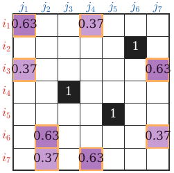

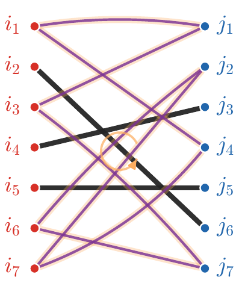

## Algorithms at a glance

::: {.result-box}
Algorithmic landscape.
- Generic LP or network simplex for discrete OT.
- Hungarian or auction methods for assignment.
- Sorting for one-dimensional convex costs.
- Semi-discrete methods when one measure is continuous and the other is discrete.
- Entropic Sinkhorn iterations in the next deck.
:::

The right algorithm depends on the structure of the measures and the cost.

## From LP to specialized solvers

Generic linear programming is only one possible computational route; problem-specific algorithms are often decisive.

- assignment: Hungarian and auction methods,
- graph costs: network simplex and sparse flows,
- Euclidean low dimension: geometric structure,
- entropic OT: repeated matrix scaling,
- semi-discrete OT: smooth concave dual maximization.

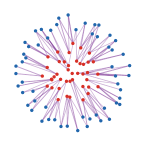

Regularization turns the LP into scalable matrix scaling.

## Roadmap: metric structure

  
<h3>1&#46; Monge matching</h3>

  
<h3>2&#46; Continuous Monge</h3>

  
<h3>3&#46; Kantorovich relaxation</h3>

  
<h3>4&#46; Metric structure</h3>

  
<h3>5&#46; Applications</h3>

## Wasserstein distances

::: {.definition-box}
Wasserstein distance.
For $p\geq 1$ and a metric $d$ on $X$,
$$
W_p(\textcolor{#c7372f}{\alpha},\textcolor{#226db4}{\beta})
=
\left(\inf_{\textcolor{#7c5bbd}{\pi}\in\Gamma(\textcolor{#c7372f}{\alpha},\textcolor{#226db4}{\beta})}
\int d(\textcolor{#c7372f}{x},\textcolor{#226db4}{y})^p\,d\textcolor{#7c5bbd}{\pi}(\textcolor{#c7372f}{x},\textcolor{#226db4}{y})\right)^{1/p}.
$$
The finite-moment condition is $\int d(\textcolor{#c7372f}{x},x_0)^p\,d\textcolor{#c7372f}{\alpha}(\textcolor{#c7372f}{x})<+\infty$ for one, hence every, $x_0\in X$.
:::

The cost is now tied to the geometry of the ground space.

## Metric theorem

::: {.theorem-box}
Metric property.
On probability measures with finite $p$-moment, $W_p$ is a distance. In particular,
$$
W_p(\textcolor{#c7372f}{\alpha},\gamma)
\leq W_p(\textcolor{#c7372f}{\alpha},\textcolor{#226db4}{\beta})+W_p(\textcolor{#226db4}{\beta},\gamma).
$$
:::

Proof idea: glue optimal couplings for $(\textcolor{#c7372f}{\alpha},\textcolor{#226db4}{\beta})$ and $(\textcolor{#226db4}{\beta},\gamma)$, then apply Minkowski to the induced pair $(X,Z)$.

## Triangle inequality by gluing

The proof mechanism is important: Wasserstein geometry is stable because transport plans can be pasted through their common marginal.

::: {.result-box}
Gluing argument.
Let $\textcolor{#7c5bbd}{\pi^{01}}\in\Gamma(\textcolor{#c7372f}{\alpha_0},\textcolor{#7c5bbd}{\alpha_1})$ and $\textcolor{#7c5bbd}{\pi^{12}}\in\Gamma(\textcolor{#7c5bbd}{\alpha_1},\textcolor{#226db4}{\alpha_2})$. The gluing lemma gives a measure
$\textcolor{#7c5bbd}{\eta}\in\mathcal P(X^3)$ such that
$(\textcolor{#c7372f}{x_0},\textcolor{#7c5bbd}{x_1})_\#\textcolor{#7c5bbd}{\eta}=\textcolor{#7c5bbd}{\pi^{01}}$ and $(\textcolor{#7c5bbd}{x_1},\textcolor{#226db4}{x_2})_\#\textcolor{#7c5bbd}{\eta}=\textcolor{#7c5bbd}{\pi^{12}}$.
Then $\textcolor{#7c5bbd}{\pi^{02}}=(\textcolor{#c7372f}{x_0},\textcolor{#226db4}{x_2})_\#\textcolor{#7c5bbd}{\eta}$ is admissible and
$$
W_p(\textcolor{#c7372f}{\alpha_0},\textcolor{#226db4}{\alpha_2})
\leq
\left(\int d(\textcolor{#c7372f}{x_0},\textcolor{#226db4}{x_2})^p\,d\textcolor{#7c5bbd}{\eta}\right)^{1/p}
\leq
W_p(\textcolor{#c7372f}{\alpha_0},\textcolor{#7c5bbd}{\alpha_1})+W_p(\textcolor{#7c5bbd}{\alpha_1},\textcolor{#226db4}{\alpha_2}).
$$
:::

## Discrete gluing formula

The finite proof used in the reference slides is the same idea written as a three-index coupling. If
$P\in U(\textcolor{#c7372f}{a},\textcolor{#7c5bbd}{b})$ and
$Q\in U(\textcolor{#7c5bbd}{b},\textcolor{#226db4}{c})$, set
$$
S_{i,j,k}=
\begin{cases}
\dfrac{P_{i,j}Q_{j,k}}{b_j}, & b_j>0,\\[0.55em]
0, & b_j=0.
\end{cases}
$$
Then
$$
\sum_k S_{i,j,k}=P_{i,j},\qquad
\sum_i S_{i,j,k}=Q_{j,k},
\qquad
R_{i,k}:=\sum_j S_{i,j,k}\in U(\textcolor{#c7372f}{a},\textcolor{#226db4}{c}).
$$
Summing out the intermediate index $j$ gives the admissible coupling used for the triangle inequality.

## Live panel: gluing couplings

<iframe src="../../myst/live/kantorovich-gluing.html" title="Interactive gluing construction for Wasserstein triangle inequality"></iframe>

## Convergence in law

::: {.result-box}
Topology.
On a compact metric space, convergence in $W_p$ is equivalent to weak convergence of probability measures:
$$
W_p(\textcolor{#7c5bbd}{\alpha_n},\textcolor{#c7372f}{\alpha})\to 0
\quad\Longleftrightarrow\quad
\int f\,d\textcolor{#7c5bbd}{\alpha_n}\to\int f\,d\textcolor{#c7372f}{\alpha}
\quad\forall f\in C(X).
$$
:::

On noncompact spaces, finite moments must also be controlled.

## Dual potentials as witnesses

Kantorovich duality exposes potentials as certificates:
$$
\mathcal L_c(\textcolor{#c7372f}{\alpha},\textcolor{#226db4}{\beta})
=
\sup_{f(\textcolor{#c7372f}{x})+g(\textcolor{#226db4}{y})\leq c(\textcolor{#c7372f}{x},\textcolor{#226db4}{y})}
\int f\,d\textcolor{#c7372f}{\alpha}+
\int g\,d\textcolor{#226db4}{\beta}.
$$

At optimality, transported mass lives where $f(\textcolor{#c7372f}{x})+g(\textcolor{#226db4}{y})=c(\textcolor{#c7372f}{x},\textcolor{#226db4}{y})$.

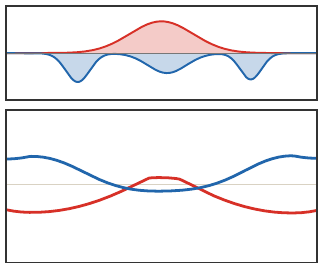

## Roadmap: applications

  
<h3>1&#46; Monge matching</h3>

  
<h3>2&#46; Continuous Monge</h3>

  
<h3>3&#46; Kantorovich relaxation</h3>

  
<h3>4&#46; Metric structure</h3>

  
<h3>5&#46; Applications</h3>

## OT application gallery

The same mathematical distance appears in very different data tasks.

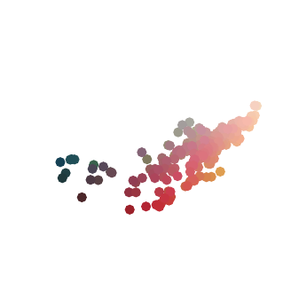
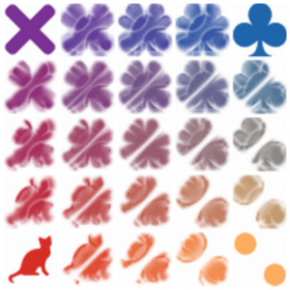
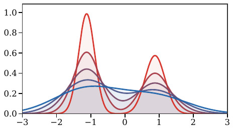

Color transfer, barycenters, and gradient flows all reuse the same core ideas: coupling, geometry, and displacement.

## Application examples

Concrete data modalities make the abstract transport formalism easier to recognize.

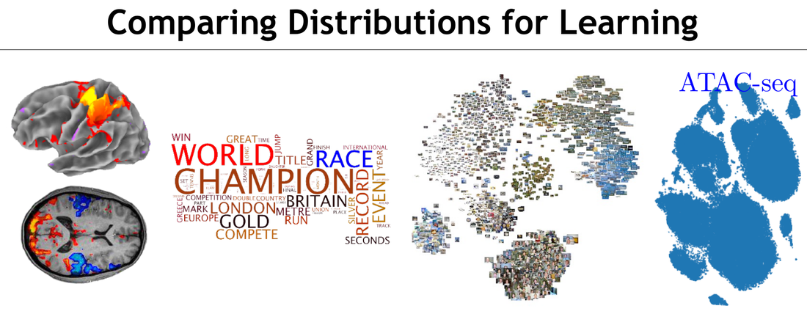

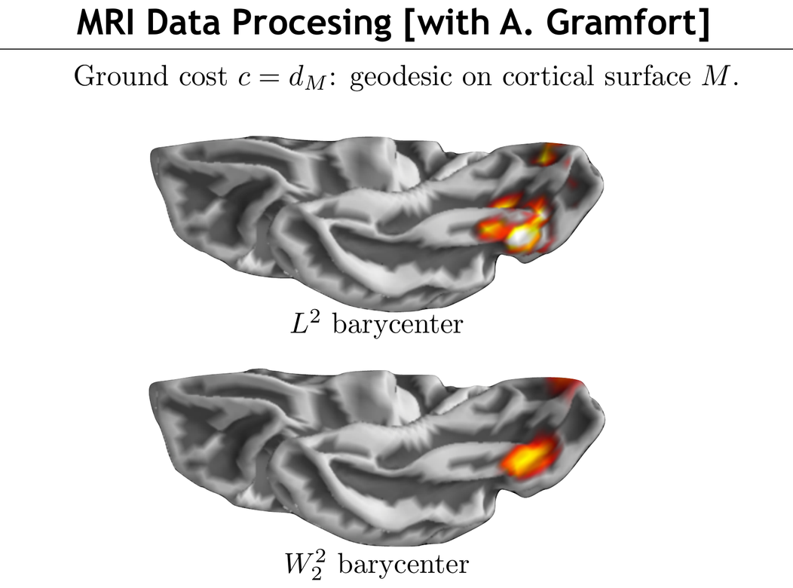

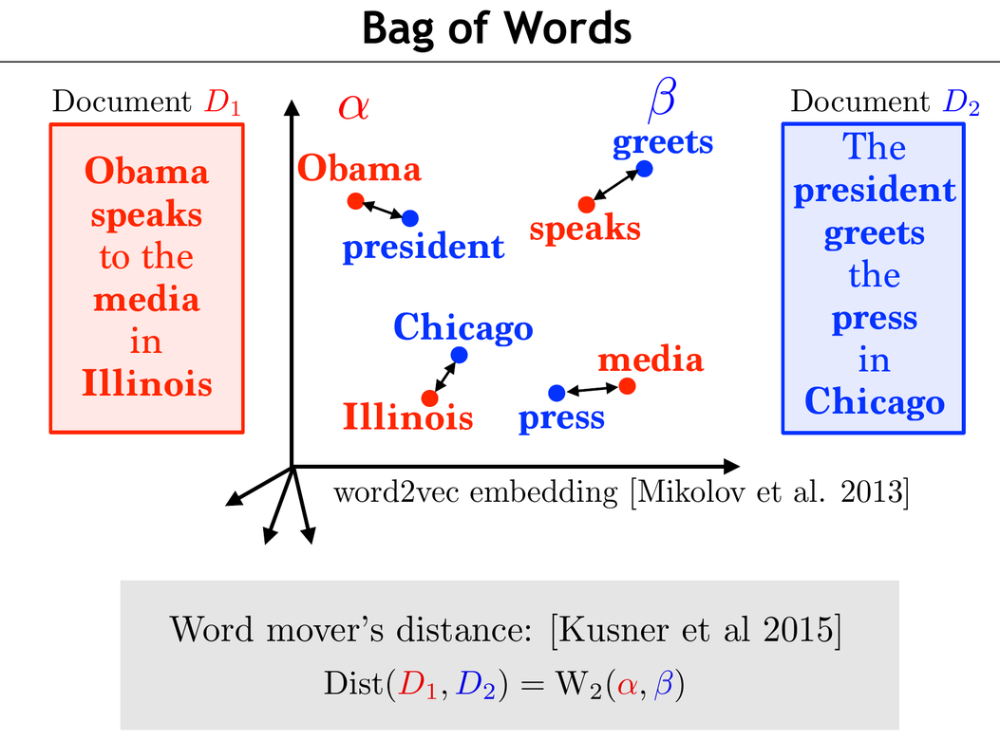

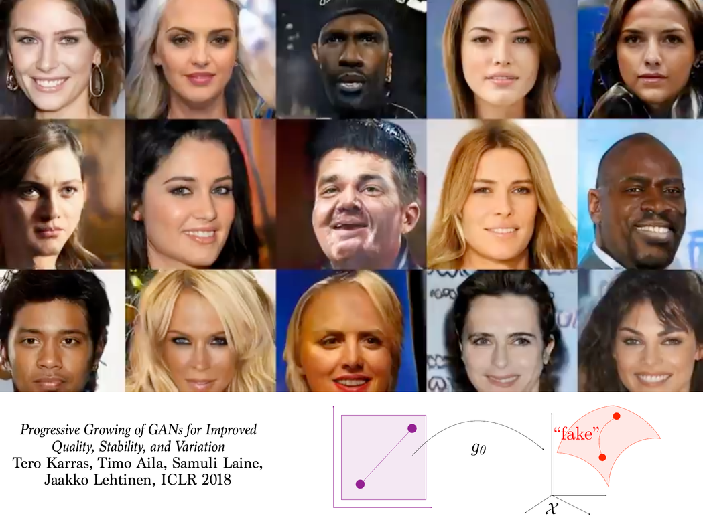

ATAC-seq and single-cell data, cortical-surface MRI processing, bag-of-words document comparison, and image generation all reduce to comparing empirical laws with geometry.

## Quantitative CLT viewpoint

The central limit theorem (CLT) says that rescaled sums converge in law:
$$
Y_n=\frac{X_1+\cdots+X_n}{\sqrt n}
\Rightarrow \mathrm N(0,1)
$$
when $\mathbb E(X)=0$ and $\mathbb E(X^2)=1$.

Writing $\mu_n=\operatorname{Law}(Y_n)$ and $\gamma=\mathrm N(0,1)$, a Berry-Esseen type estimate in Wasserstein distance is
$$
W_1(\mu_n,\gamma)\leq
\frac{C\,\mathbb E(|X|^3)}{\sqrt n}.
$$

Wasserstein distances quantify how fast this convergence happens.

## Live panel: quantitative CLT

<iframe src="../../myst/live/kantorovich-clt.html" title="Interactive quantitative central limit theorem in Wasserstein distance"></iframe>

## Gradient flows

Wasserstein geometry turns variational problems over measures into PDEs. The JKO scheme is
$$
\textcolor{#c7372f}{\alpha^{k+1}}\in\arg\min_{\textcolor{#c7372f}{\alpha}}
\frac{1}{2\tau}W_2^2(\textcolor{#c7372f}{\alpha},\textcolor{#c7372f}{\alpha^k})+\mathcal F(\textcolor{#c7372f}{\alpha}).
$$

This is the implicit Euler scheme in the metric space of measures.

## Barycenters

::: {.definition-box}
Wasserstein barycenter.
Given measures $(\beta_s)_s$ and weights $(\lambda_s)_s$, a barycenter solves
$$
\min_{\textcolor{#c7372f}{\alpha}} \sum_s \lambda_s W_2^2(\textcolor{#c7372f}{\alpha},\textcolor{#226db4}{\beta_s}).
$$
:::

## Live panel: Wasserstein barycenters

<iframe src="../../myst/live/ot-problems-barycenter.html" title="Interactive wasserstein barycenters"></iframe>

Barycenters are the first place where transport becomes a geometric averaging operation.

## Generative models

One-step generative models seek a map $g_\theta$ such that
$$
\textcolor{#c7372f}{(g_\theta)_\#\zeta} \approx \textcolor{#226db4}{\beta},
$$
where $\zeta$ is a latent distribution and $\beta$ is the data distribution.

OT, Sinkhorn, MMD, and sliced-Wasserstein losses provide training discrepancies.

## Summary

::: {.result-box}
What this deck establishes.
Optimal transport starts from matching, becomes Monge's map problem, relaxes to couplings, and yields Wasserstein geometry.
:::

<strong>Maps</strong>Monge and Brenier

<strong>Plans</strong>Kantorovich and LP

<strong>Geometry</strong>Wasserstein metrics

## Next deck

The next presentation develops entropic regularization:
$$
\min_{\textcolor{#7c5bbd}{\pi}\in\Gamma(\textcolor{#c7372f}{\alpha},\textcolor{#226db4}{\beta})}
\int c\,d\textcolor{#7c5bbd}{\pi} + \varepsilon\operatorname{KL}(\textcolor{#7c5bbd}{\pi}\mid \textcolor{#c7372f}{\alpha}\otimes\textcolor{#226db4}{\beta}),
$$
leading to Sinkhorn iterations and differentiable transport losses.

<a class="deck-link" href="../2-entropic-regularization/index.html">Open deck 2: Entropic Regularization &rarr;</a>

