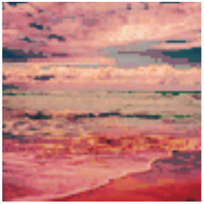

# Monge and Kantorovich Optimal Transport {.title-slide}

From matchings to probability measures, maps, relaxations, and Wasserstein distances.

Gabriel Peyré

CNRS and École normale supérieure, PSL Université

Optimal Transport for Machine Learners

## Why compare distributions?

Modern machine learning repeatedly asks for distances between probability laws:

- empirical data versus a model distribution,
- source versus target domains,
- generated samples versus real samples,
- evolving particle clouds during training.

Optimal transport compares distributions by using the geometry of the ambient space.

Transport turns distribution comparison into geometry.

## The fitting problem

::: {.definition-box}
Data and model distributions.
A model produces samples from $\alpha_\theta$, while observations come from a target law $\beta$. A geometric fitting objective has the form
$$
\min_\theta D(\alpha_\theta,\beta),
$$
where $D$ is a discrepancy between probability measures.
:::

OT chooses $D$ by asking how much effort is needed to move the mass of $\alpha_\theta$ onto $\beta$.

## Computational OT in practice

OT is not a single formula, but a computational toolbox.

::: {.result-box}
Computational ecosystem.
The same geometric principle gives sorting algorithms in one dimension, assignment algorithms for equal weights, linear programs for general discrete measures, semi-discrete solvers for continuous-to-discrete maps, and Sinkhorn iterations for differentiable large-scale losses.
:::

This course uses the POT library and the numerical figures of the OT4ML book to keep these regimes visible throughout.

## Roadmap: discrete Monge matching

  
<h3>1&#46; Monge matching</h3>

  
<h3>2&#46; Continuous Monge</h3>

  
<h3>3&#46; Kantorovich relaxation</h3>

  
<h3>4&#46; Metric structure</h3>

  
<h3>5&#46; Applications</h3>

## Finite Monge problem

Let $x_1,\ldots,x_n$ and $y_1,\ldots,y_n$ be two point clouds and let
$c_{i,j}=c(x_i,y_j)$.

::: {.definition-box}
Permutation matching.
The finite Monge problem is
$$
\min_{\sigma \in \mathfrak S_n}
\sum_{i=1}^n c_{i,\sigma(i)}.
$$
For $c(x,y)=\|x-y\|^p$, it matches points while paying a geometric displacement cost.
:::

Equivalently, one minimizes $\langle C,P_\sigma\rangle$ over permutation matrices
$(P_\sigma)_{i,j}=\mathbf 1_{\{j=\sigma(i)\}}$.

## Why this is hard

::: {.result-box}
Combinatorial nature.
The feasible set has $n!$ permutations. A brute force search is impossible except for very small $n$.
:::

For arbitrary cost matrices, this is the linear assignment problem. Classical methods include:

- Hungarian algorithm,
- auction algorithm,
- linear programming and network simplex variants.

A matching is a permutation matrix.

## The one-dimensional miracle

For convex costs on the real line, sorting solves the problem.

::: {.theorem-box}
Monotone matching.
If $x_1 \leq \cdots \leq x_n$ and $y_1 \leq \cdots \leq y_n$, then for every convex increasing cost $h(|x-y|)$,
$$
\sigma(i)=i
$$
is an optimal assignment.
:::

The proof follows from the crossing inequality: replacing two crossing segments by non-crossing ones decreases the cost.

## Convex versus concave costs in 1D

Small exponents encourage different pairing patterns.

For $c_p(x,y)=|x-y|^p$:

- $p>1$: convex geometry favors monotone rearrangement;
- $0<p<1$: concavity changes the structure and requires different algorithms;
- $p=1$: many solutions can coexist.

The line is special because order is global. In dimension two, there is no total ordering compatible with all directions.

## Roadmap: continuous Monge formulation

  
<h3>1&#46; Monge matching</h3>

  
<h3>2&#46; Continuous Monge</h3>

  
<h3>3&#46; Kantorovich relaxation</h3>

  
<h3>4&#46; Metric structure</h3>

  
<h3>5&#46; Applications</h3>

## Probability measures

::: {.definition-box}
Probability measure.
A probability measure $\alpha$ assigns masses $\alpha(A)\in[0,1]$ to measurable sets $A\subset X$, with $\alpha(X)=1$.
:::

<strong>Discrete</strong>
$$\alpha=\sum_i a_i\delta_{x_i}$$

<strong>Density</strong>
$$d\alpha(x)=\rho_\alpha(x)\,dx$$

<strong>Random variable</strong>
$$\alpha=\operatorname{Law}(X)$$

## Push-forward

::: {.definition-box}
Push-forward.
For a measurable map $T:X\toY$, the push-forward $T_\#\alpha$ is defined by
$$
(T_\#\alpha)(B)=\alpha(T^{-1}(B)).
$$
Equivalently, for all test functions $g$,
$$
\int_{Y} g(y)\,d(T_\#\alpha)(y)
=
\int_{X} g(T(x))\,d\alpha(x).
$$
:::

If $\alpha=\sum_i a_i\delta_{x_i}$, then $T_\#\alpha=\sum_i a_i\delta_{T(x_i)}$.

## Density change of variables

When $T$ is a diffeomorphism between open subsets of $\mathbb R^d$,
$$
\rho_{T_\#\alpha}(T(x))
=
\frac{\rho_\alpha(x)}{|\det DT(x)|}.
$$

The Jacobian determinant is not cosmetic: compression creates larger density.

## Continuous Monge problem

::: {.definition-box}
Monge problem.
Given probability measures $\alpha,\beta$ on $X$ and $Y$, Monge's formulation is
$$
\inf_{T_\#\alpha=\beta}
\int_{X} c(x,T(x))\,d\alpha(x).
$$
:::

This is a nonlinear constraint: the unknown is a map, and the constraint imposes the entire target distribution.

## Discrete versus continuous Monge

If
$$
\alpha=\frac1n\sum_{i=1}^n\delta_{x_i},
\qquad
\beta=\frac1n\sum_{j=1}^n\delta_{y_j},
$$
then $T_\#\alpha=\beta$ means that $T(x_i)=y_{\sigma(i)}$ for some permutation $\sigma$.

Thus finite equal-weight matching is a special case of Monge.

## Brenier theorem

::: {.theorem-box}
Brenier theorem.
Let $X=Y=\mathbb R^d$ and $c(x,y)=\|x-y\|^2$.
If $\alpha$ is absolutely continuous, then the optimal Monge map is unique and
$$
T=\nabla\varphi
$$
for a convex function $\varphi$.
:::

The theorem replaces arbitrary maps by gradients of convex potentials: geometry enters through convexity.

## Monge-Ampere equation

If $T=\nabla\varphi$ is smooth and $\alpha,\beta$ have densities, then
$$
\rho_\alpha(x)
=
\rho_\beta(\nabla\varphi(x))\det(D^2\varphi(x)).
$$

This nonlinear PDE is the analytic form of the mass conservation constraint.

## Regularity is geometric

Brenier maps are well behaved under geometric assumptions, but singularities appear when the target geometry is poor.

::: {.result-box}
Caffarelli principle.
For quadratic transport, convexity and smooth positive densities are central hypotheses behind regularity of the map $T=\nabla\varphi$.
:::

Displacement interpolation makes geometry visible.

## One-dimensional quantiles

::: {.definition-box}
CDF and quantile.
For a probability $\alpha$ on $\mathbb R$,
$$
F_\alpha(x)=\alpha((-\infty,x]),
\qquad
F_\alpha^{-1}(u)=\inf\{x:F_\alpha(x)\geq u\}.
$$
:::

If $\alpha$ has no atoms, the monotone Monge map from $\alpha$ to $\beta$ is
$$
T_{\alpha\to\beta}=F_\beta^{-1}\circ F_\alpha.
$$

## Interactive: quantile interpolation

The 1D Wasserstein geodesic is linear in quantile functions:
$$
F_{\alpha_t}^{-1}(u)
=(1-t)F_\alpha^{-1}(u)+tF_\beta^{-1}(u).
$$

Move the slider to see the density induced by interpolating quantiles.

<canvas id="quantile-interpolation-canvas"></canvas>

source<input id="quantile-interpolation-slider" type="range" min="0" max="1" value="0.5" step="0.01">t = 0.50

## Histogram equalization

Histogram equalization is a direct application of monotone rearrangement:
$$
T=F_\beta^{-1}\circ F_\alpha.
$$

Here $\alpha$ is the grayscale distribution of the input image and $\beta$ is the target grayscale distribution.

## McCann interpolation

::: {.definition-box}
Displacement interpolation.
If $T_\#\alpha=\beta$, the Monge interpolation is
$$
\alpha_t=((1-t)\operatorname{Id}+tT)_\#\alpha,
\qquad t\in[0,1].
$$
When $T$ is the quadratic optimal map, this is a constant-speed $W_2$ geodesic:
$$
W_2(\alpha_s,\alpha_t)=|s-t|\,W_2(\alpha,\beta).
$$
:::

## Color transfer as transport

A color image can be viewed as a cloud in RGB space. Transporting one color distribution onto another gives a palette transfer.

::: {.example-box}
Example.
For each input pixel color $x\in\mathbb R^3$, apply an approximate OT map $T(x)$ in RGB space.
:::

Input, transported palette, and target color distribution.

## Gaussian measures in one dimension

::: {.result-box}
Closed form for 1D Gaussians.
For $\alpha=\mathrm N(m_0,\sigma_0^2)$ and $\beta=\mathrm N(m_1,\sigma_1^2)$,
$$
T(x)=m_1+\frac{\sigma_1}{\sigma_0}(x-m_0),
$$
and
$$
W_2^2(\alpha,\beta)=(m_0-m_1)^2+(\sigma_0-\sigma_1)^2.
$$
:::

## Gaussian measures in dimension d

::: {.theorem-box}
Gaussian optimal map.
For $\alpha=\mathrm N(m_0,\Sigma_0)$ and $\beta=\mathrm N(m_1,\Sigma_1)$,
$$
T(x)=m_1+A(x-m_0),
$$
where
$$
A=\Sigma_0^{-1/2}\big(\Sigma_0^{1/2}\Sigma_1\Sigma_0^{1/2}\big)^{1/2}\Sigma_0^{-1/2}.
$$
:::

The linear part $A$ is symmetric positive definite: it is a Brenier map.

## Gaussian maps and Riccati equations

The Gaussian formula is also a computational statement: the Brenier linear part is the symmetric positive definite solution of a matrix equation.

::: {.result-box}
Riccati viewpoint.
The covariance constraint $T_\#\mathrm N(m_0,\Sigma_0)=\mathrm N(m_1,\Sigma_1)$ imposes
$$
A\Sigma_0 A=\Sigma_1,\qquad A=A^\top\succeq0.
$$
This is an algebraic Riccati equation, whose unique symmetric positive solution is
$$
A=\Sigma_0^{-1/2}
\big(\Sigma_0^{1/2}\Sigma_1\Sigma_0^{1/2}\big)^{1/2}
\Sigma_0^{-1/2}.
$$
:::

This is one reason Gaussian OT is a useful test case: the nonlinear Monge problem collapses to matrix square roots.

## Interactive: Gaussian geodesic

For Gaussian measures, the $W_2$ geodesic remains Gaussian. In one dimension,
$$
m_t=(1-t)m_0+tm_1,
\qquad
\sigma_t=(1-t)\sigma_0+t\sigma_1.
$$
In higher dimension, $\Sigma_t=((1-t)I+tA)\Sigma_0((1-t)I+tA)$.

Move the slider to see the density and the corresponding pointwise affine map.

<canvas id="gaussian-geodesic-canvas"></canvas>

source<input id="gaussian-geodesic-slider" type="range" min="0" max="1" value="0.45" step="0.01">t = 0.45

## Bures metric

The covariance contribution to Gaussian $W_2$ is the Bures metric:
$$
W_2^2(\alpha,\beta)
=\|m_0-m_1\|^2+B^2(\Sigma_0,\Sigma_1),
$$
$$
B^2(\Sigma_0,\Sigma_1)
=\operatorname{tr}\big(\Sigma_0+\Sigma_1-2(\Sigma_0^{1/2}\Sigma_1\Sigma_0^{1/2})^{1/2}\big).
$$

## Geometry of covariance matrices

For $2\times 2$ covariances, the positive semidefinite cone can be drawn explicitly. Bures geodesics follow a non-Euclidean matrix geometry.

## Roadmap: Kantorovich relaxation

  
<h3>1&#46; Monge matching</h3>

  
<h3>2&#46; Continuous Monge</h3>

  
<h3>3&#46; Kantorovich relaxation</h3>

  
<h3>4&#46; Metric structure</h3>

  
<h3>5&#46; Applications</h3>

## Why relax Monge?

Monge maps can fail to exist when mass must split.

Map-like transport.

Kantorovich allows splitting.

## Couplings

::: {.definition-box}
Coupling.
A coupling between $\alpha$ and $\beta$ is a probability measure $\pi$ on $X\times Y$ such that
$$
(P_X)_\#\pi=\alpha,
\qquad
(P_Y)_\#\pi=\beta.
$$
The set of all couplings is denoted $\Gamma(\alpha,\beta)$.
:::

The product coupling $\alpha\otimes\beta$ always belongs to $\Gamma(\alpha,\beta)$, so the feasible set is nonempty.

## Discrete couplings

For discrete measures
$$
\alpha=\sum_i a_i\delta_{x_i},
\qquad
\beta=\sum_j b_j\delta_{y_j},
$$
a coupling is a nonnegative matrix $P$ satisfying
$$
P\mathbb 1_m=a,
\qquad
P^\top\mathbb 1_n=b.
$$
This feasible polytope is denoted
$U(a,b)=\{P\geq0:P\mathbb 1_m=a,\ P^\top\mathbb 1_n=b\}$.

## Three coupling regimes

The same Kantorovich object appears in three numerical regimes.

::: {.result-box}
Discrete, semi-discrete, continuous.
Discrete OT optimizes a matrix $P$. Semi-discrete OT optimizes Laguerre cells when one measure has a density and the other is finitely supported. Continuous OT studies a measure $\pi$ on $X\times Y$ and often recovers a map through regularity.
:::

The later decks revisit these regimes with duality, Sinkhorn scaling, and gradient-flow interpretations.

## Kantorovich problem

::: {.definition-box}
Kantorovich formulation.
The relaxed optimal transport problem is
$$
\mathcal L_c(\alpha,\beta)
=
\inf_{\pi\in\Gamma(\alpha,\beta)}
\int_{X\times Y} c(x,y)\,d\pi(x,y).
$$
:::

For finite measures, this is the linear program
$$
\min_{P\geq 0}\sum_{i,j} P_{i,j}C_{i,j}
\quad\text{s.t.}\quad
P\mathbb 1_m=a,
\ P^\top\mathbb 1_n=b.
$$

## Product versus optimal coupling

The product plan is the independent coupling:
$$
(\alpha\otimes\beta)(A\times B)=\alpha(A)\beta(B),
\qquad
P^\otimes_{i,j}=a_i b_j.
$$
The OT plan instead minimizes $\langle C,P\rangle$ over $U(a,b)$.

Independent product coupling.

Optimal coupling concentrates near low cost.

## Exact relaxation for equal weights

::: {.theorem-box}
Birkhoff-von Neumann theorem.
The set of bistochastic matrices is the convex hull of permutation matrices:
$$
\{P\geq 0: P\mathbb 1=\mathbb 1/n,
P^\top\mathbb 1=\mathbb 1/n\}
=\operatorname{conv}\{P_\sigma:\sigma\in\mathfrak S_n\}.
$$
Here $(P_\sigma)_{i,j}=\frac1n\mathbf 1_{\{j=\sigma(i)\}}$ has the prescribed uniform marginals.
:::

Hence, for equal weights, Kantorovich gives the same value as Monge whenever a permutation solution is required.

## Cycle certificate

The proof finds a cycle in the support graph of a non-extreme bistochastic matrix. Moving mass around it decomposes $P$ into two feasible matrices.

## Algorithms at a glance

::: {.result-box}
Algorithmic landscape.
- Generic LP or network simplex for discrete OT.
- Hungarian or auction methods for assignment.
- Sorting for one-dimensional convex costs.
- Semi-discrete methods when one measure is continuous and the other is discrete.
- Entropic Sinkhorn iterations in the next deck.
:::

The right algorithm depends on the structure of the measures and the cost.

## From LP to specialized solvers

Generic linear programming is only one possible computational route; problem-specific algorithms are often decisive.

- assignment: Hungarian and auction methods,
- graph costs: network simplex and sparse flows,
- Euclidean low dimension: geometric structure,
- entropic OT: repeated matrix scaling,
- semi-discrete OT: smooth concave dual maximization.

Regularization turns the LP into scalable matrix scaling.

## Roadmap: metric structure

  
<h3>1&#46; Monge matching</h3>

  
<h3>2&#46; Continuous Monge</h3>

  
<h3>3&#46; Kantorovich relaxation</h3>

  
<h3>4&#46; Metric structure</h3>

  
<h3>5&#46; Applications</h3>

## Wasserstein distances

::: {.definition-box}
Wasserstein distance.
For $p\geq 1$ and a metric $d$ on $X$,
$$
W_p(\alpha,\beta)
=
\left(\inf_{\pi\in\Gamma(\alpha,\beta)}
\int d(x,y)^p\,d\pi(x,y)\right)^{1/p}.
$$
The finite-moment condition is $\int d(x,x_0)^p\,d\alpha(x)<+\infty$ for one, hence every, $x_0\in X$.
:::

The cost is now tied to the geometry of the ground space.

## Metric theorem

::: {.theorem-box}
Metric property.
On probability measures with finite $p$-moment, $W_p$ is a distance. In particular,
$$
W_p(\alpha,\gamma)
\leq W_p(\alpha,\beta)+W_p(\beta,\gamma).
$$
:::

Proof idea: glue optimal couplings for $(\alpha,\beta)$ and $(\beta,\gamma)$, then apply Minkowski to the induced pair $(X,Z)$.

## Triangle inequality by gluing

The proof mechanism is important: Wasserstein geometry is stable because transport plans can be pasted through their common marginal.

::: {.result-box}
Gluing argument.
Let $\pi^{01}\in\Gamma(\alpha_0,\alpha_1)$ and $\pi^{12}\in\Gamma(\alpha_1,\alpha_2)$. The gluing lemma gives a measure
$\eta\in\mathcal P(X^3)$ such that
$(x_0,x_1)_\#\eta=\pi^{01}$ and $(x_1,x_2)_\#\eta=\pi^{12}$.
Then $\pi^{02}=(x_0,x_2)_\#\eta$ is admissible and
$$
W_p(\alpha_0,\alpha_2)
\leq
\left(\int d(x_0,x_2)^p\,d\eta\right)^{1/p}
\leq
W_p(\alpha_0,\alpha_1)+W_p(\alpha_1,\alpha_2).
$$
:::

## Convergence in law

::: {.result-box}
Topology.
On a compact metric space, convergence in $W_p$ is equivalent to weak convergence of probability measures:
$$
W_p(\alpha_n,\alpha)\to 0
\quad\Longleftrightarrow\quad
\int f\,d\alpha_n\to\int f\,d\alpha
\quad\forall f\in C(X).
$$
:::

On noncompact spaces, finite moments must also be controlled.

## Dual potentials as witnesses

Kantorovich duality exposes potentials as certificates:
$$
\mathcal L_c(\alpha,\beta)
=
\sup_{f(x)+g(y)\leq c(x,y)}
\int f\,d\alpha+
\int g\,d\beta.
$$

At optimality, transported mass lives where $f(x)+g(y)=c(x,y)$.

## Roadmap: applications

  
<h3>1&#46; Monge matching</h3>

  
<h3>2&#46; Continuous Monge</h3>

  
<h3>3&#46; Kantorovich relaxation</h3>

  
<h3>4&#46; Metric structure</h3>

  
<h3>5&#46; Applications</h3>

## OT application gallery

The same mathematical distance appears in very different data tasks.

Color transfer, barycenters, and gradient flows all reuse the same core ideas: coupling, geometry, and displacement.

## Reference application examples

The original lecture deck emphasized concrete data modalities; the same mathematical blocks reappear in each case.

<strong>Genomics.</strong> 
ATAC-seq and single-cell measurements are empirical measures over molecular feature spaces. OT compares populations and produces soft cell correspondences.

<strong>Geometry processing.</strong> 
MRI and cortical-surface data use geodesic ground costs on meshes or surfaces, where transport becomes a geometry-aware comparison.

<strong>Text and vision.</strong> 
Bag-of-words document comparison, color transfer, image generation, and progressive growing GANs all use discrepancies between generated and observed distributions.

## Quantitative CLT viewpoint

The central limit theorem (CLT) says that rescaled sums converge in law:
$$
\frac{X_1+\cdots+X_n-nm}{\sqrt n}
\Rightarrow \mathrm N(0,\Sigma).
$$

Wasserstein distances quantify how fast this convergence happens.

## Gradient flows

Wasserstein geometry turns variational problems over measures into PDEs. The JKO scheme is
$$
\alpha^{k+1}\in\arg\min_\alpha
\frac{1}{2\tau}W_2^2(\alpha,\alpha^k)+\mathcal F(\alpha).
$$

This is the implicit Euler scheme in the metric space of measures.

## Barycenters

::: {.definition-box}
Wasserstein barycenter.
Given measures $(\beta_s)_s$ and weights $(\lambda_s)_s$, a barycenter solves
$$
\min_\alpha \sum_s \lambda_s W_2^2(\alpha,\beta_s).
$$
:::

## Generative models

One-step generative models seek a map $g_\theta$ such that
$$
(g_\theta)_\#\zeta \approx \beta,
$$
where $\zeta$ is a latent distribution and $\beta$ is the data distribution.

OT, Sinkhorn, MMD, and sliced-Wasserstein losses provide training discrepancies.

## Summary

::: {.result-box}
What this deck establishes.
Optimal transport starts from matching, becomes Monge's map problem, relaxes to couplings, and yields Wasserstein geometry.
:::

<strong>Maps</strong> Monge and Brenier

<strong>Plans</strong> Kantorovich and LP

<strong>Geometry</strong> Wasserstein metrics

## Next deck

The next presentation develops entropic regularization:
$$
\min_{\pi\in\Gamma(\alpha,\beta)}
\int c\,d\pi + \varepsilon\operatorname{KL}(\pi\mid \alpha\otimes\beta),
$$
leading to Sinkhorn iterations and differentiable transport losses.

