# Entropic Regularization and Sinkhorn {.title-slide}

Fast differentiable optimal transport through entropy, scaling, and dual potentials.

Gabriel Peyré

CNRS and École normale supérieure, PSL Université

Optimal Transport for Machine Learners

## Why regularize OT?

Kantorovich OT is geometrically meaningful but often expensive and non-smooth as a function of the data.

Entropic regularization trades exact sparsity for:

- fast matrix scaling iterations,
- differentiable losses,
- stable dual potentials,
- better statistical behavior at fixed regularization.

Entropy thickens the transport plan around low-cost pairs.

## Roadmap: entropic OT and Sinkhorn

  
<h3>1&#46; Entropic OT</h3>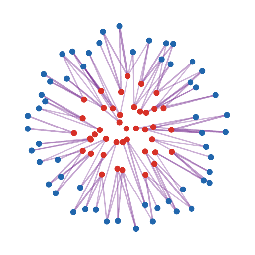

  
<h3>2&#46; Sinkhorn convergence</h3>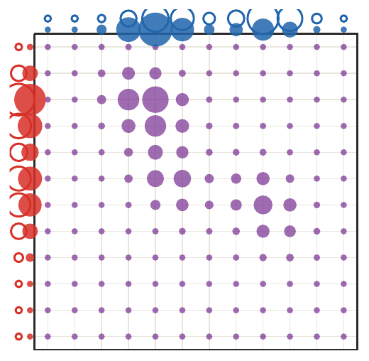

  
<h3>3&#46; Extensions and debiasing</h3>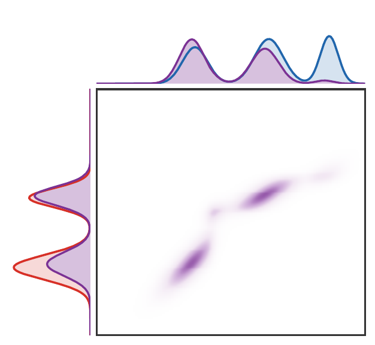

  
<h3>4&#46; Statistics</h3>

  
<h3>5&#46; Learning</h3>

## Discrete entropic OT

::: {.definition-box}
Entropic regularization.
For histograms $a\in\Sigma_n$, $b\in\Sigma_m$, cost matrix $C$, and $\varepsilon>0$,
$$
\mathcal L_{C,\varepsilon}(a,b)
=
\min_{P\in U(a,b)}
\langle C,P\rangle
+
\varepsilon\sum_{i,j}P_{i,j}\big(\log P_{i,j}-1\big),
$$
where $U(a,b)=\{P\geq 0:P\mathbb 1_m=a,\ P^\top\mathbb 1_n=b\}$.
:::

The entropy term makes the objective strictly convex on the positive orthant.

## Relative entropy form

::: {.definition-box}
KL form.
Using the product reference $a\otimes b$, the same minimization can be written, up to an additive constant independent of $P$, as
$$
\min_{P\in U(a,b)}
\langle C,P\rangle+
\varepsilon\operatorname{KL}(P\mid a\otimes b),
$$
where
$$
\operatorname{KL}(P\mid Q)=\sum_{i,j}P_{i,j}\log\frac{P_{i,j}}{Q_{i,j}}-P_{i,j}+Q_{i,j}.
$$
:::

This is the discrete static Schroedinger problem.

## Probabilistic interpretation

Let $(X,Y)$ have joint law $P$ and marginals $a,b$. Then
$$
\operatorname{KL}(P\mid a\otimes b)=I(X;Y),
$$
the mutual information between $X$ and $Y$.

::: {.result-box}
Interpretation.
Entropic OT minimizes expected transport cost while penalizing dependence between the source and target labels.
:::

Small $\varepsilon$ allows near-deterministic transport. Large $\varepsilon$ pushes toward independence.

## Continuous formulation

::: {.definition-box}
Continuous entropic OT.
For probability measures $\alpha,\beta$,
$$
\mathcal L_{c,\varepsilon}(\alpha,\beta)
=
\inf_{\pi\in\Gamma(\alpha,\beta)}
\int c(x,y)\,d\pi(x,y)
+
\varepsilon\operatorname{KL}(\pi\mid \alpha\otimes\beta).
$$
Here $\operatorname{KL}(\pi\mid q)=\int\log(d\pi/dq)\,d\pi$ if $\pi\ll q$, and $+\infty$ otherwise.
:::

Under the usual compactness and lower-semicontinuity assumptions, the value converges to the Kantorovich cost as $\varepsilon\to0$.

## Schrödinger path-space viewpoint

A dynamic version replaces straight-line transport by a controlled Brownian bridge problem. The static coupling is the endpoint law of a path measure.

In the historical “lazy gas” interpretation of Schrödinger's problem, one observes an unlikely final cloud and asks for the most likely Brownian path ensemble producing it.

::: {.result-box}
Static endpoint reduction.
For Brownian reference dynamics, optimizing over path laws with fixed endpoint marginals reduces to an entropic problem over the endpoint coupling.
:::

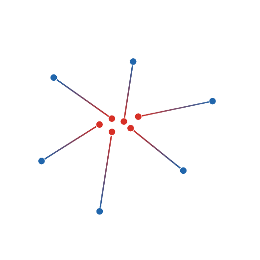
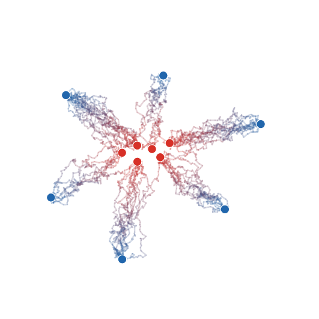
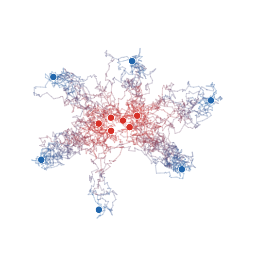
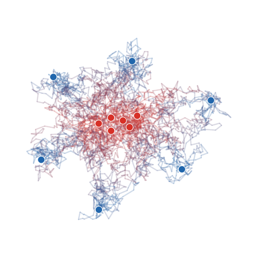

Increasing $\varepsilon$ turns OT rays into Brownian bridges.

## Live panel: Brownian bridge endpoint couplings

<iframe src="../../myst/live/sinkhorn-bridges.html" title="Interactive brownian bridge endpoint couplings"></iframe>

The same endpoint coupling can be lifted to path ensembles with increasing Brownian variability.

## Impact of $\varepsilon$

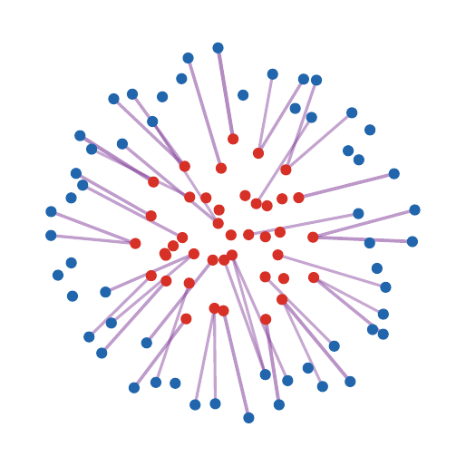

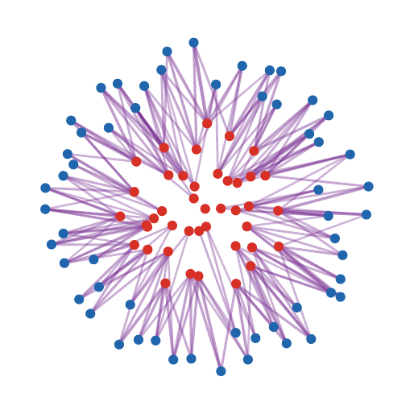
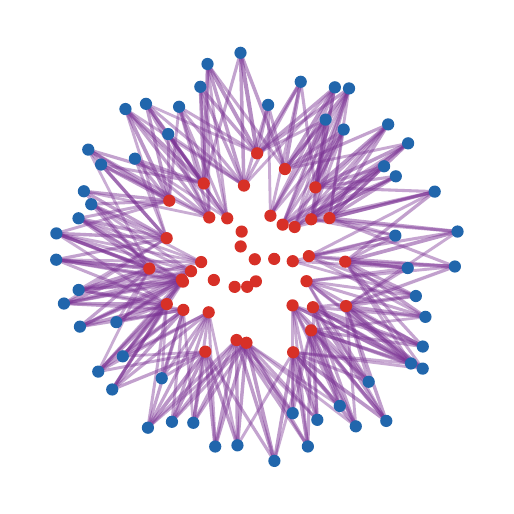

::: {.result-box}
Effect.
As $\varepsilon$ increases, the coupling becomes smoother and less sparse. As $\varepsilon$ decreases, it concentrates near the OT support.
:::

## Live panel: regularization strength

<iframe src="../../myst/live/sinkhorn-epsilon.html" title="Interactive regularization strength"></iframe>

This panel gives the continuous version of the same sharpening and blurring mechanism.

## Interactive: $\varepsilon$ controls the coupling

For $K_\varepsilon=e^{-C/\varepsilon}$, the optimal coupling has the form
$$
P_\varepsilon=\operatorname{diag}(u)K_\varepsilon\operatorname{diag}(v).
$$

Move the slider to see the coupling sharpen or diffuse.

<canvas id="sinkhorn-epsilon-canvas"></canvas>

sharp<input id="sinkhorn-epsilon-slider" type="range" min="-4.2" max="-0.3" value="-2.8" step="0.02">eps

## Sinkhorn scaling form

::: {.theorem-box}
Scaling form.
Let $K=e^{-C/\varepsilon}$ with positive entries. The entropic optimizer is unique and satisfies
$$
P=\operatorname{diag}(u)K\operatorname{diag}(v),
$$
where $u\in\mathbb R_+^n$ and $v\in\mathbb R_+^m$ enforce the two marginals.
Equivalently,
$$
u\odot(Kv)=a,
\qquad
v\odot(K^\top u)=b.
$$
:::

This reduces a constrained convex optimization problem to a matrix scaling problem.

## Sinkhorn algorithm

::: {.algorithm-box}
Sinkhorn scaling / IPFP / RAS.
Input: histograms $a,b$, kernel $K=e^{-C/\varepsilon}$.  
Output: scaled coupling $P$ with marginals $a,b$.

1. Initialize $v^{(0)}=\mathbb 1_m$.
2. For $\ell=0,1,2,\ldots$, update
$$
u^{(\ell+1)}=\frac{a}{K v^{(\ell)}},
\qquad
v^{(\ell+1)}=\frac{b}{K^\top u^{(\ell+1)}}.
$$
3. Return $P^{(\ell)}=\operatorname{diag}(u^{(\ell)})K\operatorname{diag}(v^{(\ell)})$.
:::

All divisions are entrywise.

The same matrix-scaling iteration appears under several names: Sinkhorn scaling, IPFP in statistics, and RAS in economics and input-output analysis.

## Live panel: Sinkhorn matrix scaling

<iframe src="../../myst/live/sinkhorn-scaling.html" title="Interactive sinkhorn matrix scaling"></iframe>

The row and column normalizations are the algorithmic heart of entropic OT.

## Matrix scaling has a long history

Sinkhorn is one member of a broader matrix-scaling family.

::: {.result-box}
Sinkhorn, IPFP, RAS.
Given a positive matrix $K$, the goal is to find diagonal scalings $u,v>0$ such that
$$
\operatorname{diag}(u)K\operatorname{diag}(v)\mathbb 1=a,
\qquad
\operatorname{diag}(v)K^\top\operatorname{diag}(u)\mathbb 1=b.
$$
The same alternating normalization appears in statistics, economics, input-output tables, and entropy-regularized OT.
:::

The OT contribution is to choose the matrix as the Gibbs kernel $K=e^{-C/\varepsilon}$.

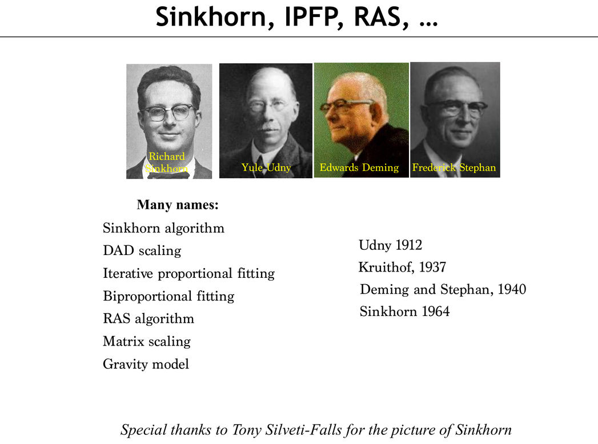

## Sinkhorn half-steps

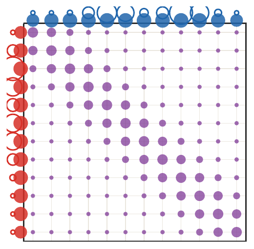
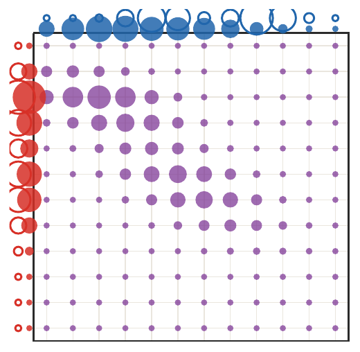
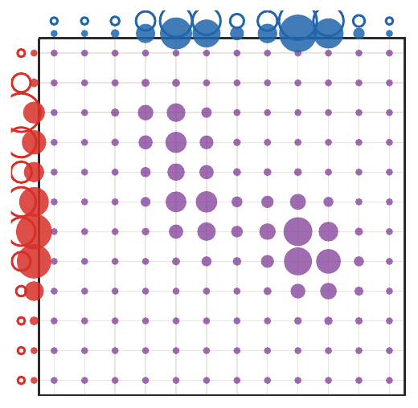

Each half-step fixes one marginal and breaks the other. Alternating the two projections converges to the intersection.

## Live panel: entropy barrier geometry

<iframe src="../../myst/live/sinkhorn-entropy-lp-geometry.html" title="Interactive entropy barrier geometry"></iframe>

The path followed by entropic solutions is a smooth central path inside the transport polytope.

## Computational structure

For dense kernels, one Sinkhorn iteration costs $O(nm)$.

::: {.result-box}
When Sinkhorn is fast.
Sinkhorn is fastest when $K$ has exploitable structure: convolution, separability, low rank, multiscale structure, or GPU-friendly matrix operations.
:::

This explains its role in machine learning: it is differentiable and easy to batch.

## Perron-Frobenius viewpoint

Hilbert-metric convergence comes from positive operators, not only from convex analysis.

::: {.theorem-box}
Positive operator intuition.
A positive linear map contracts the projective geometry of the cone. Sinkhorn alternates two such positive maps, and the resulting contraction explains a linear convergence mechanism when the kernel is strictly positive and well conditioned.
:::

This is the conceptual bridge between classical Perron-Frobenius theory, Rothblum-type matrix-scaling convergence analyses, and the Hilbert-metric proof later in this deck.

## Other convex regularizers

::: {.definition-box}
General regularized OT.
Entropy can be replaced by a convex divergence:
$$
\min_{P\in U(a,b)} \langle C,P\rangle+
\varepsilon D_\varphi(P\mid a\otimes b).
$$
For $Q=a\otimes b$, this means
$$
D_\varphi(P\mid Q)=\sum_{i,j}Q_{i,j}\,
\varphi\!\left(\frac{P_{i,j}}{Q_{i,j}}\right).
$$
:::

Different choices of $\varphi$ change both the smoothness and sparsity of the optimal coupling.

## Live panel: regularized OT beyond KL

<iframe src="../../myst/live/sinkhorn-regularizers.html" title="Interactive regularized ot beyond kl"></iframe>

Changing the divergence changes the dual update and the sparsity of the plan.

## Regularizer profiles

Each convex regularizer changes the scalar penalty applied to the density ratio $P_{i,j}/(a_i b_j)$.

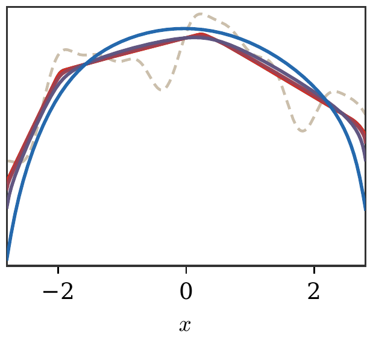
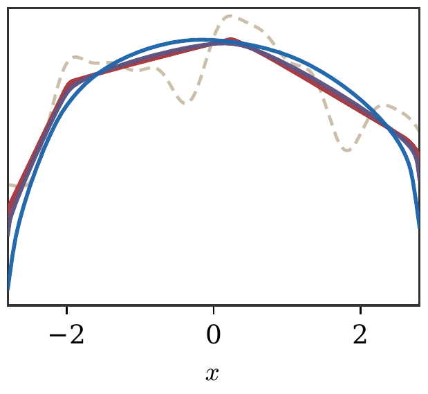
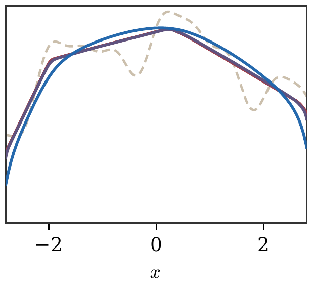

## Interactive: entropy spreads mass

Entropy replaces a sparse assignment by a Gibbs-weighted cloud around low-cost pairs. Increasing $\varepsilon$ therefore thickens the plan and improves smoothness.

The panel shows the same marginals while only the regularization strength changes.

<canvas id="entropy-spread-canvas"></canvas>

sparse<input id="entropy-spread-slider" type="range" min="-4.5" max="-0.15" value="-2.1" step="0.02">eps

## Roadmap: convergence analysis

  
<h3>1&#46; Entropic OT</h3>

  
<h3>2&#46; Sinkhorn convergence</h3>

  
<h3>3&#46; Extensions and debiasing</h3>

  
<h3>4&#46; Statistics</h3>

  
<h3>5&#46; Learning</h3>

## Bregman projection view

::: {.result-box}
Iterative KL projections.
Sinkhorn is alternating Bregman projection for the KL divergence onto the affine marginal constraint sets
$$
\mathcal C_a=\{P:P\mathbb 1_m=a\},
\qquad
\mathcal C_b=\{P:P^\top\mathbb 1_n=b\}.
$$
:::

The initial matrix is the Gibbs kernel $K=e^{-C/\varepsilon}$, and each projection is a multiplicative rescaling.

## Dual problem

::: {.theorem-box}
Entropic dual.
The discrete entropic problem has dual
$$
\max_{f,g}
\langle f,a\rangle+\langle g,b\rangle
-
\varepsilon\sum_{i,j}a_i b_j
\left(e^{(f_i+g_j-C_{i,j})/\varepsilon}-1\right).
$$
At optimality,
$$
P_{i,j}=a_i b_j e^{(f_i+g_j-C_{i,j})/\varepsilon}.
$$
:::

With the convention $P=\operatorname{diag}(u)K\operatorname{diag}(v)$, one has
$u_i=a_i e^{f_i/\varepsilon}$ and $v_j=b_j e^{g_j/\varepsilon}$.

## Soft c-transforms

::: {.definition-box}
Soft c-transform.
For a function $f$ on the source support,
$$
f^{c,\varepsilon}(y_j)
=-\varepsilon\log\sum_i a_i
\exp\left(\frac{f_i-C_{i,j}}{\varepsilon}\right).
$$
:::

Dual block maximization alternates soft transforms:
$$
g\leftarrow f^{c,\varepsilon},
\qquad
f\leftarrow g^{\bar c,\varepsilon}.
$$

## Live panel: soft c-transforms

<iframe src="../../myst/live/sinkhorn-soft-c.html" title="Interactive soft c-transforms"></iframe>

Soft transforms replace hard envelopes by log-sum-exp envelopes.

## Stabilized log-domain Sinkhorn

For small $\varepsilon$, $K=e^{-C/\varepsilon}$ can underflow. Stabilized implementations store log-scalings, equivalently dual potentials.

::: {.result-box}
Stabilized log-domain updates.
Instead of scaling vectors $u,v$, store potentials
$$
f_i=\varepsilon\log(u_i/a_i),
\qquad
g_j=\varepsilon\log(v_j/b_j).
$$
The updates are soft $c$-transforms computed with log-sum-exp operations.
:::

This keeps the Sinkhorn iteration stable when $\varepsilon$ is small and the Gibbs kernel has entries below machine precision.

## Log-domain update steps

::: {.algorithm-box .small .compact-eq}
Stabilized Sinkhorn iteration.
Input: histograms $a,b$, cost matrix $C$, regularization $\varepsilon>0$.  
Output: stabilized dual potentials $f,g$.

1. Initialize $f=0$.
2. Repeat until convergence:
$$
\begin{aligned}
g_j \leftarrow -\varepsilon\log\sum_i a_i
  \exp\!\left(\frac{f_i-C_{i,j}}{\varepsilon}\right),\\
f_i \leftarrow -\varepsilon\log\sum_j b_j
\exp\!\left(\frac{g_j-C_{i,j}}{\varepsilon}\right).
\end{aligned}
$$
3. Recover $P_{i,j}=a_i b_j \exp((f_i+g_j-C_{i,j})/\varepsilon)$.
:::

This is numerically stable because it uses log-sum-exp operations.

## Dual potentials and $\varepsilon$

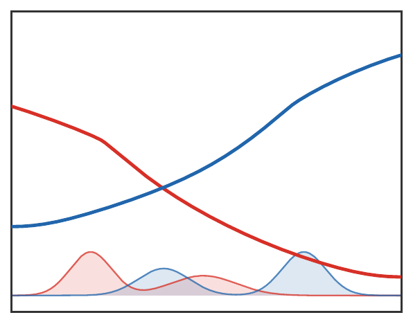
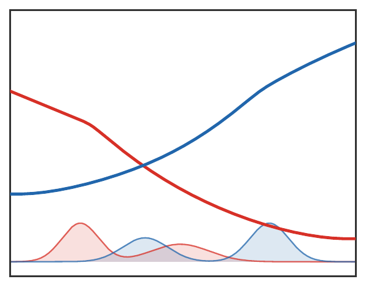
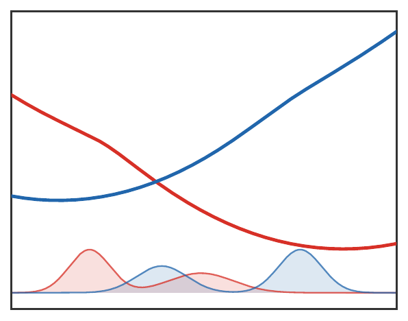

The potentials approach unregularized Kantorovich potentials as $\varepsilon\to 0$ and become smoother as $\varepsilon$ grows.

## Hilbert projective metric

::: {.definition-box}
Hilbert metric.
For positive vectors $u,v$,
$$
d_H(u,v)=\log\max_i\frac{u_i}{v_i}
-
\log\min_i\frac{u_i}{v_i}.
$$
:::

It ignores global scaling. This is exactly what is needed because Sinkhorn scalings are unique only up to reciprocal multiplication.

## Live panel: advanced Sinkhorn convergence

<iframe src="../../myst/live/sinkhorn-advanced-convergence.html" title="Interactive advanced sinkhorn convergence"></iframe>

The live view separates monotone convergence, projective contraction, and the role of conditioning.

## Linear contraction mechanism

::: {.theorem-box}
Positive maps contract projectively.
Positive linear maps are nonexpansive in Hilbert metric, and strictly positive matrices contract under quantitative irreducibility assumptions.
:::

Applied to $K$ and $K^\top$, this yields linear convergence of Sinkhorn in a projective metric.

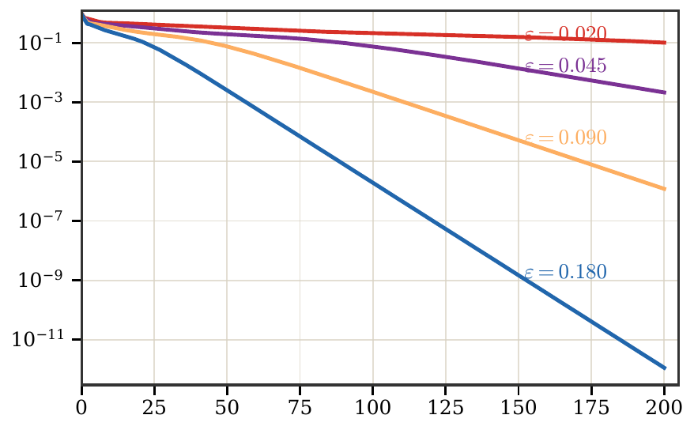

## Monotone and variation viewpoints

The log-domain map
$$
f\mapsto (f^{c,\varepsilon})^{\bar c,\varepsilon}
$$
is order-preserving and commutes with additive constants.

::: {.result-box}
Topical-map intuition.
Order preservation plus translation invariance implies nonexpansiveness for the variation seminorm
$$
\|f\|_{\mathrm{var}}=\max_i f_i-\min_i f_i.
$$
:::

This gives a robust way to read Sinkhorn as a monotone fixed-point iteration.

## Geometry of the regularized path

Entropy acts like a barrier inside the transport polytope. The solution follows a central path as $\varepsilon$ decreases.

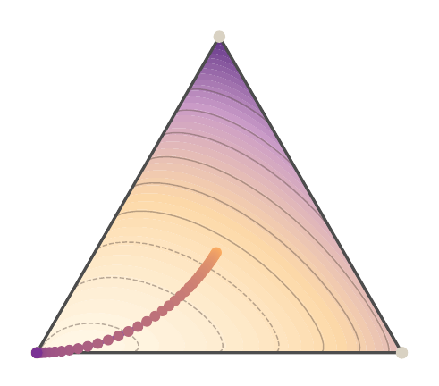

## Roadmap: extensions and debiasing

  
<h3>1&#46; Entropic OT</h3>

  
<h3>2&#46; Sinkhorn convergence</h3>

  
<h3>3&#46; Extensions and debiasing</h3>

  
<h3>4&#46; Statistics</h3>

  
<h3>5&#46; Learning</h3>

## Unbalanced entropic OT

::: {.definition-box}
KL-unbalanced formulation.
Instead of enforcing exact marginals, penalize deviations:
$$
\min_{P\geq 0}
\langle C,P\rangle+
\varepsilon\operatorname{KL}(P\mid a\otimes b)
+\tau\operatorname{KL}(P\mathbb 1\mid a)
+\tau\operatorname{KL}(P^\top\mathbb 1\mid b).
$$
:::

This allows mass creation and destruction when matching every unit of mass is unnatural.
The associated dynamic viewpoint is geodesic unbalanced OT: particles can move while their mass is also allowed to grow or decay.

## Live panel: unbalanced entropic transport

<iframe src="../../myst/live/generalized-unbalanced.html" title="Interactive unbalanced entropic transport"></iframe>

Relaxing marginal constraints changes transport into a combined displacement and mass-variation problem.

## Generalized Sinkhorn for unbalanced OT

For the KL marginal penalty, the updates become damped:
$$
u\leftarrow \left(\frac{a}{K v}\right)^{\tau/(\tau+\varepsilon)},
\qquad
v\leftarrow \left(\frac{b}{K^\top u}\right)^{\tau/(\tau+\varepsilon)}.
$$

::: {.result-box}
Balanced limit.
As $\tau\to +\infty$, the exponent tends to one and one recovers ordinary Sinkhorn scaling.
:::

## Marginal penalties matter

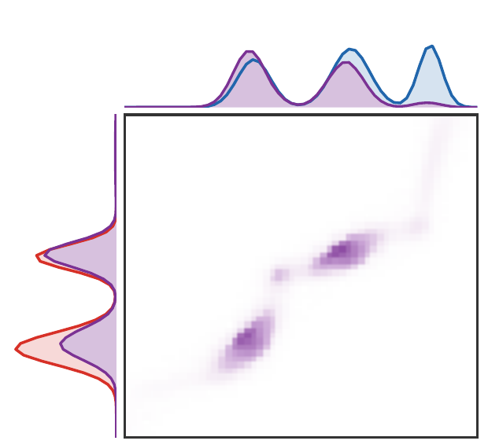
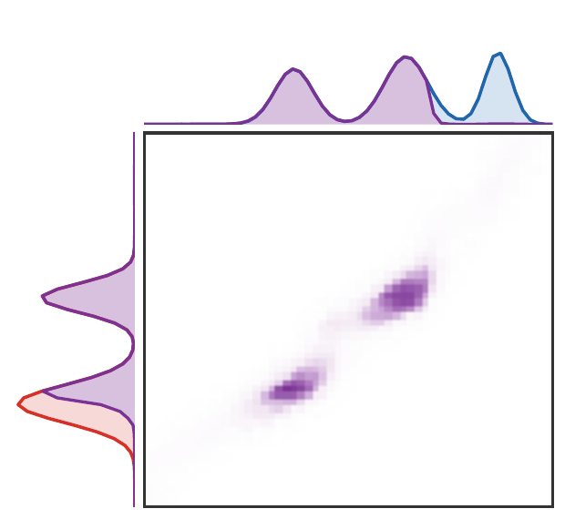
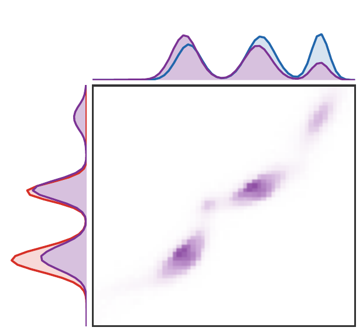

Different divergences encode different ways of ignoring or creating mass.

## Balanced versus unbalanced interpolation

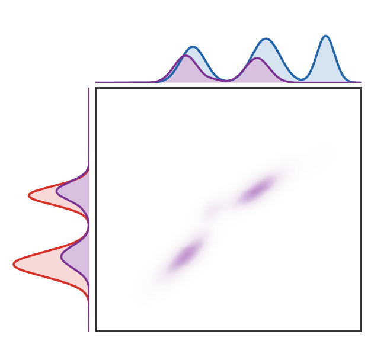

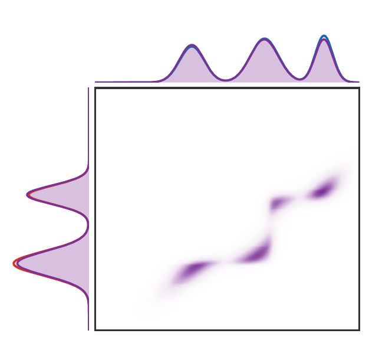

Small marginal penalty favors local mass variation; large penalty approaches balanced OT.

## Entropic barycenters

::: {.definition-box}
Entropic Wasserstein barycenter.
Given input measures $(\beta_s)_s$ and weights $(\lambda_s)_s$, compute
$$
\min_\alpha \sum_s \lambda_s\mathcal L_{c,\varepsilon}(\alpha,\beta_s).
$$
:::

Sinkhorn-like updates alternate between transport couplings and the barycenter weights.

## Live panel: entropic barycenters

<iframe src="../../myst/live/ot-problems-barycenter.html" title="Interactive entropic barycenters"></iframe>

Entropic smoothing turns barycenters into stable, differentiable averaging problems.

## Kernel norms and MMD

::: {.definition-box}
MMD.
For a reproducing kernel Hilbert space $\mathcal H$,
$$
\operatorname{MMD}_k(\alpha,\beta)
=
\sup_{\|f\|_\mathcal H\leq 1}
\int f\,d(\alpha-\beta).
$$
:::

MMD is not an OT distance, but it is another differentiable discrepancy with favorable sample complexity.

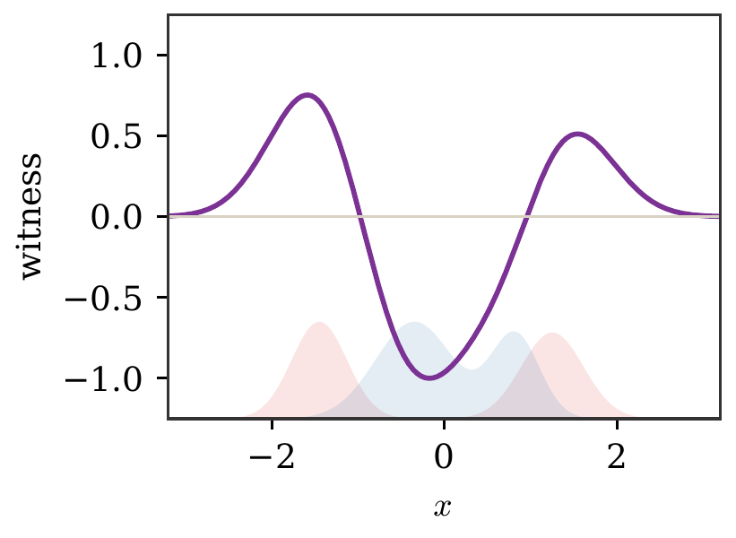

## Sinkhorn divergence

::: {.definition-box}
Debiased Sinkhorn loss.
The Sinkhorn divergence is
$$
S_\varepsilon(\alpha,\beta)
=
\mathcal L_{c,\varepsilon}(\alpha,\beta)
-\frac12\mathcal L_{c,\varepsilon}(\alpha,\alpha)
-\frac12\mathcal L_{c,\varepsilon}(\beta,\beta).
$$
:::

The correction removes the entropic self-bias: $S_\varepsilon(\alpha,\alpha)=0$, while preserving differentiability.

## Live panel: Sinkhorn debiasing

<iframe src="../../myst/live/sinkhorn-debias.html" title="Interactive sinkhorn debiasing"></iframe>

Debiasing removes the self-similarity blur introduced by entropy.

## Debiasing effect

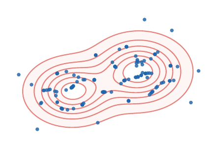

Raw, small $\varepsilon$.

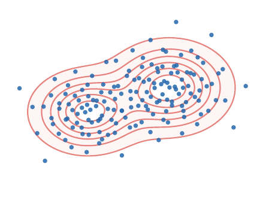

Debiased, small $\varepsilon$.

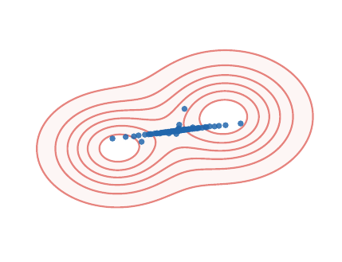

Raw, large $\varepsilon$.

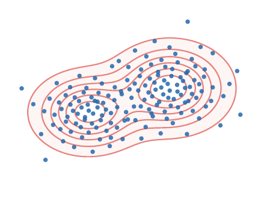

Debiased, large $\varepsilon$.

## Positivity and limits

::: {.theorem-box}
Sinkhorn divergence behavior.
For many standard costs, $S_\varepsilon$ is nonnegative and separates probability measures. Moreover,
$$
S_\varepsilon(\alpha,\beta)\to W_c(\alpha,\beta)
\quad\text{as }\varepsilon\to 0,
$$
while large $\varepsilon$ connects to kernel norms and MMD-type limits.
:::

This gives a continuum between OT geometry and kernel discrepancies.

## Roadmap: statistical behavior

  
<h3>1&#46; Entropic OT</h3>

  
<h3>2&#46; Sinkhorn convergence</h3>

  
<h3>3&#46; Extensions and debiasing</h3>

  
<h3>4&#46; Statistics</h3>

  
<h3>5&#46; Learning</h3>

## Curse of dimensionality for exact OT

For empirical measures $\hat\alpha_n$, exact OT suffers from dimension-dependent rates:
$$
\mathbb E\, W_p(\hat\alpha_n,\alpha)
\asymp n^{-1/d}
$$
in the high-dimensional absolutely continuous regime, up to known endpoint variations.

::: {.result-box}
Message.
Exact OT is geometrically rich but statistically expensive in high dimension.
:::

## Fixed $\varepsilon$ changes the statistics

At fixed $\varepsilon>0$, entropic OT and Sinkhorn divergences are smoother functionals of the empirical measure.

::: {.theorem-box}
Parametric behavior at fixed $\varepsilon$.
Under regularity assumptions, empirical Sinkhorn divergences admit $n^{-1/2}$-type fluctuations, with constants depending on $\varepsilon$.
:::

The price is bias: fixed $\varepsilon$ does not equal exact OT.

## Live panel: sample complexity at fixed epsilon

<iframe src="../../myst/live/sinkhorn-advanced-samples.html" title="Interactive sample complexity at fixed epsilon"></iframe>

Fixed regularization gives smoother statistics than exact OT.

## Bias-variance tradeoff

Small $\varepsilon$ reduces bias but makes computation and statistics harder. Large $\varepsilon$ smooths the problem but changes the geometry.

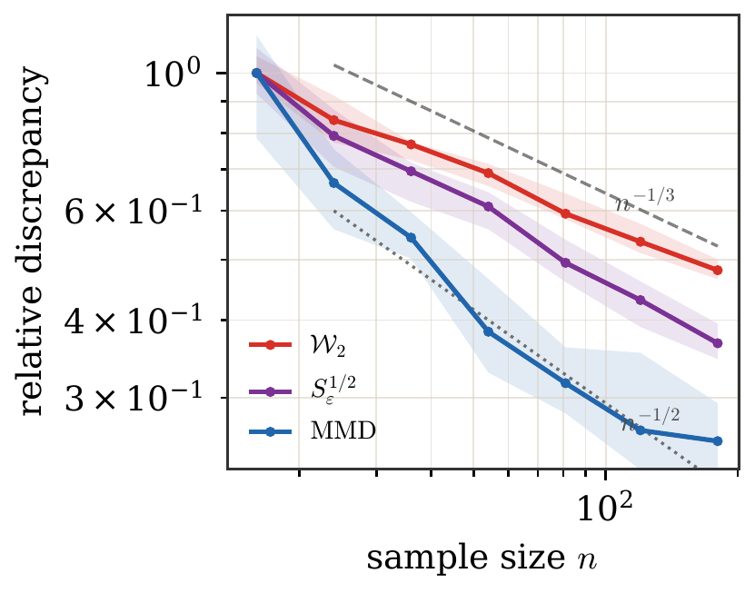

## Live panel: entropic bias and variance

<iframe src="../../myst/live/sinkhorn-bias-variance-tradeoff.html" title="Interactive entropic bias and variance"></iframe>

The useful regime balances approximation bias against statistical variance.

## Entropy estimates exact OT through three errors

For empirical data, the approximation to exact OT contains:

1. sampling error,
2. regularization bias,
3. numerical optimization error.

::: {.result-box}
Practical rule.
Choose $\varepsilon$ large enough for stable estimation and fast Sinkhorn iterations, but small enough to retain the desired OT geometry.
:::

## Smoothness and high dimension

If the inputs have smooth densities, smoothing or regularization can exploit this smoothness. In high dimension, generic smoothing is itself costly.

This is one reason entropic OT is attractive in practice: it provides a differentiable approximation with scalable linear-algebra structure.

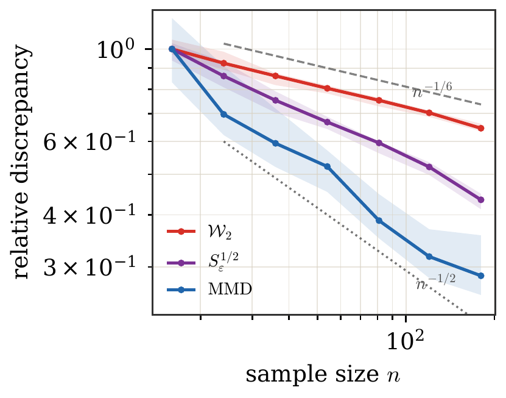

## Roadmap: learning with Sinkhorn

  
<h3>1&#46; Entropic OT</h3>

  
<h3>2&#46; Sinkhorn convergence</h3>

  
<h3>3&#46; Extensions and debiasing</h3>

  
<h3>4&#46; Statistics</h3>

  
<h3>5&#46; Learning</h3>

## Generative model fitting

::: {.definition-box}
Sinkhorn training loss.
For a generator $g_\theta$ and latent law $\zeta$, train with
$$
\min_\theta
S_\varepsilon\big((g_\theta)_\#\zeta,\beta\big).
$$
:::

The differentiability of the entropic problem makes this compatible with automatic differentiation.
Historically, the same training loop was used in Wasserstein, Sinkhorn, and MMD generative models, including progressive growing GAN experiments.

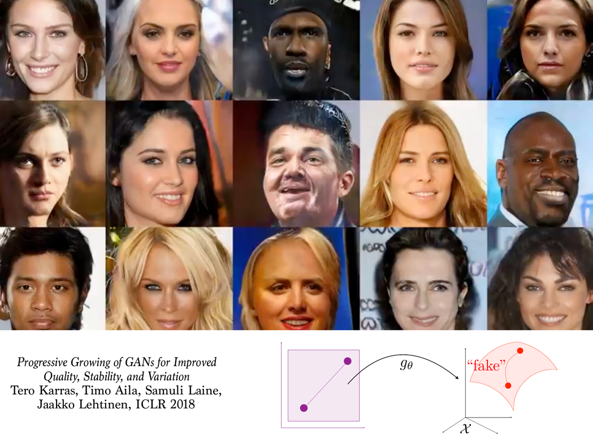

## Discriminator versus generator viewpoint

Kantorovich dual potentials play the role of smooth discriminators:
$$
\nabla_\theta S_\varepsilon((g_\theta)_\#\zeta,\beta)
$$
can be computed by differentiating through the generator and using the optimal dual potentials or coupling.

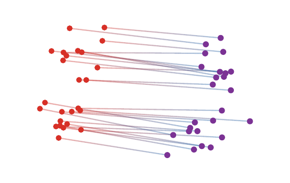

## Automatic differentiation

::: {.result-box}
Envelope principle.
Once the optimal dual variables are computed, the derivative of the regularized transport value with respect to the cost is the optimal coupling:
$$
\frac{\partial \mathcal L_{C,\varepsilon}}{\partial C_{i,j}}=P_{i,j}^\star.
$$
With respect to weights, the derivatives are the optimal dual potentials, up to the usual additive normalization.
:::

This is the basic reason Sinkhorn losses integrate well into differentiable learning pipelines.

## Training architecture

A typical mini-batch pipeline is:

1. sample latent variables and data,
2. build the cost matrix,
3. run Sinkhorn iterations,
4. backpropagate the Sinkhorn loss through the generator.

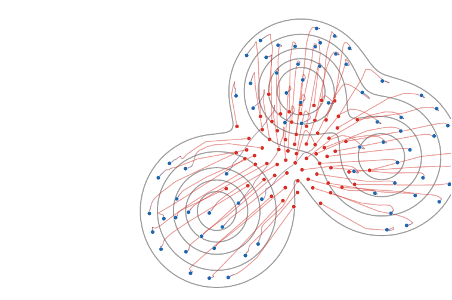

## Open problems and design tensions

::: {.result-box}
Main tension.
Entropic OT is an approximation, a numerical method, a statistical smoother, and a differentiable loss. The best $\varepsilon$ depends on the role.
:::

Open directions include scalable approximations in high dimension, adaptive regularization, metric learning for costs, and robust generative training.

## Summary

<strong>Entropy</strong> smooths OT plans

<strong>Sinkhorn</strong> solves by scaling

<strong>Debiasing</strong> turns costs into losses

::: {.result-box}
Takeaway.
Entropic regularization transforms optimal transport into a scalable differentiable primitive for optimization, statistics, and learning.
:::

## Next deck

The next presentation focuses on duality, semi-discrete OT, $c$-transforms, and Wasserstein-1 type dual norms.

