# Duality, Wasserstein-1, and Semi-discrete OT {.title-slide}

Dual potentials, Lipschitz witnesses, Laguerre cells, and quantization algorithms.

Gabriel Peyré

CNRS and École normale supérieure, PSL Université

Optimal Transport for Machine Learners

## Why duality matters

Kantorovich relaxation turns OT into a linear program. Its dual exposes functions rather than couplings.

This is useful because dual potentials:

- certify optimality,
- define gradients of OT losses,
- produce $W_1$ witnesses and GAN critics,
- drive semi-discrete algorithms.

source: $\alpha,x,a$target: $\beta,y,b$plan/map: $\pi,P,T$

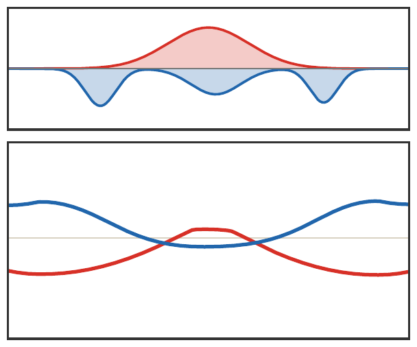

Dual potentials touch the cost on transported pairs.

## Roadmap: duality

  
<h3>1&#46; Duality</h3>

  
<h3>2&#46; Wasserstein-1 and IPMs</h3>

  
<h3>3&#46; Semi-discrete OT</h3>

  
<h3>4&#46; Quantization</h3>

  
<h3>5&#46; Learning links</h3>

## Discrete primal and dual

::: {.definition-box}
Discrete Kantorovich primal.
For $a\in\Sigma_n$, $b\in\Sigma_m$ and $C\in\mathbb R^{n\times m}$,
$$
\mathcal L_C(\textcolor{#c7372f}{a},\textcolor{#226db4}{b})=
\min_{\textcolor{#7c5bbd}{P}\geq0}
\langle C,\textcolor{#7c5bbd}{P}\rangle
\quad\text{s.t.}\quad
\textcolor{#7c5bbd}{P}\mathbb 1_m=\textcolor{#c7372f}{a},
\quad \textcolor{#7c5bbd}{P}^\top\mathbb 1_n=\textcolor{#226db4}{b}.
$$
:::

::: {.theorem-box}
Discrete dual.
$$
\mathcal L_C(\textcolor{#c7372f}{a},\textcolor{#226db4}{b})=
\max_{f\in\mathbb R^n,\ g\in\mathbb R^m}
\langle f,\textcolor{#c7372f}{a}\rangle+\langle g,\textcolor{#226db4}{b}\rangle
\quad\text{s.t.}\quad
f_i+g_j\leq C_{i,j}.
$$
:::

## Lagrangian derivation

The Lagrangian of the primal is
$$
\langle C,\textcolor{#7c5bbd}{P}\rangle+
\langle f,\textcolor{#c7372f}{a}-\textcolor{#7c5bbd}{P}\mathbb 1_m\rangle+
\langle g,\textcolor{#226db4}{b}-\textcolor{#7c5bbd}{P}^\top\mathbb 1_n\rangle.
$$

Minimizing over $P\geq0$ gives a finite value if and only if
$$
C_{i,j}-f_i-g_j\geq0\quad\forall i,j.
$$

This yields the dual constraints $f_i+g_j\leq C_{i,j}$.

## Complementary slackness

::: {.theorem-box}
Primal-dual contact.
If $P$ and $(f,g)$ are optimal, then
$$
\textcolor{#7c5bbd}{P}_{i,j}>0\quad\Longrightarrow\quad f_i+g_j=C_{i,j}.
$$
:::

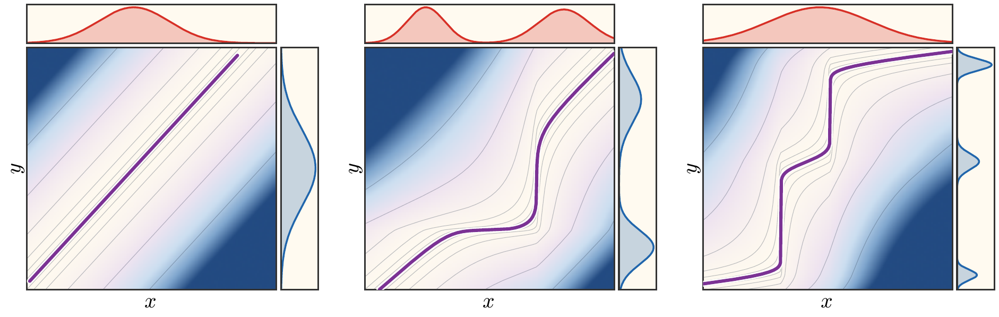

Mass is transported only on the contact set of the dual constraint.

## Discrete dual witnesses

Dual variables are not just algebraic multipliers: they are certificates explaining which transport edges can be active.

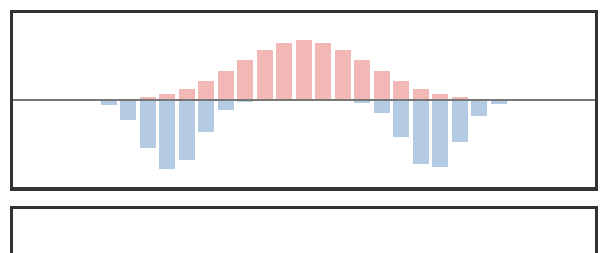
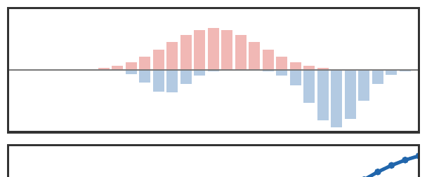
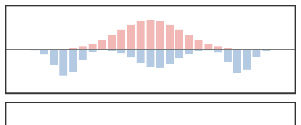
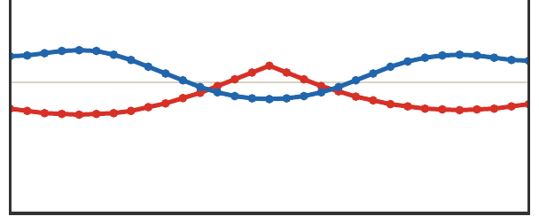
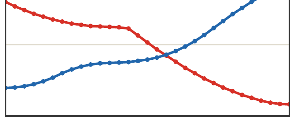
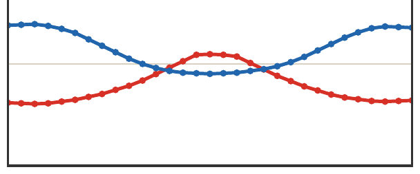

## Live panel: discrete dual potentials

<iframe src="../../myst/live/dual-discrete.html" title="Interactive discrete dual potentials"></iframe>

Dual certificates identify the active transport pairs.

## Continuous duality

::: {.theorem-box}
Kantorovich duality.
On Polish spaces, for a lower-semicontinuous cost $c$ bounded from below,
$$
\mathcal L_c(\textcolor{#c7372f}{\alpha},\textcolor{#226db4}{\beta})
=
\sup_{f,g}
\int f\,d\textcolor{#c7372f}{\alpha}+
\int g\,d\textcolor{#226db4}{\beta}
\quad\text{s.t.}\quad
f(\textcolor{#c7372f}{x})+g(\textcolor{#226db4}{y})\leq c(\textcolor{#c7372f}{x},\textcolor{#226db4}{y}).
$$
:::

Here "Polish" means complete and separable after choosing a compatible metric. This is the infinite-dimensional analogue of the finite LP dual.

## Continuous potentials

For quadratic cost in one dimension, optimal potentials encode the monotone transport map through their derivatives.

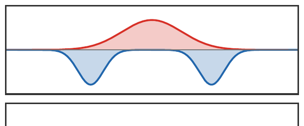
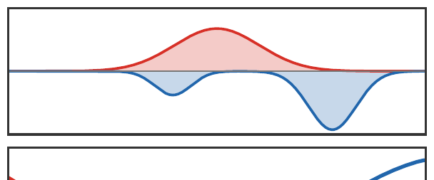
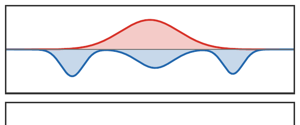
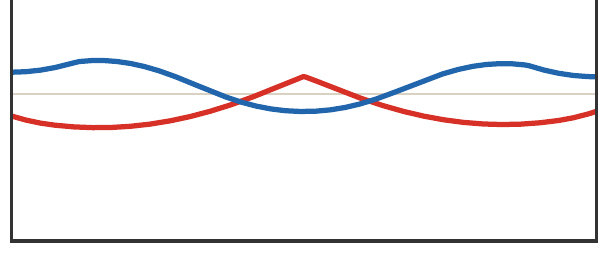
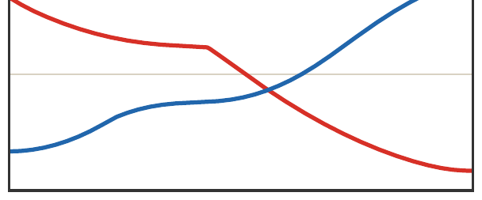
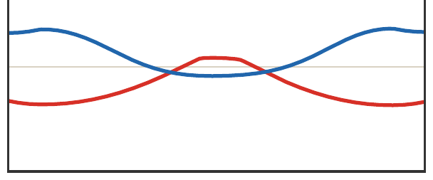

## Live panel: continuous Kantorovich potentials

<iframe src="../../myst/live/dual-continuous.html" title="Interactive continuous kantorovich potentials"></iframe>

In one dimension, the contact condition can be read directly from the potential curves.

## c-transform

::: {.definition-box}
c-transform.
For a function $f$ on the source space $X$, define
$$
f^c(\textcolor{#226db4}{y})
=
\inf_{\textcolor{#c7372f}{x}\in \textcolor{#c7372f}{X}}
\big(c(\textcolor{#c7372f}{x},\textcolor{#226db4}{y})-f(\textcolor{#c7372f}{x})\big).
$$
Similarly, for $g$ on the target space $Y$,
$$
g^{\bar c}(\textcolor{#c7372f}{x})
=
\inf_{\textcolor{#226db4}{y}\in \textcolor{#226db4}{Y}}
\big(c(\textcolor{#c7372f}{x},\textcolor{#226db4}{y})-g(\textcolor{#226db4}{y})\big).
$$
:::

The dual can be optimized by replacing one potential by the largest admissible companion.

## Reduced dual value

The $c$-transform removes one dual variable:
$$
\mathcal L_c(\textcolor{#c7372f}{\alpha},\textcolor{#226db4}{\beta})
=
\sup_f
\left\{
\int f\,d\textcolor{#c7372f}{\alpha}+\int f^c\,d\textcolor{#226db4}{\beta}
\right\}.
$$

In the discrete case this is
$$
\mathcal L_C(\textcolor{#c7372f}{a},\textcolor{#226db4}{b})=
\max_{f\in\mathbb R^n}
\left\{
\langle f,\textcolor{#c7372f}{a}\rangle+\langle f^C,\textcolor{#226db4}{b}\rangle
\right\},
\qquad
f^C_j=\min_i(C_{i,j}-f_i).
$$

This is the formula behind alternating c-transform updates.

## c-concavity

::: {.result-box}
Reduction to one potential.
At optimum one can impose
$$
g=f^c,
\qquad
f=g^{\bar c}.
$$
Thus dual potentials are fixed points of alternating c-transforms, up to non-uniqueness.
:::

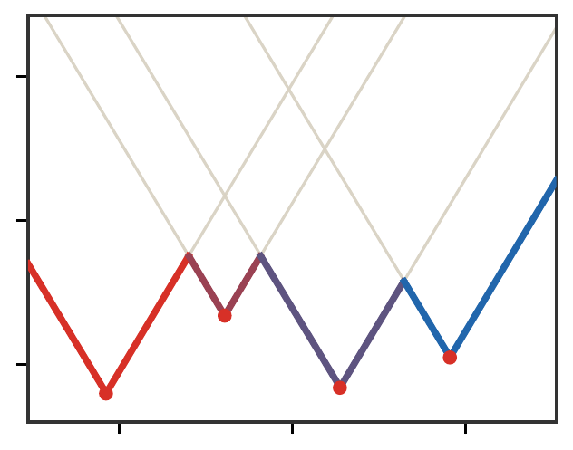
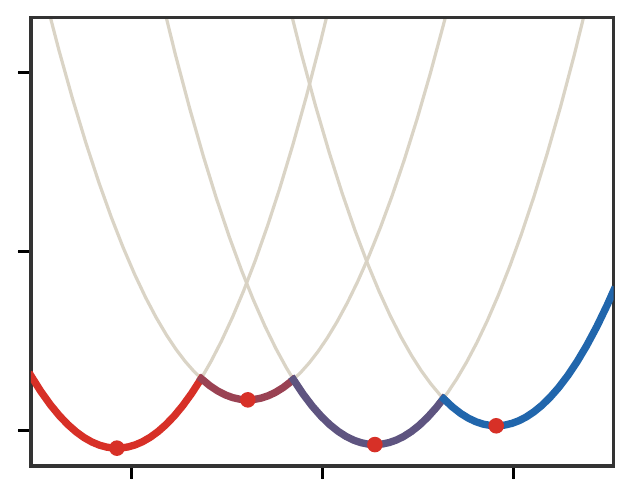
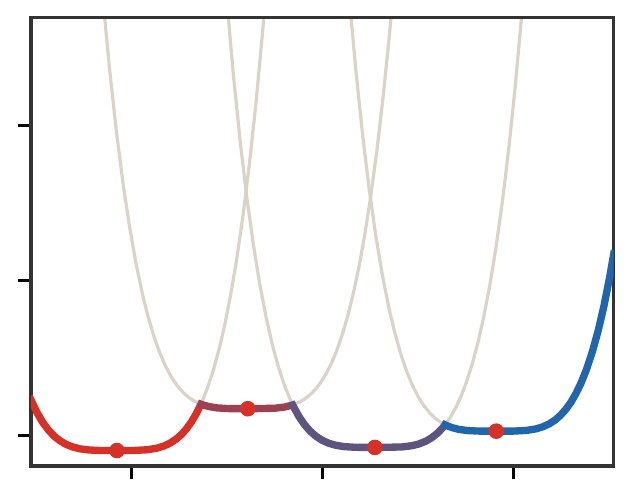

## Triple c-transform closure

The identity $f^{ccc}=f^c$ explains why alternating c-transforms stabilize.

::: {.theorem-box}
Closure identity.
For the c-transform, one always has
$$
f^{ccc}=f^c,
$$
with the appropriate alternation between $X$ and $Y$.
:::

Proof idea: the inequality $f^{cc}\geq f$ implies $f^{ccc}\leq f^c$, while applying the defining inequality of the c-transform in the reverse direction gives $f^{ccc}\geq f^c$.

## Interactive: changing the cost exponent

The $c$-transform closes a potential under the constraint $f(\textcolor{#c7372f}{x})+g(\textcolor{#226db4}{y})\leq c(\textcolor{#c7372f}{x},\textcolor{#226db4}{y})$. Changing the cost exponent changes the envelope selected by the dual constraint.

Here $c_p(\textcolor{#c7372f}{x},\textcolor{#226db4}{y})=|\textcolor{#c7372f}{x}-\textcolor{#226db4}{y}|^p$ and the slider controls $p$.

<canvas id="c-transform-exponent-canvas"></canvas>

flat<input id="c-transform-exponent-slider" type="range" min="1" max="4" value="2" step="0.02">p = 2.00

## Alternating c-transforms

Alternating minimization in the dual repeatedly closes potentials by c-transforms:

::: {.algorithm-box}
Alternating c-transform closure.
Input: initial source potential $f$. 
Output: dual feasible potentials $(f,g)$ after stabilization.

1. Set an initial source potential $f$.
2. Repeat the closure updates
$$
g\leftarrow f^c,\qquad
f\leftarrow g^{\bar c}.
$$
3. Stop when the potentials are numerically stable.
:::

Useful warning: this reveals the dual structure, but it is not by itself a fast generic OT solver.

## Live panel: alternating c-transforms

<iframe src="../../myst/live/dual-alternate.html" title="Interactive alternating c-transforms"></iframe>

Alternating envelopes implement the coordinate ascent geometry of the dual.

## c-transform closure geometry

The source and target closures can be viewed as envelopes of admissible potentials.

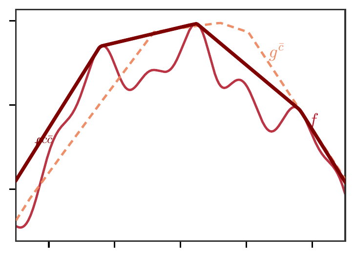

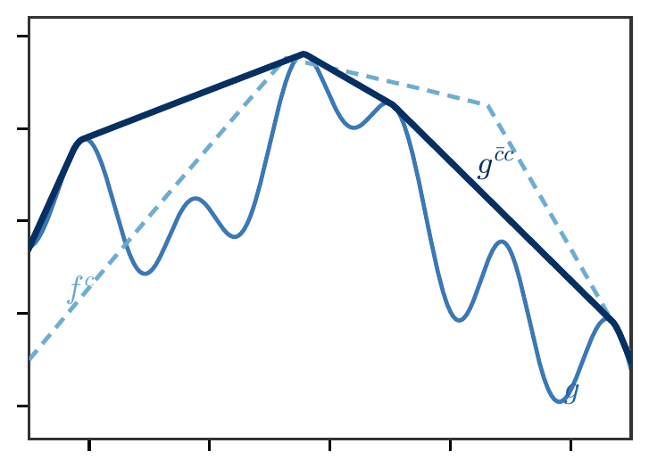

## Live panel: c-transform envelopes

<iframe src="../../myst/live/dual-envelope.html" title="Interactive c-transform envelopes"></iframe>

The envelope picture explains why c-concave potentials are the stable objects.

## Existence of dual optimizers

::: {.theorem-box}
Lipschitz compactness principle.
When the cost is Lipschitz on compact supports, optimal potentials can be chosen uniformly Lipschitz. Arzela-Ascoli compactness then yields an optimizer.
:::

This proof idea is important because the dual problem is over functions, not finite-dimensional vectors.

## Roadmap: Wasserstein-1 and integral probability metrics

  
<h3>1&#46; Duality</h3>

  
<h3>2&#46; Wasserstein-1 and IPMs</h3>

  
<h3>3&#46; Semi-discrete OT</h3>

  
<h3>4&#46; Quantization</h3>

  
<h3>5&#46; Learning links</h3>

## Kantorovich-Rubinstein formula

For $c(\textcolor{#c7372f}{x},\textcolor{#226db4}{y})=d(\textcolor{#c7372f}{x},\textcolor{#226db4}{y})$, the dual simplifies dramatically.

::: {.theorem-box}
Wasserstein-1 duality.
$$
W_1(\textcolor{#c7372f}{\alpha},\textcolor{#226db4}{\beta})=
\sup_{\operatorname{Lip}(f)\leq1}
\int f\,d(\textcolor{#c7372f}{\alpha}-\textcolor{#226db4}{\beta}).
$$
Here
$$
\operatorname{Lip}(f)=\sup_{\textcolor{#c7372f}{x}\neq \textcolor{#226db4}{y}}\frac{|f(\textcolor{#c7372f}{x})-f(\textcolor{#226db4}{y})|}{d(\textcolor{#c7372f}{x},\textcolor{#226db4}{y})}.
$$
:::

The witness $f$ is a 1-Lipschitz discriminator between the two measures.

## Wasserstein-1 as a norm

::: {.result-box}
Norm viewpoint.
On signed measures with zero total mass,
$$
\|\textcolor{#c7372f}{\alpha}-\textcolor{#226db4}{\beta}\|_{W_1}:=W_1(\textcolor{#c7372f}{\alpha},\textcolor{#226db4}{\beta})
$$
is a norm whenever the ground metric is fixed.
:::

This places $W_1$ among dual norms defined by classes of test functions.

## Integral probability metrics

::: {.definition-box}
Integral probability metric.
Given a symmetric class of test functions $\mathcal F$,
$$
D_\mathcal F(\textcolor{#c7372f}{\alpha},\textcolor{#226db4}{\beta})=
\sup_{f\in\mathcal F}\int f\,d(\textcolor{#c7372f}{\alpha}-\textcolor{#226db4}{\beta}).
$$
:::

Examples include total variation, Wasserstein-1, bounded-Lipschitz distances, and MMDs.

## Live panel: integral probability metrics

<iframe src="../../myst/live/dualnorm-ipm.html" title="Interactive integral probability metrics"></iframe>

Changing the witness class changes the geometry of the discrepancy.

## Dual witnesses compared

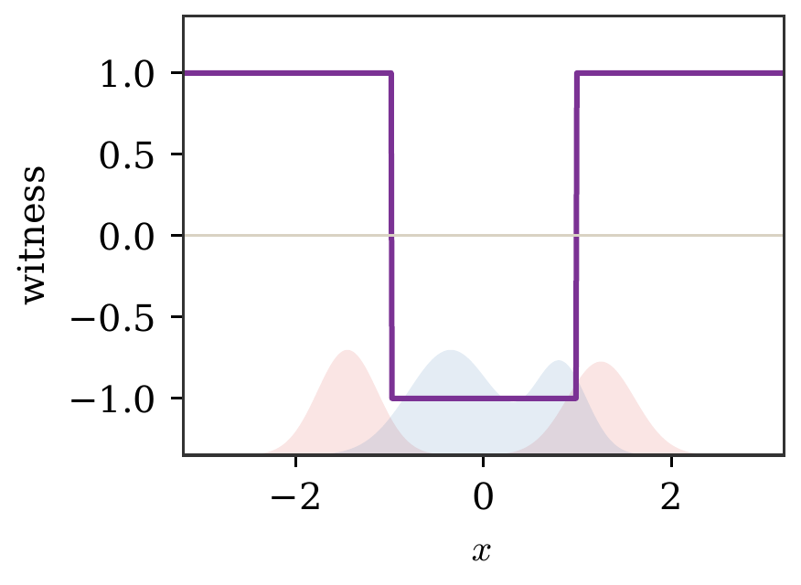
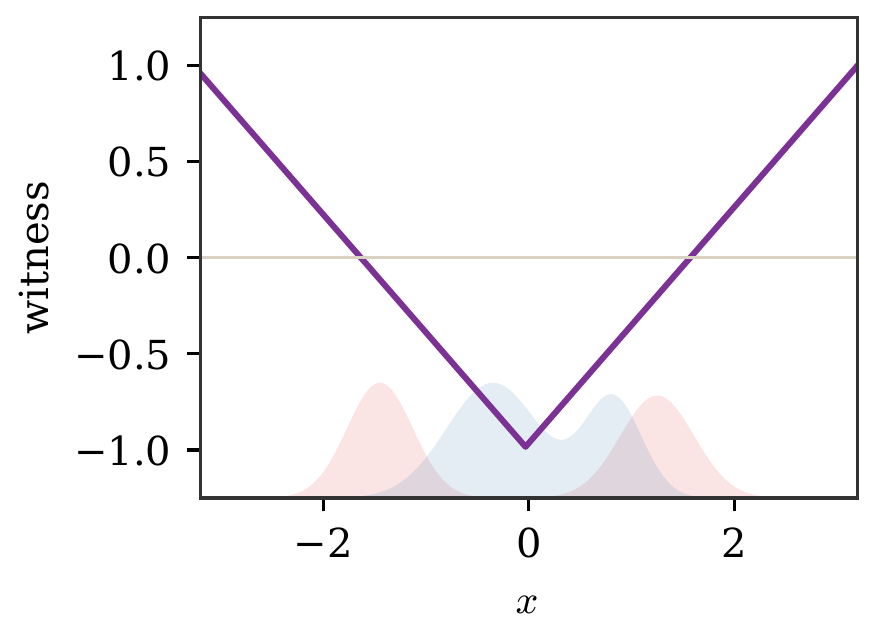
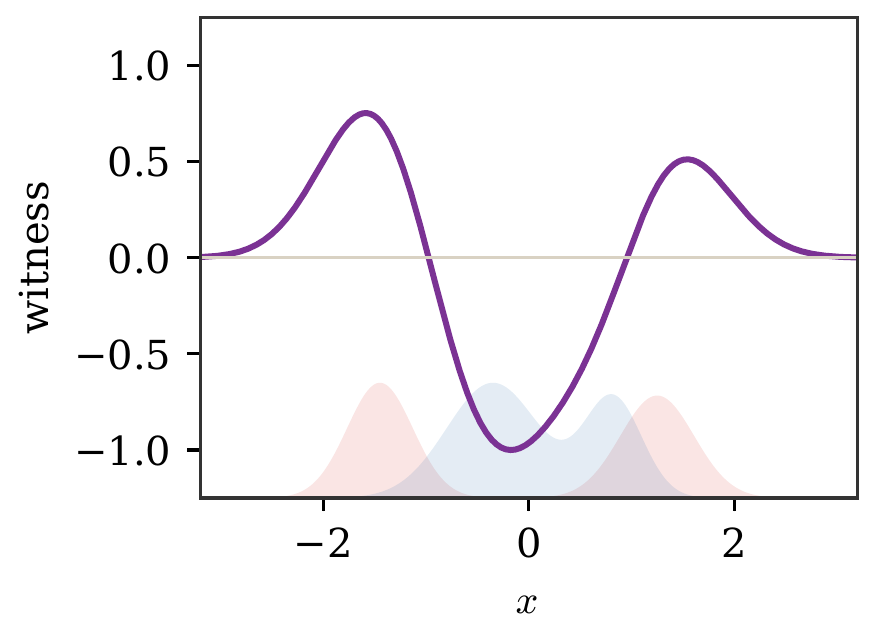

Different function classes produce different witnesses and therefore different notions of discrepancy.

## Live panel: witness constraints

<iframe src="../../myst/live/dualnorm-phi.html" title="Interactive witness constraints"></iframe>

The same signed mass can be tested by very different admissible witnesses.

## Wasserstein-1 on Euclidean domains

For smooth $f$ on Euclidean domains, $\operatorname{Lip}(f)\leq1$ is equivalent to
$$
\|\nabla f(x)\|\leq1.
$$

This connects $W_1$ to Beckmann's continuous flux formulation:
$$
W_1(\textcolor{#c7372f}{\alpha},\textcolor{#226db4}{\beta})=
\min_{\textcolor{#7c5bbd}{m}}\int \|\textcolor{#7c5bbd}{m}(\textcolor{#c7372f}{x})\|\,d\textcolor{#c7372f}{x}
\quad\text{s.t.}\quad
\operatorname{div}\textcolor{#7c5bbd}{m}=\textcolor{#c7372f}{\alpha}-\textcolor{#226db4}{\beta}.
$$

## W1 on surfaces and subdomains

The same Beckmann idea extends beyond flat Euclidean grids by replacing gradients and divergence with their geometric counterparts.

::: {.result-box}
Geometric message.
On meshes, surfaces, or subdomains, $W_1$ can be computed as a flow constrained by the geometry. Graph discretizations are the simplest finite-dimensional version of this idea.
:::

This is the setting of surface and subdomain $W_1$ solvers used in geometry processing, including the Solomon-Rustamov-Guibas-Butscher line of work. Graph flows are the simplest discrete proxy for this geometric formulation.

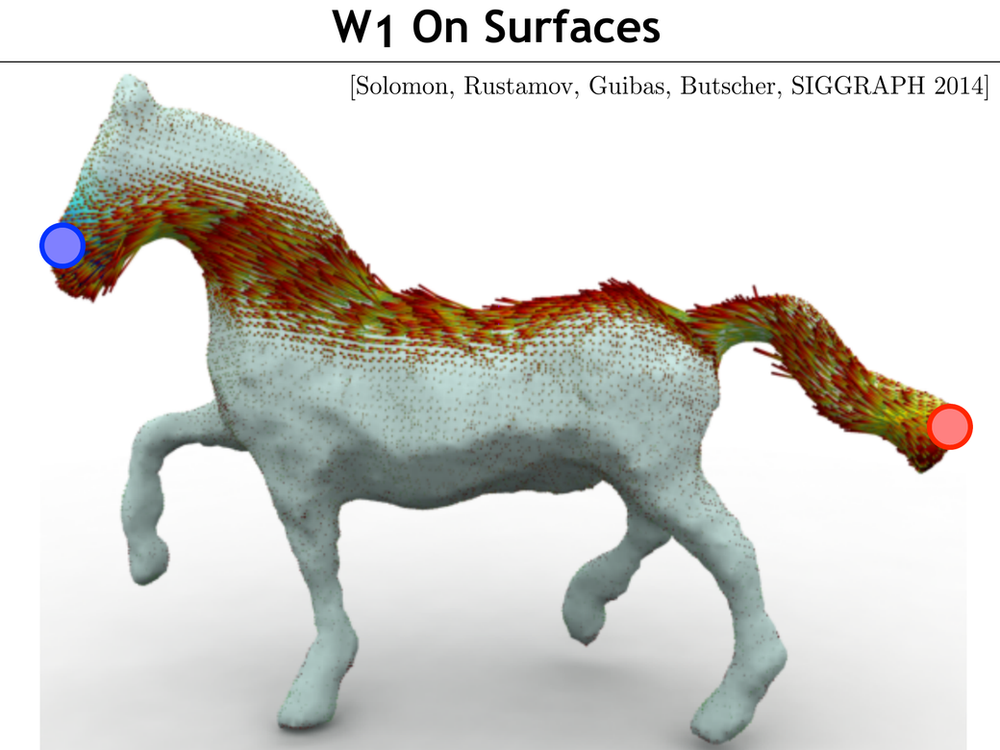

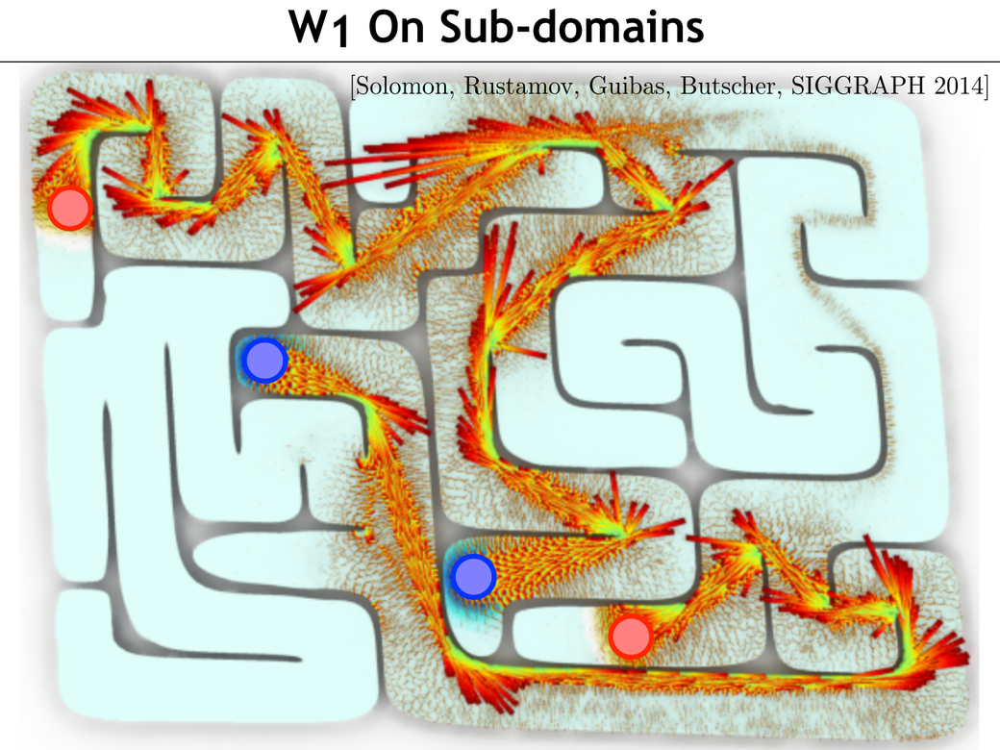

## Wasserstein-1 on graphs

On a graph, the Beckmann formulation becomes a sparse network-flow problem over edges:
$$
\min_{\textcolor{#7c5bbd}{q}}\sum_{e} w_e|\textcolor{#7c5bbd}{q_e}|
\quad\text{s.t.}\quad
D\textcolor{#7c5bbd}{q}=\textcolor{#c7372f}{a}-\textcolor{#226db4}{b}.
$$
Here $D$ is the signed vertex-edge incidence matrix and $\textcolor{#7c5bbd}{q_e}$ is the oriented mass flux on edge $e$.

This can be much smaller than a full pairwise Kantorovich LP.

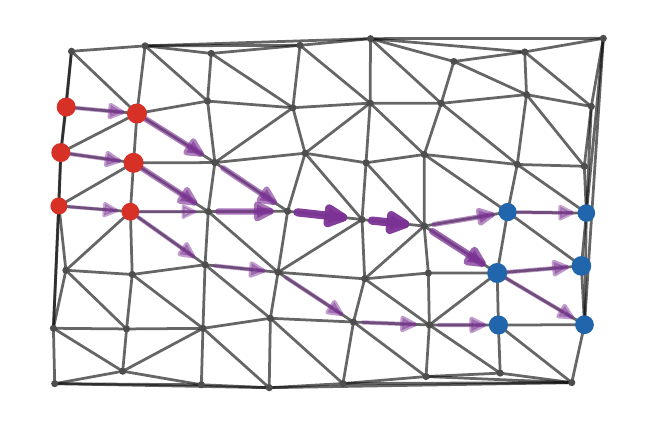

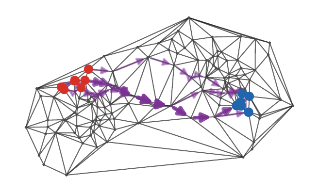

## Live panel: graph Beckmann transport

<iframe src="../../myst/live/w1-graph.html" title="Interactive graph beckmann transport"></iframe>

The graph formulation turns W1 into a network flow problem.

## Graph flow visualization

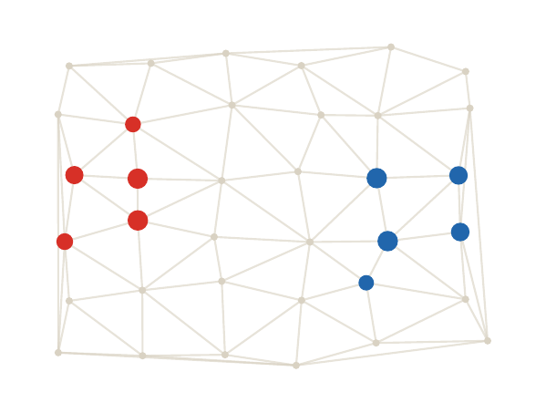

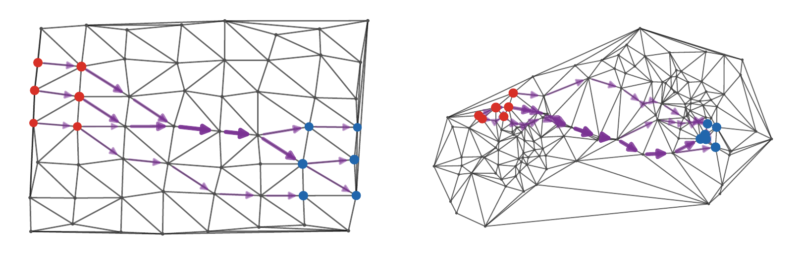

The edge flow is the sparse object that transports positive mass to negative mass through the graph geometry.

## WGAN viewpoint

::: {.example-box}
Example: Wasserstein GAN.
A generator $g_\theta$ can be trained by minimizing
$$
\min_\theta W_1(\textcolor{#c7372f}{(g_\theta)_\#\zeta},\textcolor{#226db4}{\beta})
=
\min_\theta\sup_{\operatorname{Lip}(f)\leq1}
\mathbb E f(\textcolor{#c7372f}{g_\theta(Z)})-\mathbb E f(\textcolor{#226db4}{Y}).
$$
The discriminator is a parametrized approximation of a 1-Lipschitz Kantorovich potential.
:::

This is the machine-learning face of Kantorovich-Rubinstein duality.

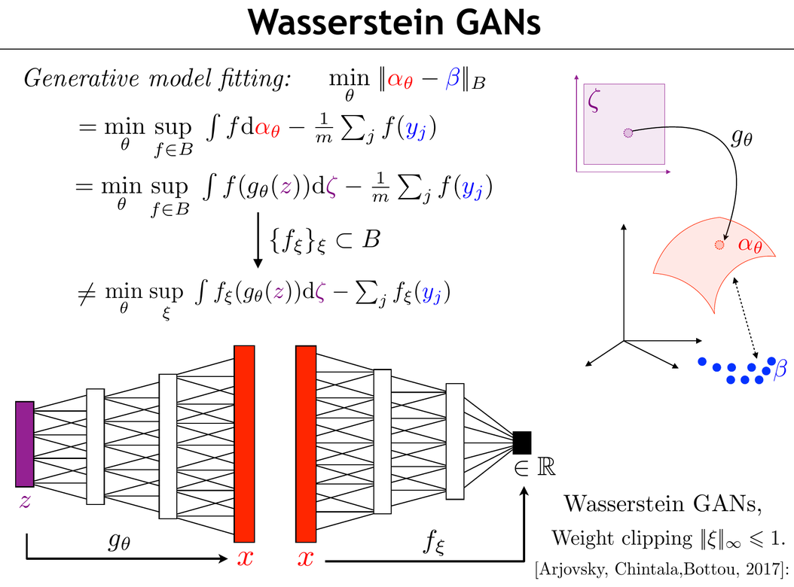

## Roadmap: semi-discrete OT

  
<h3>1&#46; Duality</h3>

  
<h3>2&#46; Wasserstein-1 and IPMs</h3>

  
<h3>3&#46; Semi-discrete OT</h3>

  
<h3>4&#46; Quantization</h3>

  
<h3>5&#46; Learning links</h3>

## Semi-discrete setting

::: {.definition-box}
Semi-discrete OT.
Let $\alpha$ be a continuous probability measure on $\mathbb R^d$ and
$$
\textcolor{#226db4}{\beta}=\sum_{j=1}^m b_j\delta_{\textcolor{#226db4}{y_j}}
$$
be discrete. For quadratic cost, one seeks a partition of the source domain whose cells have masses $b_j$.
:::

The unknown is not a full coupling matrix but a weighted spatial partition.

## Laguerre cells

::: {.definition-box}
Laguerre cell.
For target sites $y_j$ and weights $g_j$, the cell associated with $j$ is
$$
L_j(g)=\{\textcolor{#c7372f}{x}: \|\textcolor{#c7372f}{x}-\textcolor{#226db4}{y_j}\|^2-g_j\leq \|\textcolor{#c7372f}{x}-\textcolor{#226db4}{y_k}\|^2-g_k\quad\forall k\}.
$$
:::

The semi-discrete map sends every $x\in L_j(g)$ to $y_j$.
Optimal weights are characterized by the mass constraints
$$
\textcolor{#c7372f}{\alpha}(L_j(g))=\textcolor{#226db4}{b_j},\qquad j=1,\ldots,m.
$$

## Live panel: Laguerre cells and dual weights

<iframe src="../../myst/live/semidiscrete-laguerre.html" title="Interactive laguerre cells and dual weights"></iframe>

Changing a target weight geometrically expands or shrinks its cell.

## Power diagrams

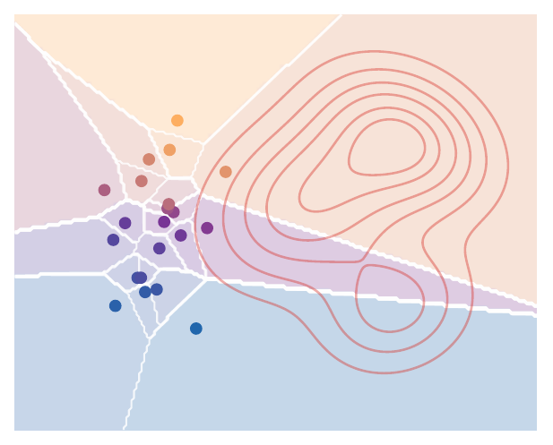
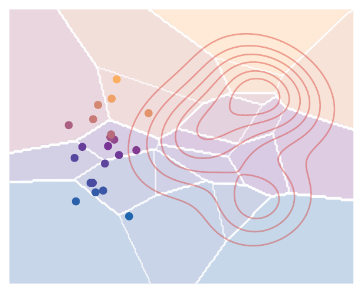
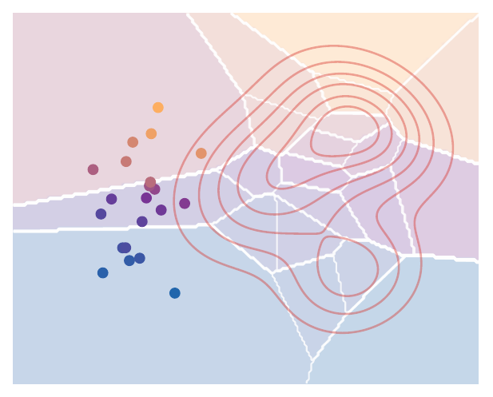

Voronoi cells become Laguerre cells when weights are introduced. The weights tune cell masses.

## Interactive: one weight changes one cell

Changing $g_j$ shifts the additive power distance
$$
\|\textcolor{#c7372f}{x}-\textcolor{#226db4}{y_j}\|^2-g_j.
$$
Increasing $g_j$ makes site $j$ more attractive and expands its Laguerre cell.

<canvas id="laguerre-weight-canvas"></canvas>

smaller cell<input id="laguerre-weight-slider" type="range" min="-0.35" max="0.35" value="0" step="0.01">weight shift

## Semi-discrete dual

For quadratic cost, the dual can be written as a concave maximization over weights:
$$
\max_{g\in\mathbb R^m}
\int \min_j\big(\|\textcolor{#c7372f}{x}-\textcolor{#226db4}{y_j}\|^2-g_j\big)\,d\textcolor{#c7372f}{\alpha}(\textcolor{#c7372f}{x})
+
\sum_{j=1}^m \textcolor{#226db4}{b_j} g_j.
$$

::: {.result-box}
Gradient.
The gradient component is
$$
\frac{\partial}{\partial g_j}=\textcolor{#226db4}{b_j}-\textcolor{#c7372f}{\alpha}(L_j(g)).
$$
Thus dual ascent balances Laguerre cell masses.
:::

## Hessian and Newton structure

The reference semi-discrete solver uses the fact that the dual has an explicit sparse Hessian. If $\textcolor{#c7372f}{\alpha}=\rho(x)\,dx$ and cells $L_i(g)$ and $L_j(g)$ share a facet
$$
F_{i,j}=L_i(g)\cap L_j(g),
$$
then for $i\neq j$,
$$
\frac{\partial\,\textcolor{#c7372f}{\alpha}(L_i(g))}{\partial g_j}
=
-\frac{1}{2\|\textcolor{#226db4}{y_i}-\textcolor{#226db4}{y_j}\|}
\int_{F_{i,j}}\rho(x)\,d\mathcal H^{d-1}(x),
$$
and the diagonal is chosen so rows sum to zero:
$$
\frac{\partial\,\textcolor{#c7372f}{\alpha}(L_i(g))}{\partial g_i}
=-\sum_{j\neq i}
\frac{\partial\,\textcolor{#c7372f}{\alpha}(L_i(g))}{\partial g_j}.
$$
Thus the Hessian of the concave dual has positive off-diagonal entries and negative diagonal row sums. Newton or quasi-Newton methods exploit the adjacency graph of the Laguerre diagram rather than a dense coupling matrix.

## Weight descent as mass balancing

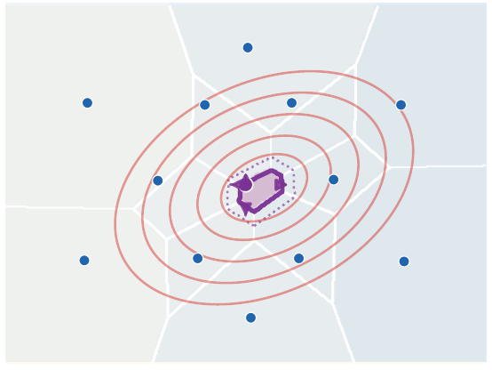
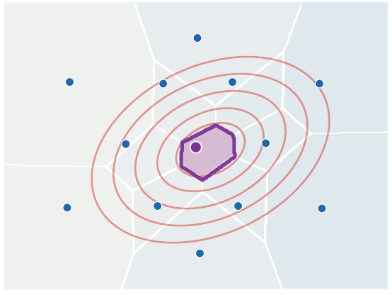
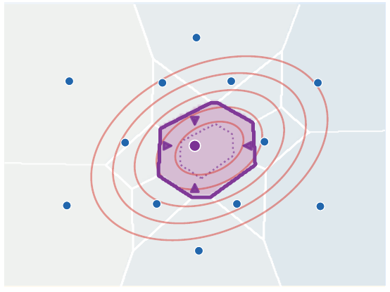

The algorithm updates the weights until every cell has the prescribed mass.

## Semi-discrete examples

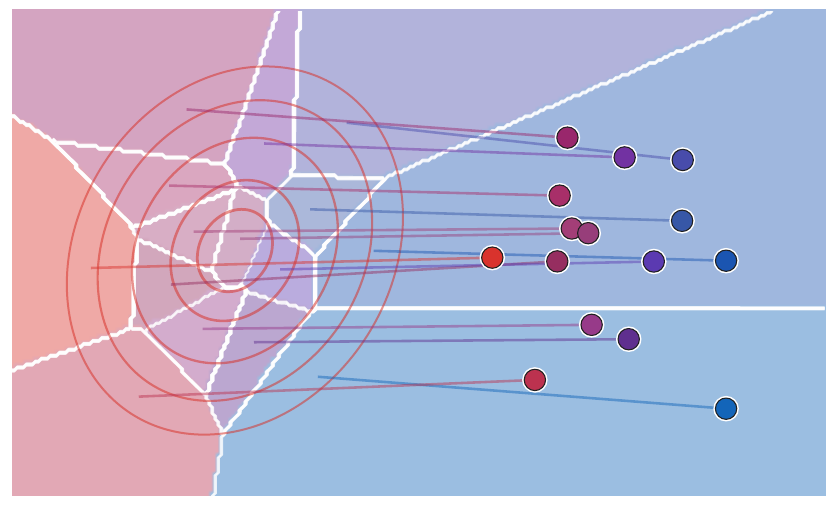

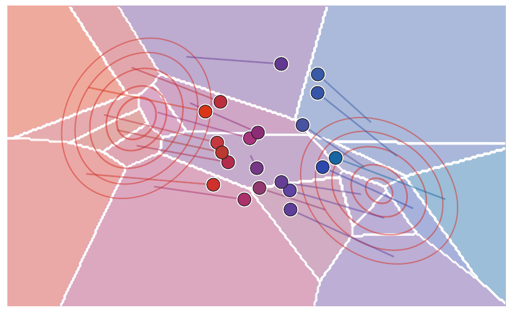

Coloring makes the spatial map visible: each source cell is sent to one target atom.

## Practical optimization

::: {.algorithm-box}
Semi-discrete dual ascent.
Input: source density $\alpha$, target sites $y_j$, target masses $b_j$. 
Initialize weights $g$. 
Repeat:
$$
L_j(g)=\{\textcolor{#c7372f}{x}: \|\textcolor{#c7372f}{x}-\textcolor{#226db4}{y_j}\|^2-g_j\leq \|\textcolor{#c7372f}{x}-\textcolor{#226db4}{y_k}\|^2-g_k\},
$$
$$
g_j\leftarrow g_j+\tau\big(\textcolor{#226db4}{b_j}-\textcolor{#c7372f}{\alpha}(L_j(g))\big).
$$
Output: the Laguerre partition and map $\textcolor{#7c5bbd}{T}(\textcolor{#c7372f}{x})=\textcolor{#226db4}{y_j}$ for $\textcolor{#c7372f}{x}\in L_j(g)$.
:::

Newton and quasi-Newton methods, especially L-BFGS variants, are typically used in high-quality implementations because the semi-discrete dual is a smooth concave objective away from cell degeneracies.

## Roadmap: optimal quantization

  
<h3>1&#46; Duality</h3>

  
<h3>2&#46; Wasserstein-1 and IPMs</h3>

  
<h3>3&#46; Semi-discrete OT</h3>

  
<h3>4&#46; Quantization</h3>

  
<h3>5&#46; Learning links</h3>

## Quantization problem

::: {.definition-box}
Optimal quantization.
For a source measure $\alpha$ and $m$ target sites $Y=(y_1,\ldots,y_m)$,
$$
Q_m(\textcolor{#c7372f}{\alpha})=
\min_{\textcolor{#226db4}{Y},\textcolor{#226db4}{b}\in\Sigma_m}
W_2^2\left(\textcolor{#c7372f}{\alpha},\sum_{j=1}^m \textcolor{#226db4}{b_j}\delta_{\textcolor{#226db4}{y_j}}\right).
$$
For fixed sites $Y$, this equals
$$
\int \min_j\|\textcolor{#c7372f}{x}-\textcolor{#226db4}{y_j}\|^2\,d\textcolor{#c7372f}{\alpha}(\textcolor{#c7372f}{x})
$$
when the masses are free.
:::

The goal is to approximate a continuous measure by a small discrete measure.

## Fixed versus free masses

If the masses $b_j$ are fixed, semi-discrete OT gives the optimal cells for fixed sites. If the masses are free, the optimal cells are Voronoi cells.

::: {.result-box}
Centroid condition.
At an unconstrained local optimum for quadratic cost,
$$
\textcolor{#226db4}{y_j}=\frac{\int_{V_j(Y)} \textcolor{#c7372f}{x}\,d\textcolor{#c7372f}{\alpha}(\textcolor{#c7372f}{x})}{\textcolor{#c7372f}{\alpha}(V_j(Y))},
$$
where $V_j(\textcolor{#226db4}{Y})$ is the Voronoi cell of $\textcolor{#226db4}{y_j}$.
:::

## Quantization stationarity

For fixed sites $Y$ and free masses, the semi-discrete dual collapses to the closest-site formula
$$
\min_{\textcolor{#226db4}{b}\in\Sigma_m}
\mathcal L_c\!\left(\textcolor{#c7372f}{\alpha},
\sum_j\textcolor{#226db4}{b_j}\delta_{\textcolor{#226db4}{y_j}}\right)
=
\int \min_j c(\textcolor{#c7372f}{x},\textcolor{#226db4}{y_j})\,d\textcolor{#c7372f}{\alpha}(\textcolor{#c7372f}{x}).
$$

If the cells $V_j(Y)=\{x:c(x,y_j)\leq c(x,y_k)\ \forall k\}$ are stable and $c$ is differentiable in $y$, a local minimizer satisfies
$$
\int_{V_j(Y)}\nabla_y c(\textcolor{#c7372f}{x},\textcolor{#226db4}{y_j})\,d\textcolor{#c7372f}{\alpha}(\textcolor{#c7372f}{x})=0.
$$
For $c(x,y)=\|x-y\|^2$, this is exactly the centroid condition.

## Lloyd algorithm

::: {.algorithm-box}
Lloyd iteration.
Input: source measure $\alpha$, initial sites $Y$. 
Repeat:

1. Build Voronoi cells $V_j(\textcolor{#226db4}{Y})$.
2. Replace each site by its cell centroid,
$$
\textcolor{#226db4}{y_j}\leftarrow \frac{\int_{V_j(Y)}\textcolor{#c7372f}{x}\,d\textcolor{#c7372f}{\alpha}(\textcolor{#c7372f}{x})}{\textcolor{#c7372f}{\alpha}(V_j(Y))}.
$$

Output: a centroidal Voronoi tessellation.
:::

## Live panel: Lloyd iterations

<iframe src="../../myst/live/semidiscrete-lloyd.html" title="Interactive lloyd iterations"></iframe>

The iterations alternate cell assignment and centroid update.

## Lloyd iterations

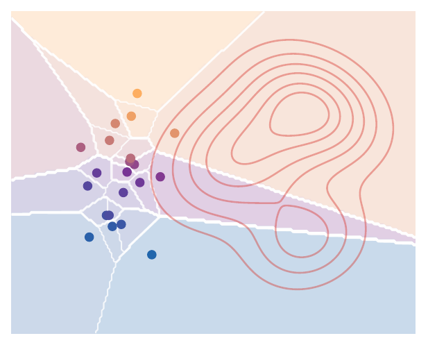
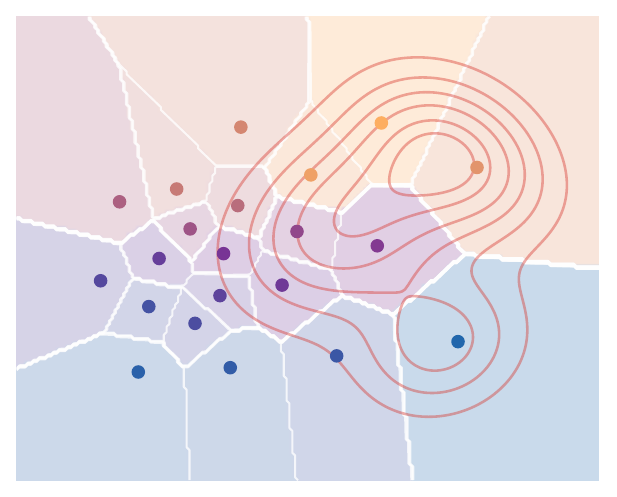
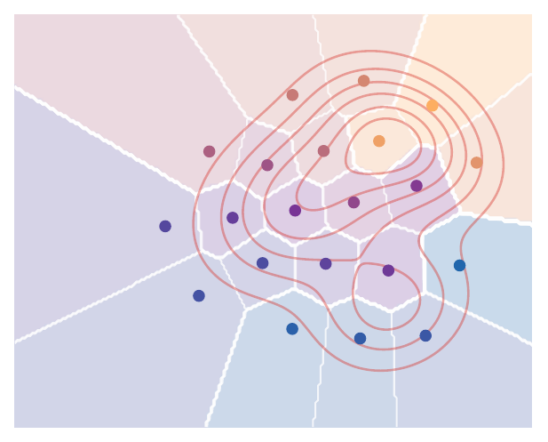

Lloyd descent is simple and robust, but it is nonconvex and can converge to local minima.

## Quantization on the line

In one dimension, quantiles give explicit optimal placements for equal masses. This is much better than random sampling for $W_2$ approximation.
For $\alpha$ with quantile $\textcolor{#c7372f}{F_\alpha^{-1}}$,
$$
\textcolor{#226db4}{y_j}=\textcolor{#c7372f}{F_\alpha^{-1}}\!\left(\frac{j-\frac12}{m}\right)
$$
is the canonical equal-mass placement.

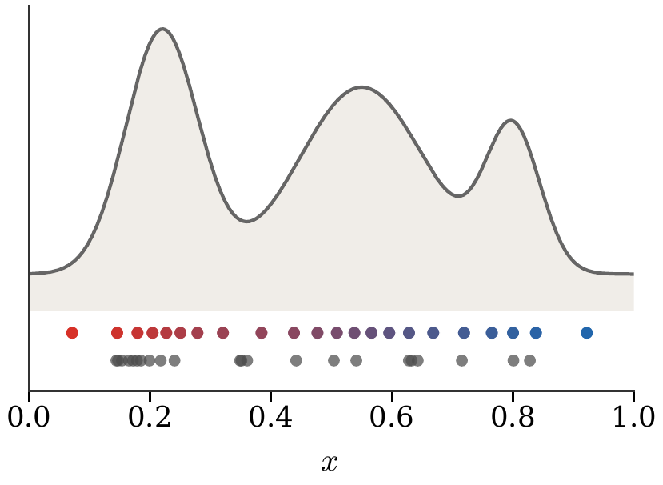
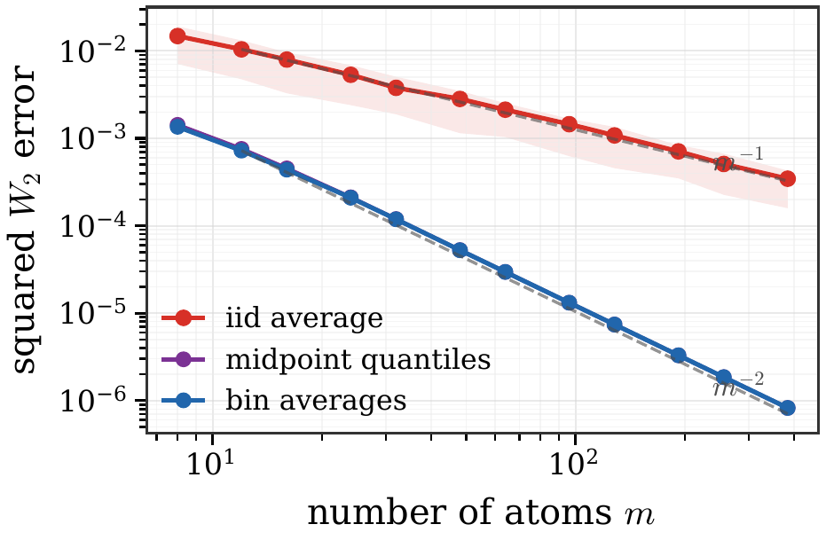

## Live panel: quantization rates

<iframe src="../../myst/live/semidiscrete-quantization-rates.html" title="Interactive quantization rates"></iframe>

Optimal quantiles and random samples have visibly different convergence behavior.

## Relaxed Lloyd flow

A slowed-down Lloyd update can be viewed as a continuous-time descent on the quantization energy in configuration space.
For small relaxation parameter $\eta$,
$$
\textcolor{#226db4}{y_j^{k+1}}=(1-\eta)\textcolor{#226db4}{y_j^k}+\eta\,\operatorname{centroid}(V_j(\textcolor{#226db4}{Y^k})).
$$

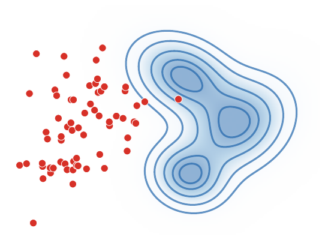
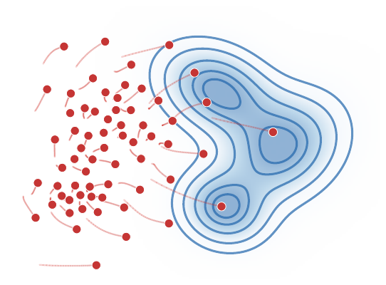
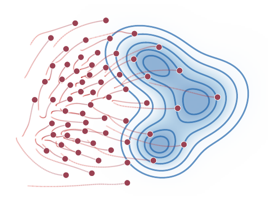
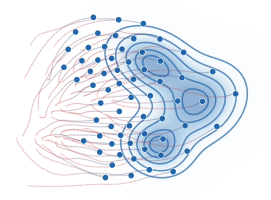

Sites move toward a quantized representation of the target density.

## Energy decay

The energy need not be globally convex, but standard Lloyd updates decrease it at each alternating minimization step.

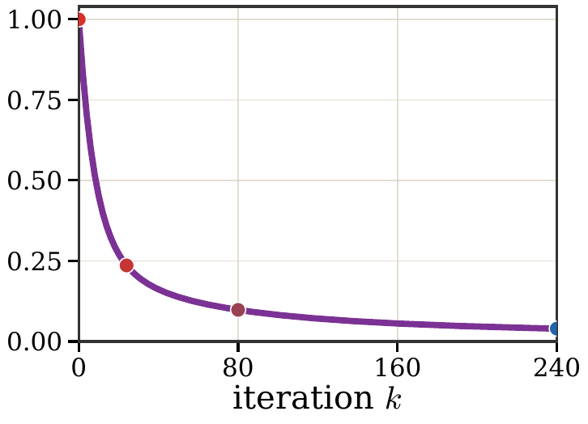

## Roadmap: links to learning

  
<h3>1&#46; Duality</h3>

  
<h3>2&#46; Wasserstein-1 and IPMs</h3>

  
<h3>3&#46; Semi-discrete OT</h3>

  
<h3>4&#46; Quantization</h3>

  
<h3>5&#46; Learning links</h3>

## Dual potentials as discriminators

The $W_1$ dual is the mathematical core of Wasserstein GANs, while other IPMs replace the Lipschitz ball by another function class.

<strong>TV</strong> bounded witnesses

<strong>Wasserstein-1</strong> Lipschitz witnesses

<strong>MMD</strong> RKHS witnesses

## Semi-discrete maps in applications

Semi-discrete OT appears when a continuous distribution is represented by a finite set of atoms:

- mesh generation and remeshing,
- color and texture processing,
- sampling and quantization,
- clustering with geometric costs,
- scalable approximations of continuous OT.

The computational object is a partition, not a dense coupling.

## Linearized OT preview

Dual and semi-discrete ideas also feed linearized OT: fix a reference measure and embed nearby measures by displacement fields.

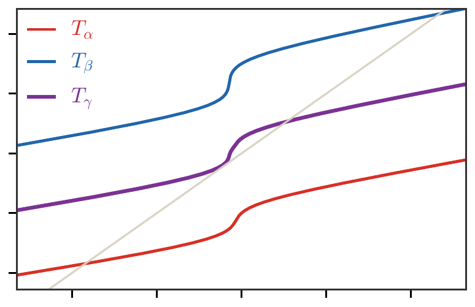

## Live panel: linearized optimal transport

<iframe src="../../myst/live/generalized-linear-ot.html?v=linear-ot-quantiles" title="Interactive linearized optimal transport"></iframe>

Linear OT turns transport maps into Euclidean coordinates for downstream analysis.

## Summary

::: {.result-box}
What this deck establishes.
Duality turns transport into potentials.
For $W_1$, these are Lipschitz witnesses.
In the semi-discrete quadratic case, they are Laguerre weights defining a power diagram.
Quantization and Lloyd algorithms reuse this geometry.
:::

<strong>Duality</strong>certificates and gradients

<strong>Wasserstein-1</strong>Lipschitz witnesses

<strong>Laguerre</strong>cells and quantization

## Next deck

The next presentation focuses on dynamic optimal transport and flows over probability measures.

<a class="deck-link" href="../4-dynamic-flows/index.html">Open deck 4: Dynamic Flows &rarr;</a>

