# Dynamic Transport and Flows for ML {.title-slide}

Eulerian PDEs, Lagrangian particles, Wasserstein gradient flows, and transportation views of modern ML.

Gabriel Peyré

CNRS and École normale supérieure, PSL Université

Optimal Transport for Machine Learners

## Why dynamic flows?

Machine learning increasingly manipulates distributions by evolving them:

- diffusion and flow-matching generative models,
- gradient-flow training dynamics,
- population dynamics in neural networks,
- token dynamics in transformers,
- biological trajectories and multi-omics integration.

Dynamic OT gives a common language for these evolutions.

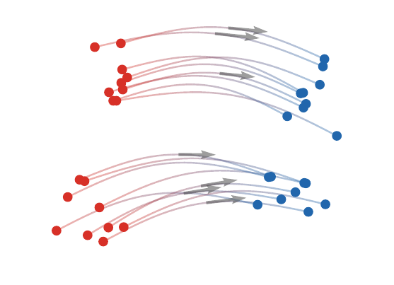

A model can generate by transporting a simple law toward data.

## Roadmap: generative transport

  
<h3>1&#46; Generative transport</h3>

  
<h3>2&#46; Dynamic OT</h3>

  
<h3>3&#46; Gradient flows</h3>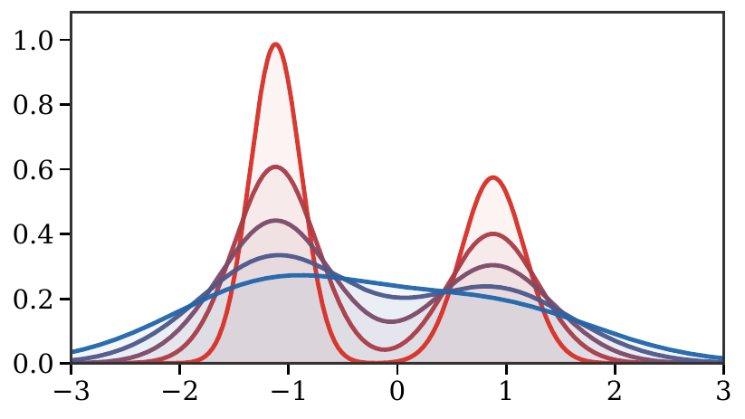

  
<h3>4&#46; Training and biology</h3>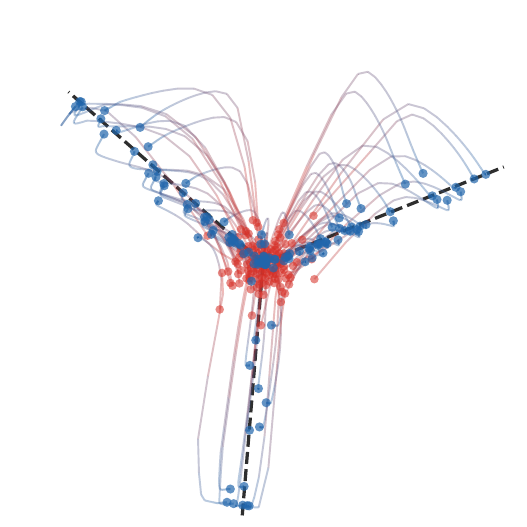

  
<h3>5&#46; Attention dynamics</h3>

## Auto-regressive models versus transport

Auto-regressive models generate one token at a time. Transport models instead evolve a whole distribution or point cloud continuously.

::: {.result-box}
Transport viewpoint.
Generation is the construction of a map or flow sending a simple reference law $\alpha_0$ to a data law $\alpha_1$.
:::

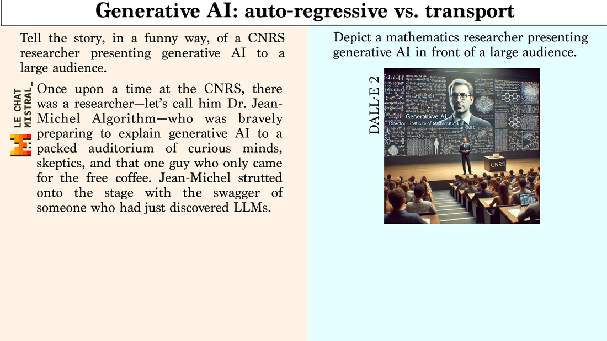

## Eulerian and Lagrangian descriptions

::: {.definition-box}
Two equivalent views.
A curve of measures $(\alpha_t)_{t\in[0,1]}$ can be described:

- in Eulerian form by a density and velocity field $(\rho_t,v_t)$,
- in Lagrangian form by particle trajectories $\dot X_t=v_t(X_t)$.

When $\alpha_t=\rho_t\,dx$, the velocity $v_t$ is an Eulerian field on space; when $X_t$ is random, $\alpha_t=\operatorname{Law}(X_t)$.
:::

The two descriptions are linked by the continuity equation
$$
\partial_t\rho_t+\operatorname{div}(\rho_t v_t)=0.
$$

## Gradient structure links the two views

This is the bridge from kinematics to optimization: the metric selects the velocity field.

::: {.result-box}
Wasserstein gradient.
For a functional $\mathcal F$, the steepest-descent velocity is
$$
v_t=-\nabla\frac{\delta\mathcal F}{\delta\rho}(\rho_t),
\qquad
\partial_t\rho_t+\operatorname{div}(\rho_t v_t)=0.
$$
The Eulerian PDE and the Lagrangian particle ODE are two descriptions of the same gradient flow.
:::

This viewpoint is reused for sampling, neural-network training, genomics, and attention dynamics.

## Interactive: transport sampling

A deterministic transport sampler moves particles from a simple source cloud to a target cloud. The slider shows a Lagrangian interpolation.

<canvas id="transport-flow-canvas"></canvas>

source<input id="transport-flow-slider" type="range" min="0" max="1" value="0.35" step="0.01">t

## Live panel: transport flow sampling

<iframe src="../../myst/live/generative-flow.html" title="Interactive transport flow sampling"></iframe>

The MyST panel exposes the same sampler with the book controls and notation.

## Stochastic interpolants and flow matching

::: {.definition-box}
Interpolant.
A stochastic interpolant defines random variables
$$
X_t=I_t(X_0,X_1,Z),
\qquad X_0\sim\alpha_0,
\quad X_1\sim\alpha_1,
$$
possibly with additional noise $Z$.
Its conditional velocity is $u_t=\partial_t I_t(X_0,X_1,Z)$.
:::

The goal of flow matching is to learn a vector field $v_t$ whose continuity equation reproduces the law of $X_t$.

## Live panel: flow-matching trajectories

<iframe src="../../myst/live/generative-trajectories.html" title="Interactive flow-matching trajectories"></iframe>

Different endpoint couplings and schedules generate different training velocities.

## Three interpolants

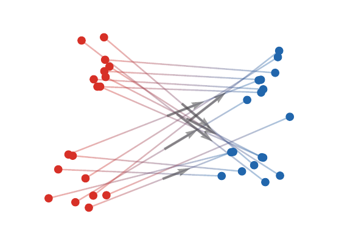
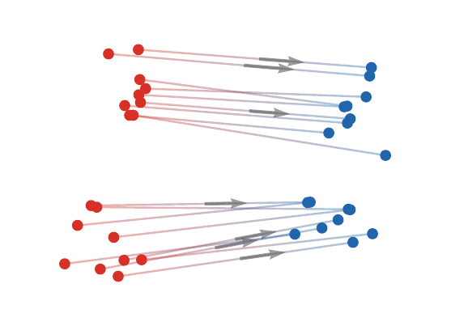

The coupling between endpoints and the time schedule change the geometry of the learned flow.

## Flow matching objective

Let $u_t$ be the conditional velocity of the interpolant. A common objective is
$$
\min_v \int_0^1 \mathbb E\left[\|v_t(X_t)-u_t\|^2\right]dt.
$$

::: {.theorem-box}
Flow matching identity.
The minimizer is the conditional expectation
$$
v_t(x)=\mathbb E[u_t\mid X_t=x],
$$
and it transports the marginal law of $X_t$ through the continuity equation.
:::

## Algorithm: flow matching training

::: {.algorithm-box}
Flow matching from paired endpoint samples.
Input: endpoint sampler $(X_0,X_1)$, schedule $I_t$, conditional velocity $u_t$, network $v_\theta(t,x)$.  
Output: trained vector field $v_\theta$.

1. Sample a mini-batch $(x_0^r,x_1^r)_r$.
2. Sample times $t_r\sim\mathrm U(0,1)$.
3. Form $x_t^r=I_{t_r}(x_0^r,x_1^r)$ and $u_t^r=u_{t_r}(x_0^r,x_1^r)$.
4. Minimize $\sum_r\|v_\theta(t_r,x_t^r)-u_t^r\|^2$ by stochastic gradient descent.
5. Generate samples by integrating $\dot X_t=v_\theta(t,X_t)$ from $X_0\sim\alpha_0$.
:::

## Diffusion versus optimal transport

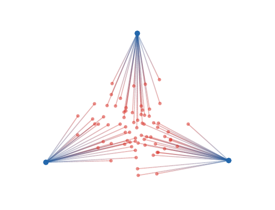

Diffusion-style paths can be more curved and noisy; OT paths are displacement-efficient but may be harder to parametrize in high dimension.

## Live panel: diffusion and OT sampling

<iframe src="../../myst/live/generative-diffusion-2d.html" title="Interactive diffusion and ot sampling"></iframe>

Diffusion trajectories and OT trajectories are compared on the same target geometry.

## Is a diffusion map optimal?

This question separates flow matching from OT geodesics.

::: {.result-box}
Key distinction.
Both diffusion-style interpolants and OT interpolants connect simple and complex laws, but only the Brenier interpolation is guaranteed to minimize kinetic action. A learned sampler can therefore be a valid transport without being an optimal transport map.
:::

Changing the interpolant changes trajectory geometry even when the endpoints are fixed.

## Forward noising schedules

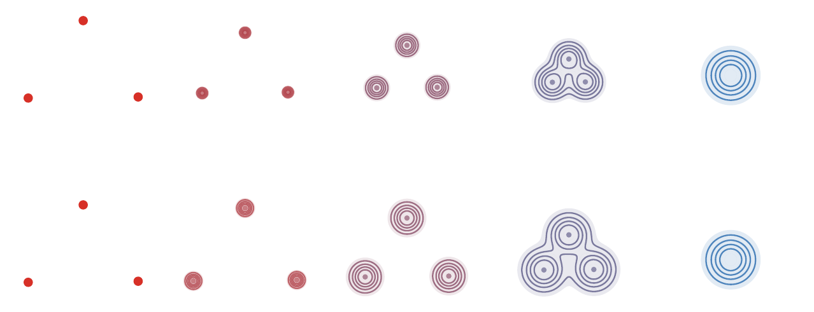
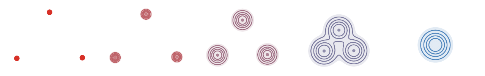
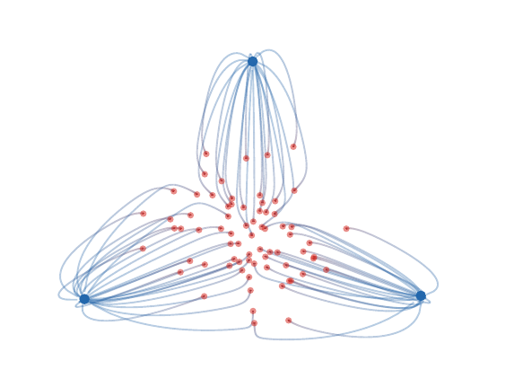

Different schedules produce different velocity fields even when they connect similar endpoint distributions.

## Live panel: noising schedules

<iframe src="../../myst/live/generative-schedule.html" title="Interactive noising schedules"></iframe>

The schedule changes the speed at which the same endpoint problem is traversed.

## Roadmap: dynamic optimal transport

  
<h3>1&#46; Generative transport</h3>

  
<h3>2&#46; Dynamic OT</h3>

  
<h3>3&#46; Gradient flows</h3>

  
<h3>4&#46; Training and biology</h3>

  
<h3>5&#46; Attention dynamics</h3>

## Wasserstein distance revisited

For quadratic cost,
$$
W_2^2(\alpha_0,\alpha_1)=
\min_{\pi\in\Gamma(\alpha_0,\alpha_1)}
\int \|x-y\|^2\,d\pi(x,y).
$$

In the Monge case, $\alpha_t=((1-t)\operatorname{Id}+tT)_\#\alpha_0$ is a constant-speed geodesic.

Dynamic OT asks for an intrinsic description of this geodesic through velocities.

## Benamou-Brenier formulation

::: {.theorem-box}
Benamou-Brenier.
For absolutely continuous curves,
$$
\frac12 W_2^2(\alpha_0,\alpha_1)=
\min_{\rho_t,v_t}
\int_0^1\int \frac12\|v_t(x)\|^2\rho_t(x)\,dx\,dt
$$
subject to
$$
\partial_t\rho_t+\operatorname{div}(\rho_t v_t)=0,
\qquad
\rho_{t=0}=\rho_0,
\quad
\rho_{t=1}=\rho_1.
$$
:::

## Live panel: Benamou-Brenier geodesics

<iframe src="../../myst/live/dynamic-bb.html" title="Interactive benamou-brenier geodesics"></iframe>

The dynamic formulation is easiest to read as mass moving through time.

## Convex moment formulation

Set $m_t=\rho_t v_t$. Then the action becomes the perspective function
$$
\int_0^1\int \frac12\frac{\|m_t(x)\|^2}{\rho_t(x)}\,dx\,dt,
$$
with the linear constraint
$$
\partial_t\rho_t+\operatorname{div}(m_t)=0.
$$

This is convex because $(\rho,m)\mapsto \|m\|^2/\rho$ is the perspective of a quadratic function.

## Algorithm: dynamic OT solve

::: {.algorithm-box}
Convex Benamou-Brenier discretization.
Input: endpoint densities $\rho_0,\rho_1$, space-time grid, time step $\Delta t$.  
Output: density path $(\rho^k)_k$ and momenta $(m^k)_k$.

1. Initialize a feasible interpolation $(\rho^k,m^k)_k$.
2. Enforce the linear constraint $\partial_t\rho+\operatorname{div}m=0$.
3. Minimize the convex action $\sum_k\Delta t\int \frac12\|m^k\|^2/\rho^k$.
4. Recover velocities by $v^k=m^k/\rho^k$ where $\rho^k>0$.
5. Read the geodesic as the curve $\alpha_k=\rho^k dx$.
:::

## Dynamic geodesic example

The geodesic can be visualized either as evolving density or as a midpoint velocity field.

## Velocity field

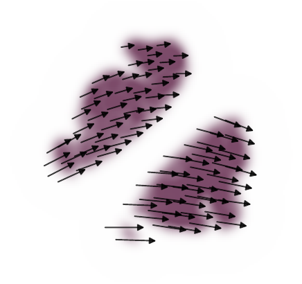

The vector field is not an arbitrary motion. It is the velocity minimizing kinetic energy under mass conservation.

At optimality, it is a gradient field in Euclidean quadratic transport.

## Dual dynamic formulation

::: {.theorem-box}
Hamilton-Jacobi dual.
The dual of the half-action formulation above can be expressed through potentials $\varphi_t$ satisfying
$$
\partial_t\varphi_t+\frac12\|\nabla\varphi_t\|^2\leq0.
$$
The endpoint objective is
$$
\int \varphi_1\,d\alpha_1-\int \varphi_0\,d\alpha_0.
$$
:::

This is the dynamic counterpart of Kantorovich duality.

## Primal and dual fields

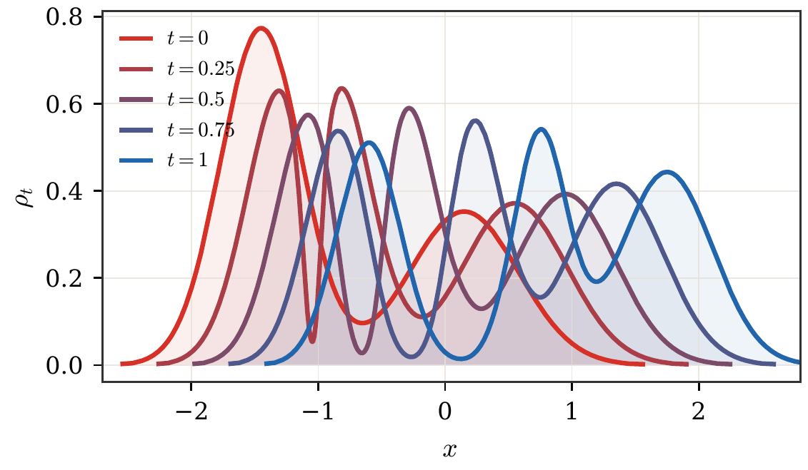
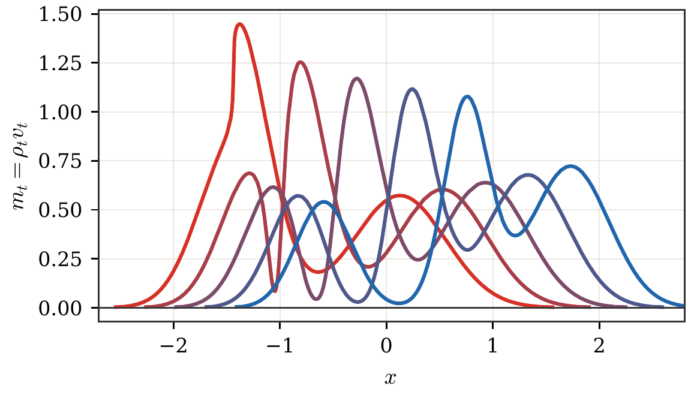
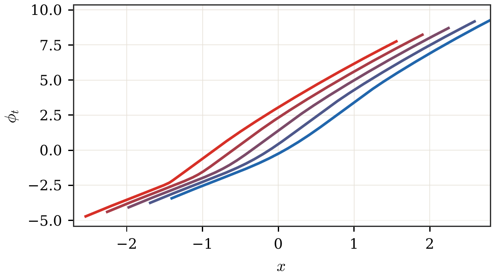

Density, momentum, and potential are coupled by the continuity equation and Hamilton-Jacobi inequality.

## Roadmap: Wasserstein gradient flows

  
<h3>1&#46; Generative transport</h3>

  
<h3>2&#46; Dynamic OT</h3>

  
<h3>3&#46; Gradient flows</h3>

  
<h3>4&#46; Training and biology</h3>

  
<h3>5&#46; Attention dynamics</h3>

## Gradient flows in Wasserstein space

::: {.definition-box}
JKO scheme.
Given an energy $\mathcal F$, the implicit Euler step is
$$
\alpha^{k+1}\in\arg\min_\alpha
\frac{1}{2\tau}W_2^2(\alpha,\alpha^k)+\mathcal F(\alpha).
$$
:::

As $\tau\to0$, this defines a gradient flow over probability measures.

## Algorithm: minimizing movements

::: {.algorithm-box}
JKO time stepping.
Input: initial law $\alpha^0$, energy $\mathcal F$, step size $\tau$, number of steps $K$.  
Output: approximate gradient-flow path $(\alpha^k)_{k=0}^K$.

1. Set $k=0$.
2. Solve $\alpha^{k+1}\in\arg\min_\alpha \frac{1}{2\tau}W_2^2(\alpha,\alpha^k)+\mathcal F(\alpha)$.
3. Set $k\leftarrow k+1$.
4. Repeat until $k=K$.
5. Interpolate the sequence to approximate the continuous curve $\alpha_t$.
:::

## From JKO to PDE

When the first variation $\delta\mathcal F/\delta\rho$ is smooth, the Wasserstein gradient flow satisfies
$$
\partial_t\rho_t=
\operatorname{div}\left(\rho_t\nabla\frac{\delta\mathcal F}{\delta\rho}(\rho_t)\right).
$$

Equivalently,
$$
v_t=-\nabla\frac{\delta\mathcal F}{\delta\rho}(\rho_t),
\qquad
\partial_t\rho_t+\operatorname{div}(\rho_t v_t)=0.
$$

For example, $\delta\operatorname{Ent}(\rho)/\delta\rho=\log\rho+1$ gives the heat equation.

## JKO entropy steps

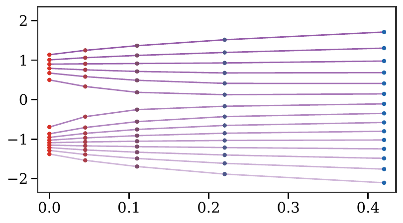

The implicit step regularizes the density by moving in Wasserstein geometry rather than in a fixed Euclidean space.

## Live panel: JKO minimizing movements

<iframe src="../../myst/live/gradflow-jko.html" title="Interactive jko minimizing movements"></iframe>

The implicit Euler step trades decrease of energy against movement in Wasserstein space.

## Gradient structure

::: {.result-box}
Otto metric intuition.
The tangent vector $\partial_t\rho=-\operatorname{div}(\rho v)$ is measured by
$$
\|\partial_t\rho\|_{T_\rho}^2=
\inf_v\left\{\int\|v\|^2d\rho:
\partial_t\rho+\operatorname{div}(\rho v)=0\right\}.
$$
:::

This is the Riemannian-like structure behind $W_2$ gradient flows.

## Least-squares inversion

The velocity is not arbitrary: for a prescribed infinitesimal density variation, the Wasserstein metric selects the minimum-energy vector field.

::: {.theorem-box}
Otto inversion.
For $\dot\rho$ with zero mass,
$$
\|\dot\rho\|_{T_\rho}^2
=
\min_v\left\{\int\|v(x)\|^2\rho(x)dx:
\dot\rho+\operatorname{div}(\rho v)=0\right\}.
$$
The minimizer is a gradient field $v=\nabla\psi$, where
$$
\Delta_\rho\psi=\operatorname{div}(\rho\nabla\psi)=-\dot\rho.
$$
:::

This elliptic inversion is the practical bottleneck behind many high-dimensional Wasserstein flows.

## Linear and nonlinear diffusions

Entropy-type energies give diffusion PDEs:

- Shannon entropy gives the heat equation,
- power entropy gives porous-medium equations.

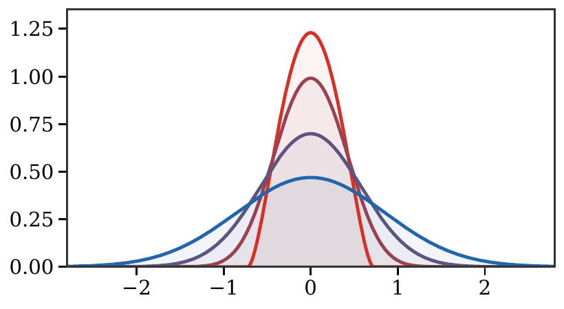
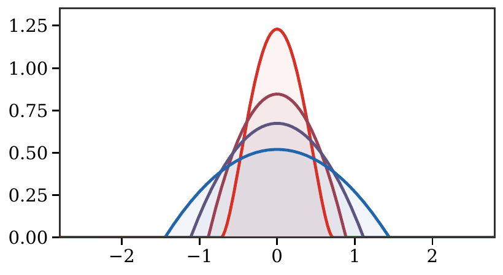

## Live panel: diffusion gradient flows

<iframe src="../../myst/live/gradflow-diffusion.html" title="Interactive diffusion gradient flows"></iframe>

Entropy and porous-medium energies produce different spreading laws.

## Fokker-Planck and Langevin dynamics

For relative entropy with respect to a target density $\beta\propto e^{-V}$,
$$
\mathcal F(\alpha)=\operatorname{KL}(\alpha\mid\beta),
$$
the flow is the Fokker-Planck equation
$$
\partial_t\rho=\operatorname{div}(\rho\nabla V)+\Delta\rho.
$$

This is the law of Langevin particles
$$
dX_t=-\nabla V(X_t)dt+\sqrt2\,dB_t.
$$

Thus the same evolution can be read as a deterministic PDE for $\rho_t$ or as the law of a stochastic particle system.

## Live panel: Fokker-Planck evolution

<iframe src="../../myst/live/gradflow-fokker.html" title="Interactive fokker-planck evolution"></iframe>

The deterministic PDE and the particle SDE give two numerical views of the same flow.

## Interactive: deterministic versus noisy descent

Noise changes the geometry of particle trajectories. With zero noise, particles follow descent curves. With Langevin noise, they explore the target landscape and spread across modes.

The slider controls the Brownian amplitude in a two-well potential.

<canvas id="langevin-noise-canvas"></canvas>

deterministic<input id="langevin-noise-slider" type="range" min="0" max="1.15" value="0.55" step="0.01">noise = 0.55

## Algorithm: Langevin particle solver

::: {.algorithm-box}
Euler-Maruyama Fokker-Planck sampler.
Input: target potential $V$, step size $h$, particles $(X_i^0)_{i=1}^N$.  
Output: empirical approximation $\alpha_t^N=\frac1N\sum_i\delta_{X_i^t}$.

1. For each step $k=0,\ldots,K-1$, sample $\xi_i^k\sim\mathrm N(0,I_d)$.
2. Update $X_i^{k+1}=X_i^k-h\nabla V(X_i^k)+\sqrt{2h}\,\xi_i^k$.
3. Approximate the law by $\alpha_{kh}^N=\frac1N\sum_i\delta_{X_i^k}$.
4. Estimate densities by KDE or solve the Fokker-Planck PDE directly when dimension permits.
:::

## Three numerical representations

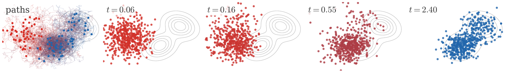
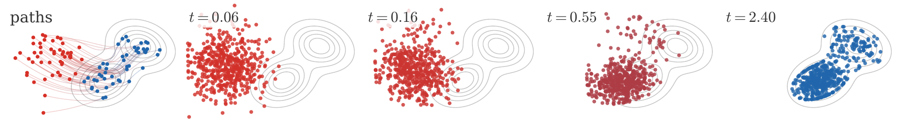
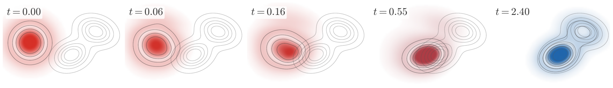

The same PDE can be approximated by stochastic particles, deterministic KDE-score particles, or a finite-difference density solver.

## Discrepancy-driven flows

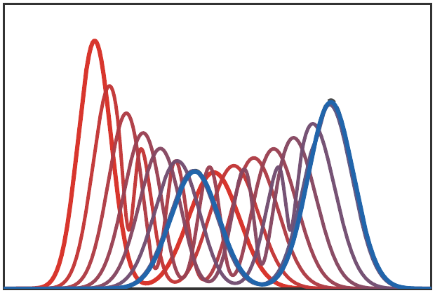
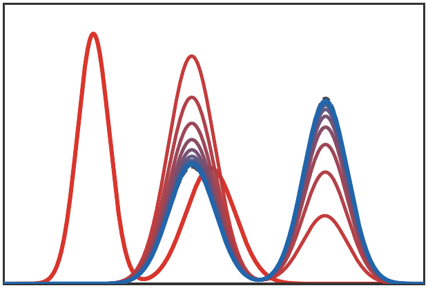
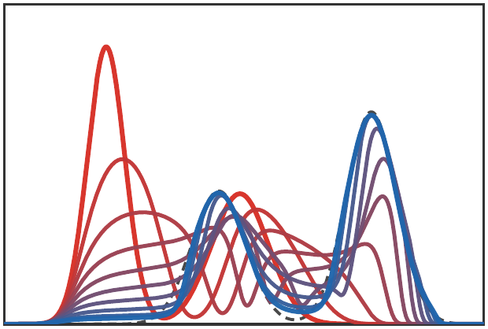

Changing the discrepancy changes the geometry of the velocity field and the resulting motion.

## Live panel: gradient-flow objectives

<iframe src="../../myst/live/gradflow-objective.html" title="Interactive gradient-flow objectives"></iframe>

Different discrepancies create different velocities even with the same target.

## Particle objective geometries

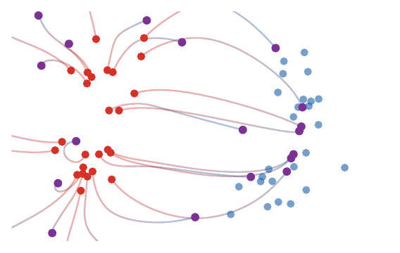
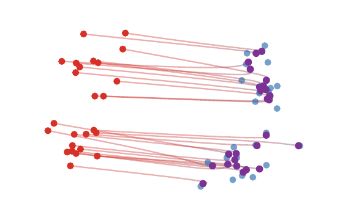

Different losses induce very different particle forces: OT rays, local-density pressure, MMD fields, and Sinkhorn divergence forces.

## Live panel: MMD particle flow

<iframe src="../../myst/live/gradflow-mmd.html" title="Interactive mmd particle flow"></iframe>

The particle count changes how faithfully the flow explores the target geometry.

## Constraints and unbalanced flows

Dynamic formulations can impose extra constraints or allow mass variation. These change the tangent space and therefore the PDE.

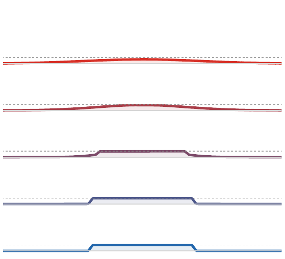
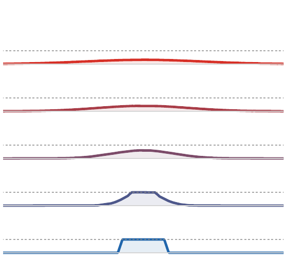
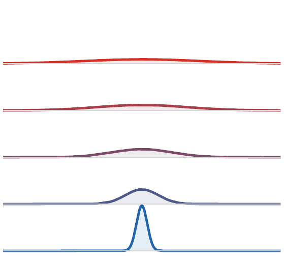

## Live panel: density-constrained flows

<iframe src="../../myst/live/gradflow-density-constraint.html" title="Interactive density-constrained flows"></iframe>

Hard density caps create pressure-like effects in the transport dynamics.

## Crowd motion with congestion

Congestion models combine transport, entropy, and a hard density cap. A typical energy is
$$
\mathcal F(\alpha)
=\int \varphi\,d\alpha+\operatorname{Ent}(\alpha)+\iota_C(\alpha),
\qquad
C=\{\rho\,dx:\rho(x)\leq \kappa(x)\}.
$$

::: {.example-box}
Example: density cap.
The Wasserstein gradient flow follows the force $-\nabla\varphi$, diffuses through entropy, and adds a pressure term enforcing $\rho\leq\kappa$.
:::

The reference model is the Maury-Roudneff-Chupin-Santambrogio crowd-motion framework.

## Crowd motion visual

This visual illustrates how the hard density cap creates a pressure field in congested regions.

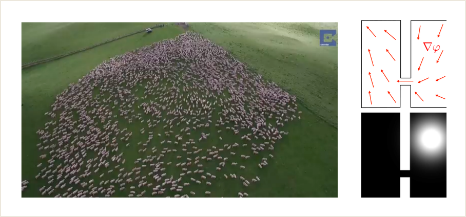

## Wasserstein-Fisher-Rao flows

WFR augments transport by growth:
$$
\partial_t\rho+\operatorname{div}(\rho v)=\rho r,
\qquad
\int_0^1\int(\|v\|^2+r^2)\rho\,dx\,dt.
$$

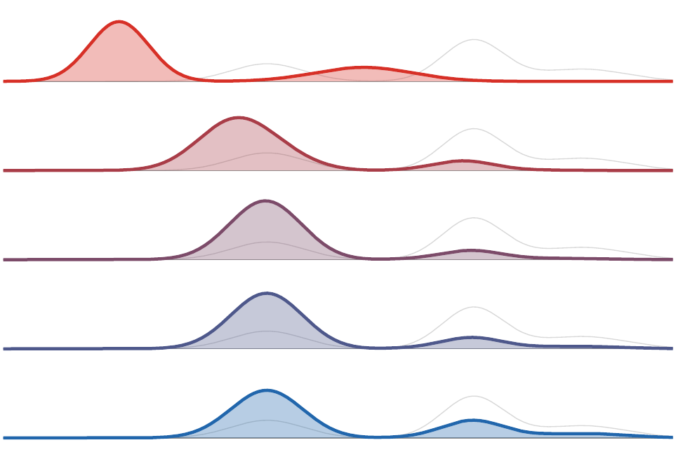

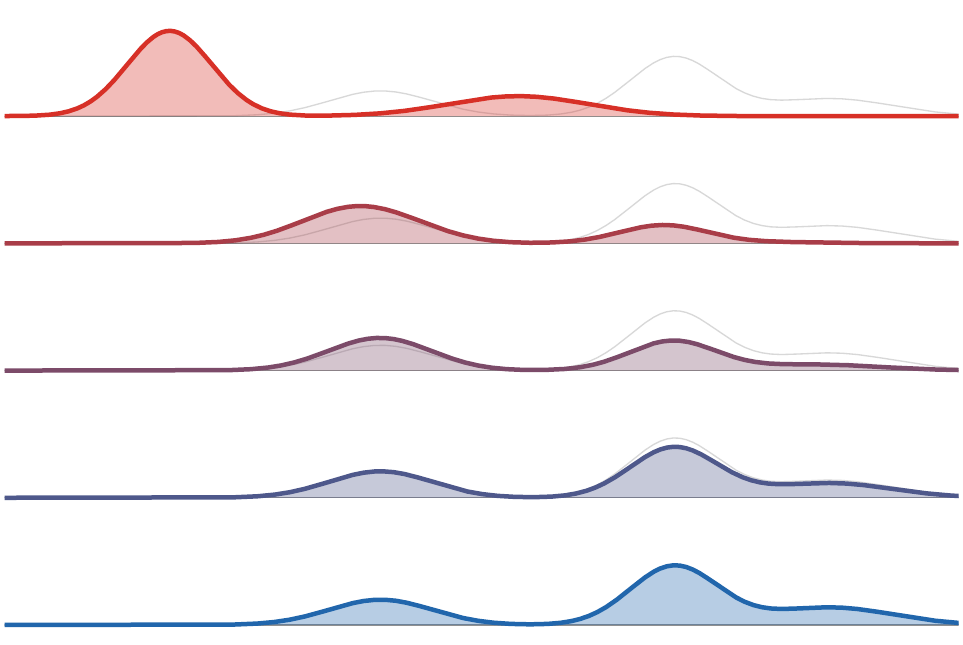

Unbalanced geometries add a scalar growth field to the transport velocity, allowing mass to appear or disappear.

## Live panel: dynamic unbalanced flows

<iframe src="../../myst/live/dynamic-unbalanced.html" title="Interactive dynamic unbalanced flows"></iframe>

Unbalanced flows add growth and decay to pure transport.

## Roadmap: training and biology

  
<h3>1&#46; Generative transport</h3>

  
<h3>2&#46; Dynamic OT</h3>

  
<h3>3&#46; Gradient flows</h3>

  
<h3>4&#46; Training and biology</h3>

  
<h3>5&#46; Attention dynamics</h3>

## Mean-field two-layer networks

A two-layer model can be written as an integral over neurons:
$$
f_\alpha(z)=\int a\,\sigma(w^\top z)\,d\alpha(a,w).
$$

Here $\alpha$ is a probability measure over neuron parameters $(a,w)$. In the infinite-width limit, particle descent becomes a Wasserstein gradient flow for $\alpha_t$.

## Mean-field risk and first variation

Write $\theta=(a,w)$ and $\varphi_\theta(z)=a\,\sigma(w^\top z)$. For supervised data law $\nu$ on pairs $(z,y)$,
$$
\mathcal R(\alpha)
=\frac12\int |f_\alpha(z)-y|^2\,d\nu(z,y),
\qquad
f_\alpha(z)=\int \varphi_\theta(z)\,d\alpha(\theta).
$$

The first variation is explicit:
$$
\frac{\delta\mathcal R}{\delta\alpha}(\theta)
=
\int (f_\alpha(z)-y)\,\varphi_\theta(z)\,d\nu(z,y).
$$
Particle gradient descent differentiates this quantity with respect to the neuron parameter $\theta$.

## Live panel: mean-field MLP training

<iframe src="../../myst/live/gradflow-mlp.html" title="Interactive mean-field mlp training"></iframe>

The neuron distribution evolves as a Wasserstein gradient flow in parameter space.

## Mean-field training PDE

For a risk functional $\mathcal R(\alpha)$, the mean-field dynamics has the form
$$
\partial_t\alpha_t+
\operatorname{div}(\alpha_t v_t)=0,
\qquad
v_t=-\nabla\frac{\delta\mathcal R}{\delta\alpha}(\alpha_t).
$$

This is a training PDE, not merely an optimization algorithm in a finite parameter vector.

## Perceptron global-convergence message

For two-layer perceptrons, the empirical particle system is
$$
\alpha_t=\frac1m\sum_{k=1}^m \delta_{(a_k(t),w_k(t))}.
$$

The mean-field limit replaces finite-dimensional parameter descent by descent of a functional $\mathcal R(\alpha)$.

::: {.result-box}
Qualitative theorem.
With enough directional support, convergence rules out bad stationary points: the limiting measure is a global minimizer of the mean-field risk.
:::

This is why the measure viewpoint is not just notation: it changes the convexity and stationarity picture.

## Neuron trajectories

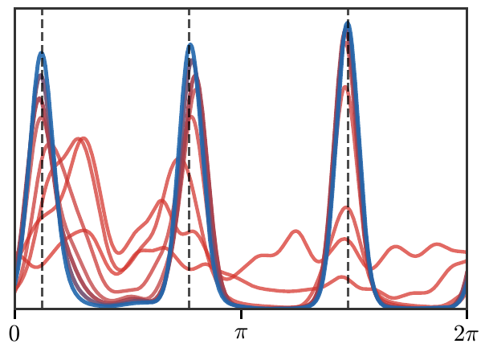

The empirical measure of neurons evolves as particles in parameter space.

## Normalized and Muon-type flows

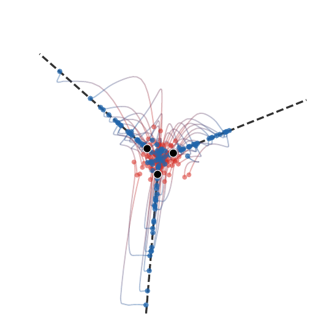
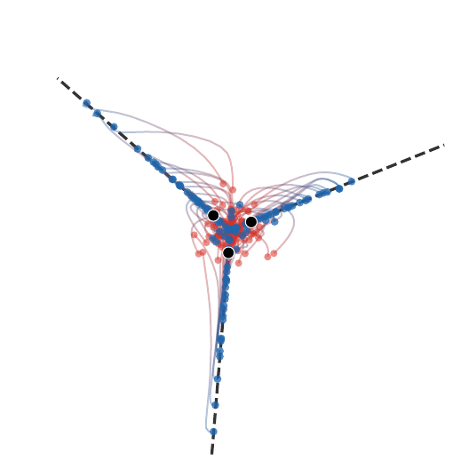
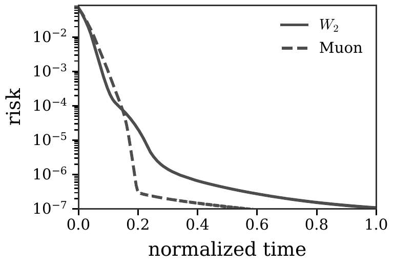

Changing the underlying transport geometry changes the training path and the risk decay.

## Live panel: Muon-type normalized dynamics

<iframe src="../../myst/live/gradflow-mlp-muon.html" title="Interactive muon-type normalized dynamics"></iframe>

The normalized geometry changes the effective path through parameter space.

## Single-cell and multi-omics viewpoint

Single-cell data naturally produces empirical distributions of cells in feature spaces. OT is used to:

- compare cell populations,
- match cells across modalities,
- infer developmental trajectories,
- regularize couplings with biological priors.

The mathematical object is again a coupling or a flow between distributions.

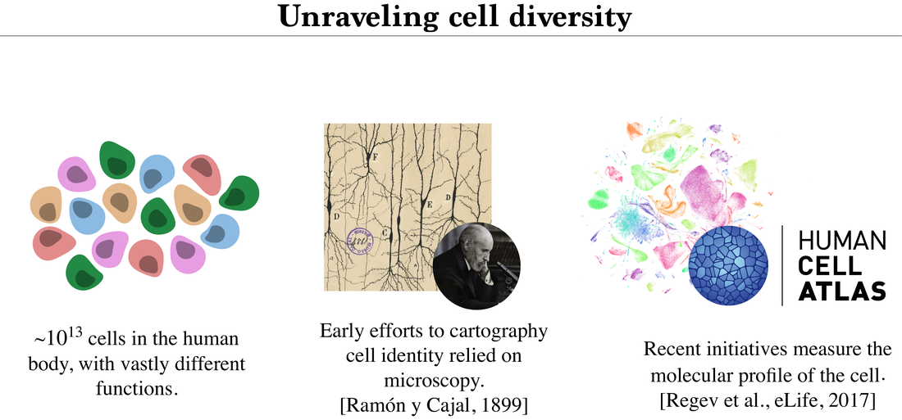

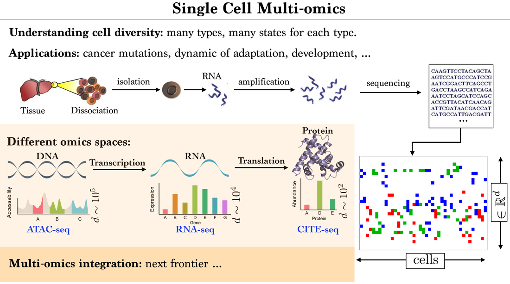

## Cell-to-cell dissimilarity

Single-cell comparison is naturally a distribution problem rather than a pointwise one.

::: {.example-box}
Example: cell populations.
A sample is an empirical measure
$$
\alpha=\frac1n\sum_i\delta_{x_i}
$$
over cells represented by gene-expression, accessibility, or learned latent features. OT compares two populations by coupling cells while respecting the geometry of the feature space.
:::

The coupling is not only a number: it can be interpreted as a soft cell-to-cell correspondence.

## Paired multi-omics integration

When several modalities describe the same biological system, OT can align their empirical laws through a shared latent geometry.

::: {.result-box}
Coupling across modalities.
Multi-omics integration often seeks nonnegative weights or maps that match several observed distributions at once. OT supplies the cost-sensitive alignment term, while additional constraints encode marker structure, sparsity, or temporal consistency.
:::

This is the same mathematical pattern as barycenters and multimarginal couplings, specialized to biological measurements. The MOWGLI model is a representative multi-omics example: it combines cost-sensitive OT couplings with low-rank factors to align modalities.

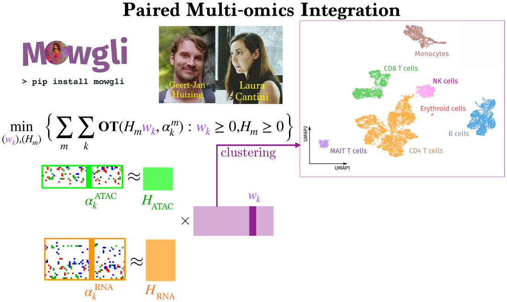

## Trajectory inference as transport

Given observations at several times, one can infer a coupling or flow linking consecutive distributions.

::: {.example-box}
Example: developmental dynamics.
A population at time $t_k$ is a measure $\alpha_k$.
OT-based trajectory inference connects $\alpha_k$ to $\alpha_{k+1}$ with geometry and growth priors.
:::

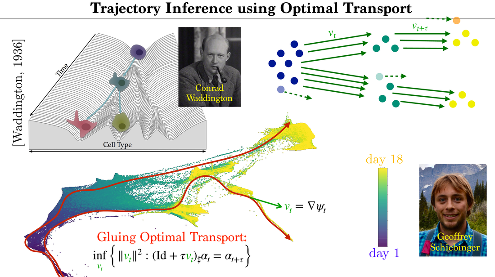

## Roadmap: attention dynamics

  
<h3>1&#46; Generative transport</h3>

  
<h3>2&#46; Dynamic OT</h3>

  
<h3>3&#46; Gradient flows</h3>

  
<h3>4&#46; Training and biology</h3>

  
<h3>5&#46; Attention dynamics</h3>

## Attention as interacting particles

Self-attention maps a set of tokens $(x_i)_i$ to weighted averages
$$
A_i(X)=\sum_j
\frac{\exp(q(x_i)^\top k(x_j))}{\sum_\ell \exp(q(x_i)^\top k(x_\ell))}
v(x_j).
$$
The maps $q,k,v$ are the query, key, and value parametrizations.

This is permutation-equivariant and can be interpreted as an interaction rule between particles.

## Continuous-depth transformers

A residual transformer layer has the form
$$
x_i^{\ell+1}=x_i^\ell+h\,A_i(X^\ell).
$$

As the depth step $h\to0$, this suggests an ODE
$$
\frac{dx_i}{dt}=A_i(X_t),
$$
and, in the mean-field limit, a PDE for the token distribution.

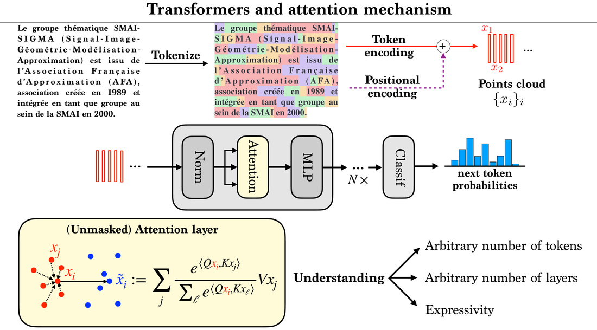

## L2 attention and mean shift

If attention scores use $-\|x-y\|^2/\varepsilon$, the continuum vector field resembles mean shift:
$$
v_\alpha(x)=
\frac{\int (y-x)e^{-\|x-y\|^2/\varepsilon}\,d\alpha(y)}
{\int e^{-\|x-y\|^2/\varepsilon}\,d\alpha(y)}.
$$

This moves particles toward local density modes.

## Mean-shift PDE visualization

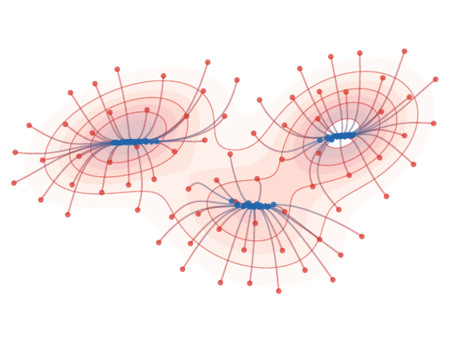

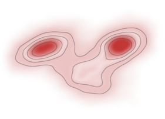
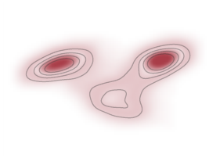
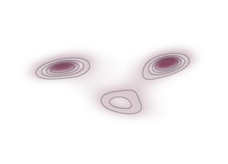
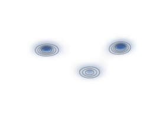

## Live panel: mean-shift dynamics

<iframe src="../../myst/live/generative-mean-shift.html" title="Interactive mean-shift dynamics"></iframe>

Replacing dot-product attention by an L2 kernel reveals the mean-shift mechanism.

## Gaussian case and clustering

For Gaussian mixtures, attention/mean-shift flows concentrate mass near modes. This gives a PDE-level explanation of clustering in token dynamics.

::: {.result-box}
Message.
Transformer depth can be viewed as an evolution equation on tokens. In suitable limits, it becomes a nonlocal PDE for a probability measure.
:::

## Universality viewpoint

Deep transformers alternate equivariant interaction blocks. In the continuum viewpoint, they generate rich families of flows on empirical measures.

The qualitative message is:

- attention is an interaction kernel,
- depth is time,
- tokens are particles,
- expressive power comes from composing many equivariant flow steps.

## Universality proof sketch

The reference deck used this as a final message: attention layers are not only a modeling heuristic, they can emulate rich equivariant computations.

::: {.result-box}
Sketch.
Residual attention blocks build permutation-equivariant maps
$(x_i)_i\mapsto (x_i+hA_i(X))_i$.
By composing such blocks, one can localize interactions, separate token configurations, and approximate elementary equivariant operations. These operations generate dense families of continuous equivariant maps on compact sets; in discrete settings, related constructions underlie transformer universality results.
:::

The PDE viewpoint interprets the same statement infinitesimally: expressive depth comes from composing nonlocal interaction vector fields.

## Interactive MyST figures

The project also contains browser-native interactive experiments mirroring several of these ideas:

<strong>Gradient flows</strong> <a href="../../myst/live/gradflow-jko.html">JKO demo</a>

<strong>Generative flows</strong> <a href="../../myst/live/generative-flow.html">flow demo</a>

<strong>Mean shift</strong> <a href="../../myst/live/generative-mean-shift.html">attention demo</a>

## Conclusion

::: {.result-box}
Takeaway.
Dynamic OT links maps, PDEs, particles, optimization, training, generation, and attention. The same continuity equation reappears under many names.
:::

<strong>Sampling</strong>flow matching and diffusion

<strong>Optimization</strong>Wasserstein gradient flows

<strong>Learning</strong>neurons, cells, and tokens

